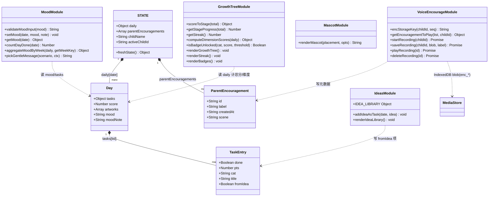
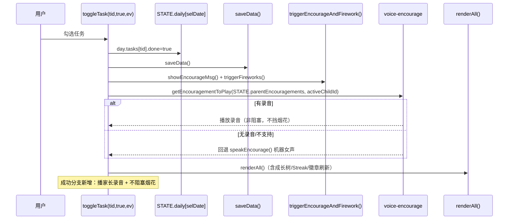
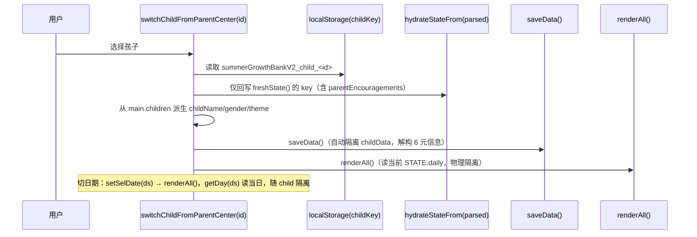
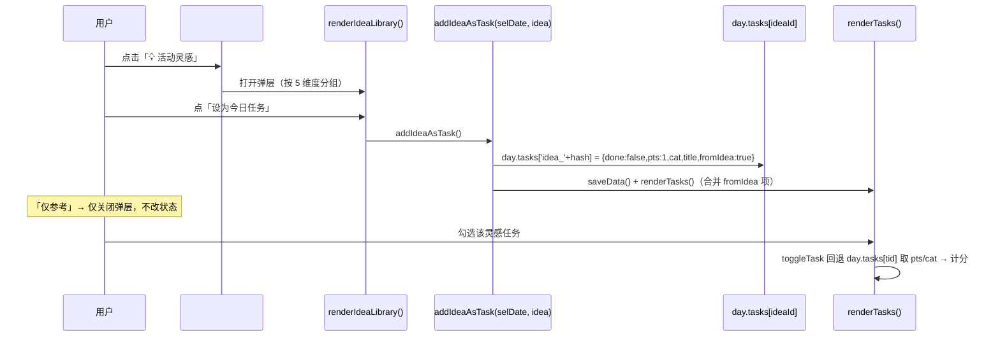
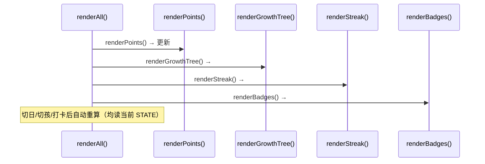
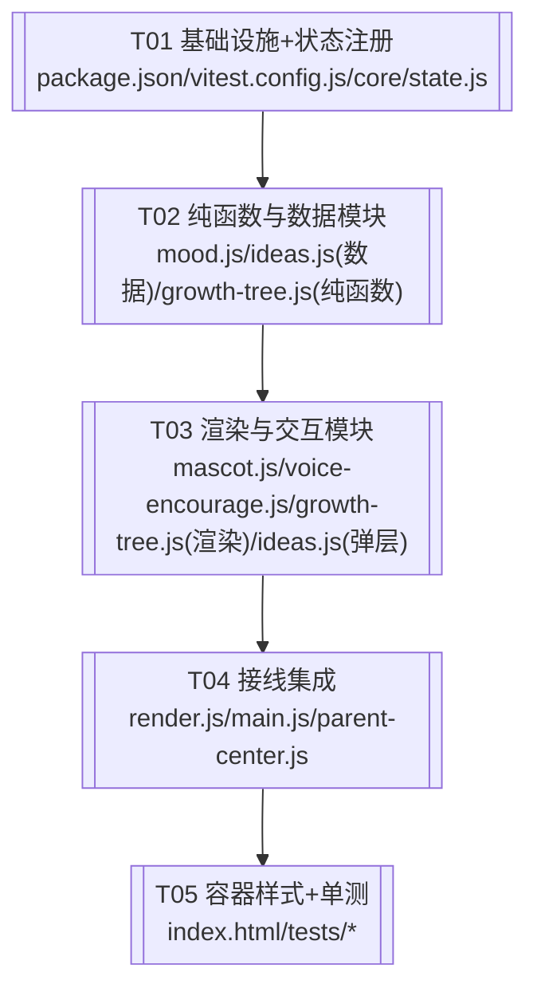

# 暑假成长积分银行 · 增量架构设计 + 任务分解

> 版本：v1.0（增量架构）｜架构师：高见远｜基于 `prd-growth-improve.md`
> 范围：③ 温柔失败话术 + 心情打卡、⑥ 活动灵感库 + 手绘 SVG 吉祥物、⑤ 家长录音鼓励、② 成长树 MVP + 连续打卡 Streak + 维度徽章。
> 硬约束：保持原生 ESM、不引入框架；纯本地、无后端；多孩子隔离必须保持；不顺带修 B 类 bug；交付走 CloudStudio。

---

## 1. 实现方案 + 框架选型

### 1.1 为何保持原生 ESM、不引入框架

- **现状**：项目已是 `index.html` + 多文件原生 ESM（`core/`、`features/`），`STATE`/`data` 为单源真相，`render.js` 用 `innerHTML` 拼接渲染，已能在无构建工具下直接以 `<script type="module">` 运行（配合 PWA + sw.js）。
- **引入框架的代价**：React/Vue 需要打包器（Vite），会改变整个加载/构建链路、破坏现有原生 `innerHTML` 渲染与全局 `window.*` 事件（如 `applySWUpdate`、`toast`），且本次 4 项功能均为"在现有容器内增量插入"的小模块，框架带来的组件化收益远小于迁移风险。
- **结论**：继续原生 ESM。新功能以"纯函数模块 + DOM 渲染模块"组织，复用现有 `STATE`、`getDay`、`calcTotalScore`、`saveData` 与 `features/media.js` 的 IndexedDB 能力。无打包步骤，CloudStudio 静态托管即可。

### 1.2 Vitest 测试环境

- 仅引入 `vitest` + `jsdom`（devDependencies），不引入任何运行时框架。
- **纯函数（node 跑）**：`features/mood.js`、`features/ideas.js`（数据部分）、`features/growth-tree.js`（纯函数部分）不依赖 DOM，在其测试文件顶部加 `// @vitest-environment node`，用真实/假 STATE 对象断言。
- **DOM 相关（jsdom 跑）**：`renderGrowthTree/renderStreak/renderBadges`、`renderMascot` 产出、MediaRecorder mock 流程，在 `vitest.config.js` 默认 `environment: 'jsdom'`，或文件顶部 `// @vitest-environment jsdom`。
- 配置：`vitest.config.js` 设 `test.environment='jsdom'`、`test.globals=true`、`test.include=['tests/**/*.test.js']`，并加 `jsdom` setup 以 stub `localStorage`/`indexedDB`/`speechSynthesis`/`MediaRecorder`。

### 1.3 技术难点与对策

| 难点 | 对策 |
|---|---|
| 多孩子隔离 + 新顶层字段易丢 | 新顶层字段 `parentEncouragements` 必须进 `freshState()`；`hydrateStateFrom` 仅回写 `freshState()` 的 key，故注册即自动隔离；`daily[date]` 本就在 `STATE.daily` 内随 child 快照隔离。 |
| 灵感"设为今日任务"与现有任务体系冲突 | 写入 `day.tasks[ideaId]`（`fromIdea:true`），复用 `calcDayScore/calcTotalScore` 自动计分；`renderTasks` 合并 `fromIdea` 项；`toggleTask` 在 `getActiveTasks()` 找不到时回退 `day.tasks[tid]` 取 pts/cat。 |
| 录音物理隔离 + 不进备份 | IndexedDB key = `enc_<activeChildId>_<seq>`，复用 `media` store；仅元数据 `parentEncouragements` 进 STATE→JSON 备份，blob 不进 JSON（机器声兜底）。 |
| Streak 今天未打卡误归零 | `getStreak()` 从今天向前扫描，今天 0 打卡时改从昨天起算。 |
| 温柔话术骚扰 | 同场景会话内 module 级 `lastGentleMsg` 去重；`zeroCheckin` 卡片每次都显示，toast 仅当天首次进 Tab 弹一次。 |

---

## 2. 文件列表（相对路径，标注 新增 / 修改）

> 以下覆盖 PRD§8 涉及文件 + 新增测试文件。`docs/` 为交付文档，不计入源码。

### 新增文件
- `package.json` — 依赖与 `npm test` 脚本（若已存在则修改）。
- `vitest.config.js` — Vitest + jsdom 配置。
- `tests/setup.js` — jsdom 下的 localStorage/IndexedDB/MediaRecorder/SpeechSynthesis stub。
- `features/mood.js` — 心情读写 + 温柔话术层（纯函数）。
- `features/ideas.js` — `IDEA_LIBRARY` + `addIdeaAsTask` + 灵感弹层渲染。
- `features/mascot.js` — `renderMascot` 手绘内联 SVG 吉祥物。
- `features/voice-encourage.js` — 家长录音录制/列表/播放/删除 + `getEncouragementToPlay`。
- `features/growth-tree.js` — 成长树/Streak/徽章的纯函数 + 渲染。
- `tests/mood.test.js` — mood/gentle/streak 纯函数。
- `tests/growth-tree.test.js` — scoreToStage/getStreak/computeDimensionScores/isBadgeUnlocked。
- `tests/ideas.test.js` — IDEA_LIBRARY 结构 + addIdeaAsTask 幂等。
- `tests/voice-encourage.test.js` — encStorageKey/getEncouragementToPlay + mock MediaRecorder 三态。
- `tests/mascot.test.js` — renderMascot 返回 `<svg>`、placement→class、非法回退。

### 修改文件
- `core/state.js` — `freshState()` 增加 `parentEncouragements: []`（**必须**）。
- `features/render.js` — `renderTasks` 合并 `fromIdea`；`toggleTask` 成功播录音 + 取消加温柔话术；`renderAll` 增 `renderGrowthTree/renderStreak/renderBadges`；`renderPoints` 更新 `#streakBadge`；新增吉祥物放置调用。
- `main.js` — 设置宝贝信息弹层加录音区；打卡 Tab 加心情行 + 灵感按钮 + 温柔空状态。
- `features/parent-center.js` — `deleteChild` 非阻塞 `removeMedia` 该孩录音 blob（`enc_<cid>_<seq>`）。
- `index.html` — 加 `#streakBadge` / `#moodRow` / `#ideaBtn` / `#growthTree` / `#badgeWall` 容器与 CSS/keyframes；`#asub-review` 加情绪趋势容器。

---

## 3. 数据结构与接口（类型签名 / 类图）

### 3.1 STATE 顶层扩展（在 `core/state.js` 的 `freshState()` 注册）

```ts
STATE.parentEncouragements: Array<{
  id: string;          // 唯一 id，如 enc_<childId>_<seq>
  label: string;       // 家长命名，如 "加油语音 #1"
  createdAt: string;   // ISO 日期
  scene?: string;      // 预留 P2-2；无 scene 视为通用
}>
// 默认：[]
```

### 3.2 `daily[date]` 扩展（嵌套于 `STATE.daily`，随 child 快照隔离）

```ts
day.mood: 'happy' | 'neutral' | 'sad' | undefined   // 由 getDay(date) 保证 day 存在
day.moodNote: string                                  // 心情附言，≤50 字
day.tasks[ideaId]: {                                  // 灵感库"设为今日任务"写入（复用 day.tasks 结构）
  done: boolean;
  pts: number;       // 默认 1
  cat: string;       // 维度名（与 CATEGORIES.title 一致）
  title: string;
  fromIdea: true;
}
```

### 3.3 新模块导出函数签名

```ts
// features/mood.js
MOOD_ENUM = ['happy','neutral','sad']
GENTLE_MESSAGES: { zeroCheckin: string[]; uncheck: string[]; streakBroken: string[] }
validateMoodInput(mood: unknown): 'happy'|'neutral'|'sad'|null
setMood(date: string, mood: 'happy'|'neutral'|'sad'|null, note: string): void
getMood(date: string): { mood?: 'happy'|'neutral'|'sad'; moodNote: string }
countDayDone(date: string): number
aggregateMoodByWeek(daily: Record<string, Day>, getWeekKey: (ds:string)=>string): { happy:number; neutral:number; sad:number }
pickGentleMessage(scenario: 'zeroCheckin'|'uncheck'|'streakBroken', ctx?: {streak?:number}): string

// features/ideas.js
IDEA_LIBRARY: Record<string /*cat*/, Array<{ id:string; title:string; pts:number; cat:string }>>
ideaIdOf(idea: {title:string; cat:string}): string          // 'idea_' + 简单 hash
addIdeaAsTask(date: string, idea: {title:string; cat:string; pts?:number}): void
renderIdeaLibrary(): void                                    // 打开弹层，按 5 维度分组

// features/growth-tree.js（纯函数）
STAGES: Array<{ name:string; threshold:number }>  // 种子0/发芽20/幼苗50/开花100/结果200
BADGE_THRESHOLD = 30
scoreToStage(total: number): { stage:string; idx:number; nextThreshold:number|null; pct:number }
getStageProgress(total: number): number                       // [0,1]
getStreak(): number
computeDimensionScores(daily: Record<string, Day>): Record<string, number>  // 仅计 done
isBadgeUnlocked(cat: string, score: number, threshold?: number): boolean
// features/growth-tree.js（渲染）
renderGrowthTree(): void     // 写 #growthTree
renderStreak(): void         // 写 #streakBadge
renderBadges(): void         // 写 #badgeWall

// features/mascot.js
renderMascot(placement: 'tree'|'success'|'empty'|'encourage', opts?: { mood?: string; size?: number }): string
// 返回含 <svg ... class="mascot-..."> 的字符串；非法 placement 回退 'tree'

// features/voice-encourage.js
encStorageKey(childId: string, seq: number): string            // `enc_${childId}_${seq}`
getEncouragementToPlay(list: Array<{id:string}>, childId: string): {id:string; label:string} | null
startRecording(childId: string): Promise<MediaRecorder>        // 失败抛 typed error（unsupported/denied）
stopRecording(): void
saveRecording(childId: string, blob: Blob, label: string): Promise<void>  // 写 IndexedDB + 推 parentEncouragements
listRecordings(): Array<{id:string; label:string; createdAt:string; scene?:string}>
playRecording(id: string): Promise<void>                       // getMedia → Audio 播放
deleteRecording(id: string): Promise<void>                     // removeMedia（非阻塞）+ 删元数据
playParentEncouragementOnCheckin(childId: string): void        // 优先录音，无则调用方回退机器声
```

### 3.4 类图（Mermaid）



---

## 4. 程序调用流程（Mermaid 时序图）

### 4.1 ① 打卡成功触发链（toggleTask 成功 → 播录音/机器声 + 烟花 + 吉祥物 pop）



### 4.2 ② 切日期 / 切孩数据隔离链路



### 4.3 ③ 灵感库"设为今日任务"写入与渲染



### 4.4 ④ 成长树 / Streak / 徽章在 renderAll 的挂载点



---

## 5. 任务列表（有序、含依赖、按实现顺序）

> 硬约束：≤5 个任务；每个任务 ≥3 个相关文件；第一个任务必须是"项目基础设施"。
> 实现顺序：先注册状态字段与纯函数 → 再渲染模块 → 再接线集成 → 最后容器样式与单测。

### T01 — 项目基础设施与状态字段注册  【P0】
- **Source Files**：`package.json`（改）、`vitest.config.js`（新）、`core/state.js`（改）
- **Dependencies**：—
- **Priority**：P0
- **内容**：
  - `package.json`：增加 devDependencies `vitest`、`jsdom`；增加 `"test": "vitest run"` 脚本。
  - `vitest.config.js`：默认 `environment: 'jsdom'`，`globals: true`，`include: ['tests/**/*.test.js']`，`setupFiles: ['tests/setup.js']`。
  - `core/state.js`：`freshState()` 增加 `parentEncouragements: []`（**必须**，否则切孩丢失）。

### T02 — 纯函数与数据模块（无 DOM）  【P0】
- **Source Files**：`features/mood.js`（新）、`features/ideas.js` 数据/纯函数部分（新）、`features/growth-tree.js` 纯函数部分（新）
- **Dependencies**：T01
- **Priority**：P0
- **内容**：
  - `features/mood.js`：`validateMoodInput`、`setMood`、`getMood`、`countDayDone`、`aggregateMoodByWeek`、`pickGentleMessage`、`GENTLE_MESSAGES`、`MOOD_ENUM`（全部读 `STATE.daily`，无 DOM）。
  - `features/ideas.js`：`IDEA_LIBRARY`（5 维度各 5–8 条）、`ideaIdOf`、`addIdeaAsTask`（幂等：已存在且 done 不覆盖）。
  - `features/growth-tree.js`（纯函数）：`STAGES`、`BADGE_THRESHOLD`、`scoreToStage`、`getStageProgress`、`getStreak`、`computeDimensionScores`、`isBadgeUnlocked`。

### T03 — 渲染与交互模块（DOM）  【P0】
- **Source Files**：`features/mascot.js`（新）、`features/voice-encourage.js`（新）、`features/growth-tree.js` 渲染部分（改）、`features/ideas.js` 弹层部分（改）
- **Dependencies**：T02
- **Priority**：P0
- **内容**：
  - `features/mascot.js`：`renderMascot(placement, opts)` 返回内联 SVG（按 §4.6 配色/形状，单文件内联），挂 `mascot-sway/blink/pop` class；非法 placement 回退默认。
  - `features/voice-encourage.js`：`encStorageKey`、`getEncouragementToPlay`、`startRecording`（MediaRecorder 三态：成功/拒绝/不支持）、`stopRecording`、`saveRecording`（写 IndexedDB `enc_<cid>_<seq>` + 推 `parentEncouragements`）、`listRecordings`、`playRecording`、`deleteRecording`（非阻塞 `removeMedia`）、`playParentEncouragementOnCheckin`。
  - `features/growth-tree.js`（渲染）：`renderGrowthTree`（SVG/CSS 树 + 进度条）、`renderStreak`（更新 `#streakBadge`）、`renderBadges`（5 槽位）。
  - `features/ideas.js`（弹层）：`renderIdeaLibrary` 打开模态，按 5 维度列出，绑定「设为今日任务」/「仅参考」。

### T04 — 接线与集成（render.js + main.js + parent-center.js）  【P0】
- **Source Files**：`features/render.js`（改）、`main.js`（改）、`features/parent-center.js`（改）
- **Dependencies**：T03
- **Priority**：P0
- **内容**：
  - `features/render.js`：
    - `renderTasks`：合并 `day.tasks` 中 `fromIdea:true` 项（按 `selCat` 过滤），渲染可勾选行。
    - `toggleTask`：成功分支（`checked && !done`）→ 调 `playParentEncouragementOnCheckin(activeChildId)`（无则回退机器声）；取消分支（`!checked && done`）→ `showEncourageMsg(pickGentleMessage('uncheck',{streak}))`；回退取 pts/cat：`const t = getActiveTasks().find(x=>x.id===tid) || day.tasks[tid];`。
    - `renderAll`：增 `renderGrowthTree()`、`renderStreak()`、`renderBadges()`。
    - `renderPoints`：更新 `#streakBadge`（「🔥 连续 N 天」）。
    - 新增吉祥物放置：空状态卡用 `renderMascot('empty')`、成功弹层角落用 `renderMascot('success')`。
  - `main.js`：
    - 设置宝贝信息弹层加「🎙️ 家长录音鼓励」区（录制/试听/删除/命名），调用 `voice-encourage`。
    - 打卡 Tab：在 `checkinDateLabel` 与 `catTabs` 间插入 `#moodRow`（3 表情 + 文本框，未设宝贝禁用）；`catTabs` 同行右对齐加 `#ideaBtn`（未设宝贝禁用）；今天且 `countDayDone(today)===0` 时渲染温柔空状态卡（含 `renderMascot('empty')`）。
  - `features/parent-center.js`：`deleteChild` 中对该孩所有 `enc_<cid>_<seq>` 调 `removeMedia`（非阻塞）。

### T05 — 视图容器、样式与单元测试  【P0 容器 / P1 测试】
- **Source Files**：`index.html`（改）、`tests/setup.js`（新）、`tests/mood.test.js`（新）、`tests/growth-tree.test.js`（新）、`tests/ideas.test.js`（新）、`tests/voice-encourage.test.js`（新）、`tests/mascot.test.js`（新）
- **Dependencies**：T04
- **Priority**：P0（容器）/ P1（测试）
- **内容**：
  - `index.html`：顶部 pill 组加 `#streakBadge`；打卡 Tab 加 `#moodRow`、`#ideaBtn`、温柔空状态容器；日历 Tab 成长地图下方加 `#growthTree`、`#badgeWall`；复盘 `#asub-review` 加情绪趋势容器；新增 CSS keyframes `mascot-sway/blink/pop` 与吉祥物/录音区/徽章墙样式。
  - `tests/setup.js`：jsdom 下 stub `localStorage`、`indexedDB`、`speechSynthesis`、`MediaRecorder`、`navigator.mediaDevices`。
  - 单测覆盖 PRD§7 全部纯函数（见 §7 汇总映射）。

---

## 6. 依赖包列表

```
- vitest@^1.6.0        devDependency — 测试运行器（node/jsdom 双环境）
- jsdom@^24.0.0        devDependency — DOM 相关测试环境（render/mascot/MediaRecorder mock）
```

> 运行时零新增依赖，保持原生 ESM。

---

## 7. 共享知识（跨文件约定）

1. **`freshState()` 注册新字段规则**：任何新顶层 STATE 字段（如 `parentEncouragements`）必须加进 `freshState()` 默认值；`hydrateStateFrom` 只回写 `freshState()` 的 key，漏注册 = 切孩丢失。当前仅此一个新增顶层字段。
2. **`saveData` 子快照解构**：`const { children, childName, childGender, theme, activeChildId, parentPasswordHash, customRewards, ...childData } = STATE;` 除这 6 个元信息外，挂在 STATE 上的任何顶层字段（含 `parentEncouragements`、`daily`）自动进入 `summerGrowthBankV2_child_<id>` 隔离快照。**新增顶层字段无需改 `saveData`**。
3. **`getDay` 使用约定**：读取/写入某日数据一律用 `getDay(dateStr)`（保证 day 对象存在，含 `tasks/score/artworks`）。新增的 `mood/moodNote` 直接挂在返回的 day 上即可；**不要**直接 `STATE.daily[date]` 读取（可能为 undefined）。现有代码已沿此习惯，新代码保持一致。
4. **IndexedDB key 规则**：复用 `features/media.js` 的 `media` store（keyPath `id`）。家长录音 blob 的 id = `enc_<activeChildId>_<seq>`（`encStorageKey`），物理隔离随 child；`media` store 同时存作品 blob，互不冲突。
5. **CSS 动画 class 命名**：吉祥物动画统一 `mascot-sway`（常驻/树旁左右摆）、`mascot-blink`（眨眼）、`mascot-pop`（成功/鼓励弹层缩放）。定义在 `index.html` 的 `<style>`。
6. **mascot SVG 单文件内联**：`renderMascot` 直接返回内联 `<svg>` 字符串（含 `class`），不引用外部资源；配色按 §4.6（`#FFB74D` 身体、`#A5D6A7` 嫩芽、`#FF8A65` 脸颊、`#6D4C41` 描边）。
7. **MediaRecorder 权限降级路径**：
   - 不支持：`!window.MediaRecorder || !navigator.mediaDevices?.getUserMedia` → 提示「⚠️ 无法录音，打卡仍会有机器鼓励声」，回退机器声。
   - 用户拒绝（`NotAllowedError`）→ 同上提示 + 回退机器声。
   - 支持且授权 → 录制，单条 ≤30s、单孩 ≤10 条（超条数禁用录制按钮）。
8. **温柔话术去重**：`mood.js` 维护 module 级 `lastGentleMsg`（同场景会话内不连续重复同一条）；`zeroCheckin` 卡片每次进 Tab 都显示，toast 仅当天首次（`shownZeroCheckinDate` 标记）弹一次。
9. **闸门一致性**：未设宝贝（`!STATE.childName`）时，心情行、`#ideaBtn`、录音入口一律禁用/隐藏；`toggleTask` 既有 `if(!STATE.childName)` 闸门不动。
10. **渲染 null 安全**：`renderGrowthTree/renderStreak/renderBadges/renderMascot` 调用方均 `if(!el) return`；即使容器（T05）晚于接线（T04）存在，也不报错，仅暂不可见。

---

## 8. 待明确事项

主理人已拍板 10 个待确认（§6 全部按既定方案设计），故本增量**待明确事项极少**：

- **P2-2 录音 scene 分组**：本次 `scene` 字段预留（类型已含 `scene?`），录入 UI 不做分组，播放默认随机选通用录音。无阻塞。
- **`getWeekKey` 来源**：`aggregateMoodByWeek(daily, getWeekKey)` 直接复用 `core/helpers.js` 现有 `getWeekKey`（周一为周起点），无需新实现。
- **情绪趋势容器位置**：落在 `#asub-review`（复盘 Tab）内，作为新增区块；成长报告 `renderGrowthReport` 暂不接入（留待 P1 复盘增强，不在本次硬范围）。

---

## 9. 任务依赖图（Mermaid）



> 说明：链路为分层实现的自然顺序（基础设施→纯逻辑→渲染→接线→容器/测试）。各渲染函数均做了 null 安全，T05 容器晚于 T04 存在也不会报错，因此 T04 与 T05 实质可并行收尾。
