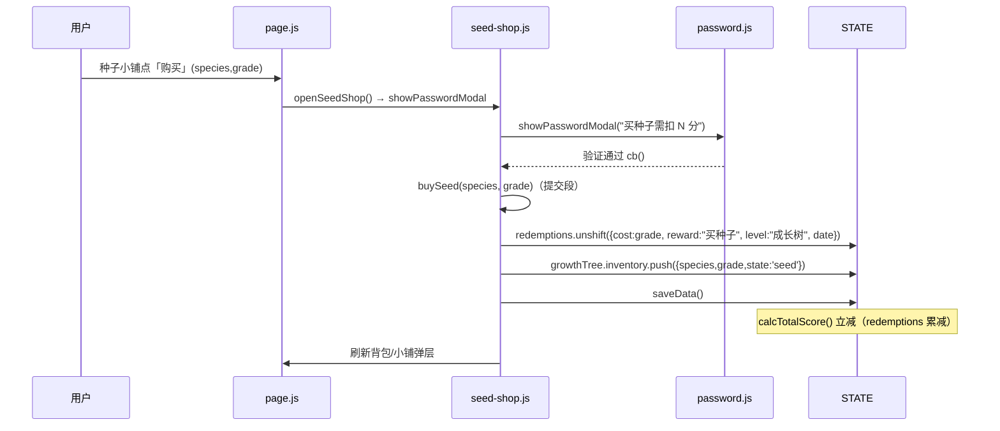
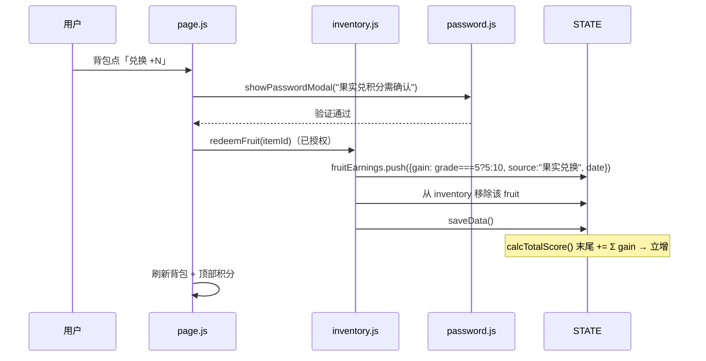
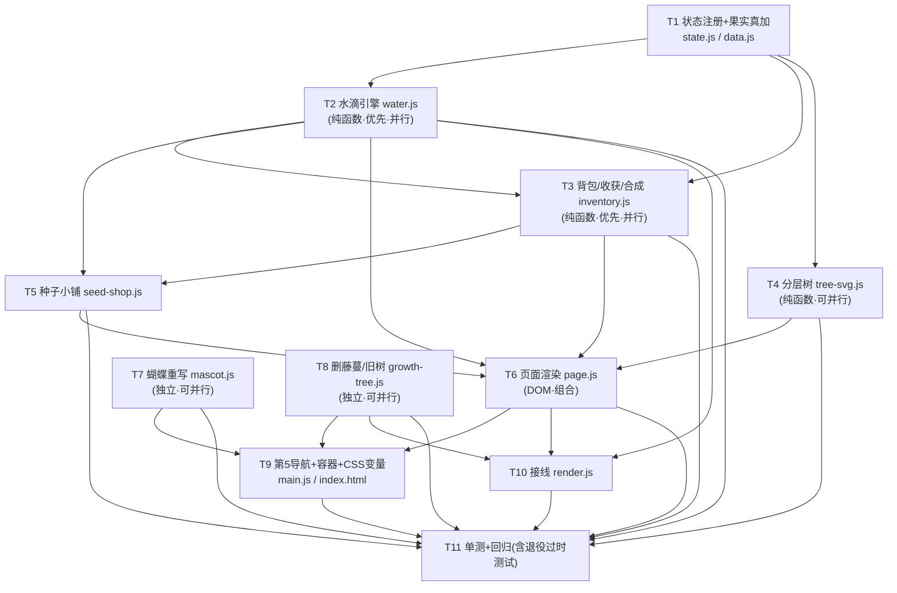

# 暑假成长积分银行 · 成长树独立页面 — 系统架构设计 + 任务分解

> 版本：v1.0（增量架构）｜架构师：高见远（software-architect）
> 输入：PRD `docs/prd-growth-tree.md`（许清楚，成长树独立页面）
> 技术栈：**原生 HTML + CSS 变量 + 原生 ES Module JS（PWA）**，无构建、无框架、无新依赖
> 根目录：`I:\summer-growth-bank\`

---

## 1. 实现方案 + 框架选型

### 1.1 总体策略

延续项目「STATE 单源真相 + 纯函数模块 + `renderXxx()` 字符串渲染 + 事件委托」的单体模式。本次需求本质是「在独立新文件夹内新建一套养成子系统，并把首页藤蔓/旧树区块剥离」，因此：

- **新代码全部进独立新文件夹 `features/tree-garden/`**（硬约束，PRD §7），绝不塞进现有 `features/growth-tree.js`。
- **蝴蝶吉祥物原地重写 `features/mascot.js`**（非新文件夹，P1-1）。
- **复用既有能力，不复制**：`showPasswordModal`（买种/兑果）、`getMakeupCost/canMakeupDate/isToday/makeupVerifiedDates`（坚持水接续）、`getStreak`（坚持水里程碑，来自被保留的 `growth-tree.js`）、`voice-encourage`（浇水随机语音）、`openModal`（种子小铺/背包/合成弹层）。
- **双真相源（故意保留）**：本页树由独立 `totalWater` 水滴池驱动，与 `calcTotalScore()` 总积分解耦；徽章逻辑仍绑总积分（暂不动）。

### 1.2 关键技术难点与对策

| 难点 | 对策 |
|---|---|
| 多孩子隔离 + 新顶层字段易丢 | `fruitEarnings` 与 `growthTree` 必须进 `core/state.js` 的 `freshState()`；`hydrateStateFrom` 只回写 `freshState()` 的 key，注册即自动随 child 快照隔离（PRD §5.1）。`saveData` 子快照解构已自动纳入挂在 STATE 上的顶层字段，无需改 `saveData`。 |
| 零新余额字段（铁律） | 买种扣：`push {cost:grade, reward:"买种子", level:"成长树", date}` 到 `STATE.redemptions`；兑果加：`push {gain, source:"果实兑换", date}` 到 `STATE.fruitEarnings` + `calcTotalScore()` 末尾 `+= Σ gain`；两套机制都与现有兑换记录 UI 解耦（果实加分不污染 `redemptions` 列表）。 |
| 主题铁律（禁硬编码 hex） | SVG/JS 内一律走 CSS 变量；新增 `--tree-*` / `--fruit-*` / `--butterfly-*` 变量须在 `:root` + 5 主题块（`sakura/ocean/forest/sunset/starry`）+ 暗色 `@media` **全部定义**。 |
| **测试回归（CRITICAL，见 §8）** | PRD/主理人声称「藤蔓/旧树 render 无测试引用、181 用例全绿」与代码实际不符：现有 `tests/ui-polish-2`、`ui-polish-3-qa`、`ui-polish-4`、`qa-verify-polish4` 共约 380 例直接 `import { renderGrowthVine }` / `{ beeSVG }` 并断言藤蔓/蜜蜂内部 class。**删除 `renderGrowthVine`、将 mascot 重写为蝴蝶会导致这些用例失败**。设计决策：随功能移除一并**退役/改写**这些过时测试（保留 badge/idea/mood/voice/`growth-tree` 纯函数等仍应全绿的用例），并新增 `tests/tree-garden.test.js`。 |
| 蝴蝶重写契约保全 | `renderMascot(placement)` 公开契约必须保留：`placement→mascot-<placement>` 类、`success→★`、`empty→rotate(-8`、`unknown→tree` 回退、`mascot-sway/pop/blink` 动画类，单文件内联 `<svg>`。否则 `tests/mascot.test.js`（19 例）失败。 |

### 1.3 架构模式

新文件夹内分两层：
- **纯函数层（无 DOM，可单测）**：`water.js`（水滴三源引擎）、`inventory.js`（背包/种下/收获/兑果/合成）、`tree-svg.js`（分层 SVG 字符串）、`seed-shop.js` 的 `buySeed` 提交段。
- **渲染/接线层（DOM）**：`seed-shop.js` 的弹层、`page.js`（整页渲染 + 操作栏 + 蝴蝶挂载）、`index.js`（挂载出口）。

---

## 2. 文件列表（相对路径）

### 2.1 新建文件（独立新文件夹 `features/tree-garden/`）

| 文件 | 角色 |
|---|---|
| `features/tree-garden/water.js` | **纯函数**：`treeThresholds(grade)`、`scoreToTreeStage(water,grade)`、`grantDailyWater(today)`、`grantEffortWater(taskId,date)`、`grantStreakWater()`、`STREAK_MILESTONES` 表 |
| `features/tree-garden/inventory.js` | **纯函数**：`InventoryItem` 结构、`plantSeed(itemId)`、`plantFruitAsSeed(itemId)`、`redeemFruit(itemId)`、`harvestTree(rng?)`、`synthesizeFruit(rng?)`、`addInventoryItem/getInventory` 辅助 |
| `features/tree-garden/tree-svg.js` | **渲染（字符串，无 DOM）**：`renderTreeStage(species, grade, stageIdx)` 返回含 `<g>` 分层的伪 3D 分层 `<svg>`（4 物种树形 + 4 果实 SVG） |
| `features/tree-garden/seed-shop.js` | `buySeed(species, grade)`（**纯函数提交段**：push `redemptions` + 背包 seed）；`openSeedShop()`（弹层 + `showPasswordModal` 真扣门） |
| `features/tree-garden/page.js` | `renderGrowthTreePage()`（顶部进度条 + 还差 X 水 / 中央双树舞台 + 底部操作栏）、`mountGrowthTreePage()`、`onTaskChecked(taskId,date)`、`refreshGrowthTree()`、浇水/背包/合成弹层接线、蝴蝶挂载 |
| `features/tree-garden/index.js` | 挂载出口：re-export `mountGrowthTreePage / onTaskChecked / refreshGrowthTree` |
| `tests/tree-garden.test.js` | **新增单测**：water/inventory/tree-svg/seed-shop 全部纯函数（PRD §5.5） |

### 2.2 原地修改文件

| 文件 | 本次改动 |
|---|---|
| `core/state.js` | `freshState()` 注册 `fruitEarnings:[]` 与 `growthTree:{...}`（**必须**，PRD §5.1） |
| `core/data.js` | `calcTotalScore()` 末尾在 `redemptions` 累减后追加 `fruitEarnings` 累加（**必须**，PRD §5.2） |
| `features/mascot.js` | 原地重写为**蝴蝶**（保留 `renderMascot` 公开契约），P1-1 |
| `features/growth-tree.js` | **删除** `renderGrowthVine` 及所有藤蔓辅助（`vine*`/`morningGlorySVG` 仅 D 报告卡复用——见下注）、`treeSVG`/`renderGrowthTree`（旧按总积分树区块）；**保留** `getStreak`/`renderStreak`、`renderBadges`/`badgeSVG`/`badgeIcon`/`badgeLevel`/`computeDimensionScores`/`isBadgeUnlocked`/`BADGE_THRESHOLD`、`scoreToStage`/`STAGES`/`getStageProgress` |
| `features/render.js` | `toggleTask` 成功分支追加 `onTaskChecked(taskId, date)`；`renderAll()` 末尾追加 `refreshGrowthTree()`；移除 `renderGrowthVine` 的 import 与调用 |
| `main.js` | `#mainTabNav` 切换监听新增 `data-maintab="tree"` 分支 → `mountGrowthTreePage()` |
| `index.html` | ① 移除日历 Tab 的 `#growth-vine-block` 容器与相关 CSS（`.growth-vine-*`）；② 新增第 5 个导航项 `🌳 成长树` 与 `<section class="main-tab-content" id="mtab-tree">` 容器；③ `:root`+5 主题+暗色 `@media` 补齐 `--tree-*`/`--fruit-*`/`--butterfly-*` 变量；④ 新增 `butterfly-dance`/`tree-sway`/`petal-fall` keyframes；⑤ 删除旧 `.growth-tree`/`.tree-*` 旧树样式（避免与同名新样式冲突，建议新样式统一加 `gt-` 前缀） |

> **注（morningGlorySVG 去留）**：现有 `render.js` 的 `openSummerSummary()` 仍引用 `morningGlorySVG`（D 报告卡大牵牛花）。若该引用保留，则 `morningGlorySVG` 不能删；但 PRD P0-1 要求清除首页藤蔓，**未要求**删除报告卡牵牛花。建议：`morningGlorySVG` **保留**在 `growth-tree.js`（仅 D 报告卡用），其余藤蔓渲染函数全删。这样 `render.js` 的 `import { ..., morningGlorySVG }` 仍有效，零回归。

### 2.3 测试迁移（随功能移除一并处理，详见 §8）

| 文件 | 处理 |
|---|---|
| `tests/ui-polish-2.test.js` | **整体退役**（77 例，专测已删 `renderGrowthVine`） |
| `tests/ui-polish-3-qa.test.js` | **整体退役**（72 例，专测已删 `renderGrowthVine` + `.vine-mascot`） |
| `tests/ui-polish-4.test.js` | **改写**：移除 `beeSVG` 4 形态断言（110 例中约 1 个 describe）；`renderMascot` 契约断言（★ / rotate(-8 / mascot-<placement>）保留并改为蝴蝶断言 |
| `tests/qa-verify-polish4.test.js` | **改写**：移除 `renderGrowthVine` vine 断言 + `beeSVG` 断言；保留 badge/idea 部分 |
| `tests/mascot.test.js` | **保留并适配**：`renderMascot` 契约断言（★ / rotate(-8 / mascot-<placement> / 回退 tree）对蝴蝶仍成立 |

---

## 3. 数据结构与接口（类图 / Mermaid）

### 3.1 STATE 顶层扩展（`core/state.js` 的 `freshState()` 注册）

```ts
STATE.fruitEarnings: Array<{ gain:number; source:'果实兑换'; date:string }>  // 默认 []
STATE.growthTree: {
  firstPlantDate: string | null;   // 种下首棵当天（此前水滴池不计入）
  seasonSeq: number;               // 第几季（每季从 0 重新累计）
  totalWater: number;              // 当前季全局共享水滴池（累计，双树同步）
  lastDailyWaterDate: string;      // 每日浇水礼去重（按真实日，跨季保留）
  effortGranted: Record<string,true>;  // {'YYYY-MM-DD:taskId':true} 努力水去重（每季清空）
  claimedMilestones: number[];     // [3,7,14,21,28,35,…] 坚持水已领（跨季持久，一次性）
  activeTrees: Array<{ id:string; species:'pine'|'apple'|'sakura'|'orange'; grade:5|10; plantedSeason:number }>;  // 最多 2
  inventory: Array<InventoryItem>; // 种子 + 果实统一仓库
}
```

### 3.2 模块导出签名（TypeScript 风格）

```ts
// ===== features/tree-garden/water.js（纯函数，无 DOM）=====
treeThresholds(grade: 5|10): number[]                  // [0,30,70,120,180] | [0,45,105,180,270]
scoreToTreeStage(water: number, grade: 5|10):
  { stage:string; idx:number; nextThreshold:number|null; pct:number }  // pct∈[0,1]
grantDailyWater(today: string): boolean                 // 跨天幂等 +1；同日返回 false
grantEffortWater(taskId: string, date: string): boolean // 同日同任务去重 +1
grantStreakWater(): number                             // 返回本次加水量；按种树后连续天数 getStreakSincePlant（plant 边界，非全局 getStreak）
STREAK_MILESTONES: Array<{ day:number; water:number }>  // 3/7/14/21/28/35 + 之后每7天+5

// ===== features/tree-garden/inventory.js（纯函数，无 DOM）=====
type InventoryItem = { species:'pine'|'apple'|'sakura'|'orange'; grade:5|10; state:'seed'|'fruit' }
plantSeed(itemId: string): boolean                      // <2 成功进 activeTrees；=2 失败
plantFruitAsSeed(itemId: string): boolean               // 果实按其 grade 开种
redeemFruit(itemId: string): boolean                    // 已授权上下文：push fruitEarnings + 移除 fruit
harvestTree(rng?: ()=>number): InventoryItem[] | false  // 非繁茂 false；繁茂产果 + 重置 totalWater=0/seasonSeq++
synthesizeFruit(rng?: ()=>number): boolean              // 2×5分果→1×10分果；20% 失败净 -1
addInventoryItem(item: InventoryItem): void
getInventory(): InventoryItem[]

// ===== features/tree-garden/tree-svg.js（字符串，无 DOM）=====
renderTreeStage(species:'pine'|'apple'|'sakura'|'orange', grade:5|10, stageIdx:number): string
  // 返回 <svg>…<g class="tree-trunk">…<g class="tree-branch">…<g class="tree-leaf">…
  //        <g class="tree-flower">…<g class="tree-fruit">…</svg>

// ===== features/tree-garden/seed-shop.js =====
buySeed(species, grade): boolean                        // 纯函数提交段（已授权）：push redemptions + 背包 seed
openSeedShop(): void                                    // 弹层 + showPasswordModal 真扣门

// ===== features/tree-garden/page.js（DOM 渲染 + 接线）=====
renderGrowthTreePage(): void
mountGrowthTreePage(): void
onTaskChecked(taskId: string, date: string): void       // 供 render.js 打卡成功调用
refreshGrowthTree(): void                               // 供 render.js renderAll 调用（不可见静默）
onWaterClick(): void                                    // 浇水按钮：grantDailyWater + 随机语音 + 重渲染

// ===== features/tree-garden/index.js =====
export { mountGrowthTreePage, onTaskChecked, refreshGrowthTree } from './page.js'
```

### 3.3 类图（Mermaid）

```mermaid
classDiagram
    class STATE {
        +Object daily
        +Array redemptions
        +Array fruitEarnings
        +Object growthTree
        +String childName
        +freshState() Object
    }
    class WaterEngine {
        +treeThresholds(grade) number[]
        +scoreToTreeStage(water, grade) Object
        +grantDailyWater(today) boolean
        +grantEffortWater(taskId, date) boolean
        +grantStreakWater() number
        +STREAK_MILESTONES Array
    }
    class Inventory {
        +InventoryItem type
        +plantSeed(itemId) boolean
        +plantFruitAsSeed(itemId) boolean
        +redeemFruit(itemId) boolean
        +harvestTree(rng) Array~false~
        +synthesizeFruit(rng) boolean
        +addInventoryItem(item) void
        +getInventory() Array
    }
    class TreeSVG {
        +renderTreeStage(species, grade, stageIdx) string
    }
    class SeedShop {
        +buySeed(species, grade) boolean
        +openSeedShop() void
    }
    class Page {
        +renderGrowthTreePage() void
        +mountGrowthTreePage() void
        +onTaskChecked(taskId, date) void
        +refreshGrowthTree() void
        +onWaterClick() void
    }
    class MascotModule {
        +renderMascot(placement, opts) string
    }
    class GrowthTreeLegacy {
        +getStreak() number
        +scoreToStage(total) Object
        +renderStreak() void
        +renderBadges() void
        +badgeSVG(cat, level) string
    }
    class VoiceEncourage {
        +getEncouragementToPlay(list, cid) Object
        +playRecording(id) Promise
    }
    class Password {
        +showPasswordModal(prompt, cb) Promise
    }
    class Modal {
        +openModal(id, builder, opts) void
        +closeModal(id) void
    }

    STATE "1" *-- "1" growthTree : 顶层字段
    STATE "1" *-- "many" fruitEarnings : 顶层字段
    WaterEngine ..> STATE : 读写 growthTree
    Inventory ..> STATE : 读写 growthTree.inventory/activeTrees
    Inventory ..> WaterEngine : scoreToTreeStage(成熟判定)
    SeedShop ..> STATE : 写 redemptions/inventory
    SeedShop ..> Password : showPasswordModal
    Page ..> WaterEngine : grant*
    Page ..> Inventory : plant/redeem/harvest/synth
    Page ..> TreeSVG : renderTreeStage
    Page ..> MascotModule : renderMascot(蝴蝶)
    Page ..> VoiceEncourage : 浇水随机语音
    Page ..> Modal : openModal(背包/合成/小铺)
    %% 坚持水已内置为 water.js 的 getStreakSincePlant()（读 STATE.daily，仅计种树后连续天数），不再依赖 GrowthTreeLegacy
    SeedShop ..> Inventory : buySeed 提交段
    note for GrowthTreeLegacy : 仅保留 Streak/徽章/scoreToStage\n藤蔓与旧树区块已删
    note for MascotModule : 原地重写为蝴蝶\n公开契约不变
```

> 说明：模块间依赖方向——`water.js`/`inventory.js`/`tree-svg.js` 为叶子纯函数（仅依赖 `core/state`、`core/helpers`；water.js 的坚持水 getStreakSincePlant 自包含，不再依赖 growth-tree）；`seed-shop.js`、`page.js` 组合它们并接 DOM/密码/弹层。`render.js` 与 `main.js` 仅依赖 `tree-garden/index.js` 暴露的 3 个出口，不直接 import 内部模块，降低耦合。

---

## 4. 程序调用流程（时序图 Mermaid）

> 6 条核心流程。参与者缩写：U=用户、PG=`page.js`、W=`water.js`、INV=`inventory.js`、SS=`seed-shop.js`、PW=`password.js`、RT=`render.js`、V=`voice-encourage`、S=`STATE`。

### ① 进页面浇水 → 水滴引擎 → 重渲染

```mermaid
sequenceDiagram
    participant U as 用户
    participant PG as page.js
    participant W as water.js
    participant S as STATE.growthTree
    participant V as voice-encourage
    U->>PG: 点「💧 浇水 +1」
    PG->>W: grantDailyWater(today)
    alt lastDailyWaterDate !== today
        W->>S: totalWater += 1; lastDailyWaterDate = today
        W-->>PG: true
        PG->>V: getEncouragementToPlay → playRecording (随机，非阻塞)
    else 同日已浇
        W-->>PG: false（按钮置灰「明日再来」）
    end
    PG->>PG: refreshGrowthTree()（重渲染进度条 + 双树）
```

### ② 打卡任务勾选 → onTaskChecked → grantEffortWater / grantStreakWater

```mermaid
sequenceDiagram
    participant U as 用户
    participant RT as render.js(toggleTask)
    participant PG as page.js
    participant W as water.js
    participant S as STATE.growthTree
    U->>RT: 勾选任务(tid)
    RT->>RT: day.tasks[tid].done=true; saveData()
    RT->>PG: onTaskChecked(tid, today)
    PG->>W: grantEffortWater(tid, today)
    W->>S: effortGranted['today:tid'] 去重 → 未发则 totalWater += 1
    PG->>W: grantStreakWater()
    W->>W: getStreakSincePlant()（读 STATE.daily，仅计种树后连续天数）
    W->>S: 命中里程碑且未 claimed → totalWater += water; claimedMilestones.push(day)
    RT->>RT: renderAll() → refreshGrowthTree()
```

### ③ 买种子 → 密码 → redemptions → 背包



### ④ 收获 → harvestTree → 重置

```mermaid
sequenceDiagram
    participant U as 用户
    participant PG as page.js
    participant INV as inventory.js
    participant W as water.js
    participant S as STATE.growthTree
    U->>PG: 点「🍎 收获」（繁茂时）
    PG->>INV: harvestTree(rng)
    INV->>W: scoreToTreeStage(totalWater, grade).idx === 4 ?
    alt 存在繁茂树
        INV->>S: 按各 activeTree.grade 产果(5种:3–6 / 10种:5–10) push inventory(state:'fruit')
        INV->>S: totalWater = 0; seasonSeq++; effortGranted = {}
        INV->>S: claimedMilestones 不变（跨季保留）
        INV-->>PG: 果实数组
    else 未繁茂
        INV-->>PG: false（提示「还没成熟」）
    end
    PG->>PG: refreshGrowthTree()（两树同步回种子）
```

### ⑤ 果实兑积分 → fruitEarnings → calcTotalScore



### ⑥ 合成 → synthesizeFruit

```mermaid
sequenceDiagram
    participant U as 用户
    participant PG as page.js
    participant INV as inventory.js
    participant S as STATE.growthTree
    U->>PG: 背包点「🧪 合成」
    PG->>INV: synthesizeFruit(rng)
    INV->>INV: 统计 5分果 ≥ 2 ?
    alt 不足 2 个 5分果
        INV-->>PG: false（提示「需要 2 个 5分果」）
    else 充足
        INV->>INV: roll = rng(); 成功(roll≥0.2) ?
        alt 成功(80%)
            INV->>S: 移除 2×5分果; 新增 1×10分果
        else 失败(20%)
            INV->>S: 移除 1×5分果（净 -1，另 1 个退回）
        end
        INV->>S: saveData()
        INV-->>PG: true
    end
    PG->>PG: 刷新背包
```

---

## 5. 任务列表（有序、含依赖、按实现顺序）

> 说明：主理人明确要求本增量按 PRD §7 枚举的 T1–T11 落地（细粒度、逐条可执行、标注依赖）。此清单**超出通用「≤5 任务」默认值**，但属主理人显式指派，故遵循。纯函数任务（T2/T3/T4）应**优先且可并行**；DOM 接线任务（T6/T9/T10）依赖它们。

### T1【P0】状态字段注册 + 果实真加积分
- **源文件**：`core/state.js`（改 `freshState`）、`core/data.js`（改 `calcTotalScore`）
- **内容**：`freshState()` 加 `fruitEarnings:[]` 与 `growthTree:{firstPlantDate:null,seasonSeq:0,totalWater:0,lastDailyWaterDate:'',effortGranted:{},claimedMilestones:[],activeTrees:[],inventory:[]}`；`calcTotalScore()` 在 `redemptions` 累减后追加 `for(const f of (STATE.fruitEarnings||[])) total += f.gain||0;`。
- **依赖**：无
- **优先级**：P0

### T2【P0】新文件夹脚手架 + 水滴引擎 `water.js`（纯函数）
- **源文件**：`features/tree-garden/water.js`（新）、`features/tree-garden/index.js`（新，先建空导出壳）
- **内容**：`treeThresholds`、`scoreToTreeStage`、`STREAK_MILESTONES`、`grantDailyWater`、`grantEffortWater`、`grantStreakWater`（坚持水按种树后连续天数 `getStreakSincePlant`，plant 边界，不再复用全局 `getStreak`）；全部读/写 `STATE.growthTree`，无 DOM。
- **依赖**：T1
- **优先级**：P0（**优先**，纯函数无 DOM 依赖，可与 T3/T4 并行）

### T3【P0】背包/种下/收获/兑果/合成 `inventory.js`（纯函数）
- **源文件**：`features/tree-garden/inventory.js`（新）
- **内容**：`InventoryItem` 结构、`plantSeed`、`plantFruitAsSeed`、`redeemFruit`、`harvestTree(rng)`、`synthesizeFruit(rng)`、`addInventoryItem`/`getInventory`；收获成熟判定复用 `water.scoreToTreeStage`；随机 `rng` 默认 `Math.random` 可注入。
- **依赖**：T1、T2（成熟判定用 `scoreToTreeStage`）
- **优先级**：P0（**优先、可并行**）

### T4【P0】伪 3D 分层树 `tree-svg.js`（纯函数字符串）
- **源文件**：`features/tree-garden/tree-svg.js`（新）
- **内容**：`renderTreeStage(species, grade, stageIdx)` 返回含 `<g class="tree-trunk/branch/leaf/flower/fruit">` 分层的 `<svg>`；4 物种树形 + 4 果实 SVG 明显不同；配色全走 `--tree-*`/`--fruit-*` 变量，无硬编码 hex；纯字符串可单测。
- **依赖**：T1
- **优先级**：P0（**可并行**）

### T5【P0】种子小铺 `seed-shop.js`（buySeed）
- **源文件**：`features/tree-garden/seed-shop.js`（新）
- **内容**：`buySeed(species, grade)` 纯函数提交段（push `redemptions` + 背包 seed，余额不足返回 false 不写）；`openSeedShop()` 弹层 + `showPasswordModal` 真扣门；4 物种 2 档价（松树/苹果=5，樱花/橙子=10），不限制囤买。
- **依赖**：T2、T3（`buySeed` 提交段调 `inventory.addInventoryItem`）
- **优先级**：P0

### T6【P0】独立页面渲染 `page.js`（页面 + 操作栏 + 弹层 + 蝴蝶挂载）
- **源文件**：`features/tree-garden/page.js`（新）、`features/tree-garden/index.js`（新，补全导出）
- **内容**：`renderGrowthTreePage()`（顶部进度条+「还差 X 水到下阶段」、中央双树舞台每树 2 蝴蝶、底部操作栏浇水/种子小铺/背包）；`mountGrowthTreePage()`；`onTaskChecked(taskId,date)`（调 `grantEffortWater`+`grantStreakWater`）；`refreshGrowthTree()`（不可见静默）；`onWaterClick()`（浇水+随机语音）；背包/合成弹层接线（复用 `openModal`）；未设宝贝整页禁用；所有 `getElementById` 做 null 安全。
- **依赖**：T2、T3、T4、T5（组合纯函数 + SVG + 弹层）
- **优先级**：P0

### T7【P1】蝴蝶吉祥物 `mascot.js` 原地重写
- **源文件**：`features/mascot.js`（改，原地重写为蝴蝶）
- **内容**：保留 `renderMascot(placement, opts)` 公开契约（`placement→mascot-<placement>`、`success→★`、`empty→rotate(-8`、`unknown→tree`、`mascot-sway/pop/blink` 动画类、单文件内联 `<svg>`、无外链）；主体由小蜜蜂改为蝴蝶（4 物种可共用一套蝴蝶，或按主题色）；配色走 `--butterfly-*` 变量；移除 `beeSVG` 导出（见 §8 测试迁移）。
- **依赖**：无（独立，可与 T2–T4 并行启动）
- **优先级**：P1

### T8【P0】`growth-tree.js` 删藤蔓与旧树区块，保留 Streak/徽章
- **源文件**：`features/growth-tree.js`（改）
- **内容**：删除 `renderGrowthVine` 及全部藤蔓辅助（`vine*`）、`treeSVG`/`renderGrowthTree`（旧按总积分树区块）；**保留** `getStreak`/`renderStreak`、`renderBadges`/`badgeSVG`/`badgeIcon`/`badgeLevel`/`computeDimensionScores`/`isBadgeUnlocked`/`BADGE_THRESHOLD`、`scoreToStage`/`STAGES`/`getStageProgress`；`morningGlorySVG` **保留**（D 报告卡复用，避免 `render.js` 回归）。删除后确认 `tests/growth-tree.test.js`（测保留纯函数）仍绿。
- **依赖**：无（独立，可与 T2–T4 并行启动）
- **优先级**：P0

### T9【P0】`main.js` + `index.html` 第 5 导航 + 容器 + CSS 变量 + keyframes
- **源文件**：`main.js`（改 `#mainTabNav` 监听加 `tree` 分支）、`index.html`（改/新）
- **内容**：① 移除日历 Tab `#growth-vine-block` 容器 + 相关 `.growth-vine-*` CSS；② 新增导航按钮 `🌳 成长树` 与 `<section class="main-tab-content" id="mtab-tree">`；③ `:root`+5 主题+暗色 `@media` 补齐 `--tree-trunk/--tree-leaf/--tree-flower/--tree-fruit/--fruit-5/--fruit-10/--butterfly-body/--butterfly-wing/--butterfly-dot/--growth-bg/--gt-progress` 等；④ 新增 `butterfly-dance`/`tree-sway`/`petal-fall` keyframes；⑤ 删除旧 `.growth-tree`/`.tree-*` 旧树样式（新样式统一 `gt-` 前缀避免冲突）。
- **依赖**：T6（页面容器内容）、T7（蝴蝶变量）、T8（删藤蔓后清理 CSS）
- **优先级**：P0

### T10【P0】`render.js` 接线（toggleTask / renderAll）
- **源文件**：`features/render.js`（改）
- **内容**：`toggleTask` 成功分支（`checked && !done`）追加 `onTaskChecked(tid, STATE.selDate)`（来自 `tree-garden/index.js`）；`renderAll()` 末尾追加 `refreshGrowthTree()`；移除 `renderGrowthVine` 的 import 与调用；import 改为从 `tree-garden/index.js` 取 `onTaskChecked`/`refreshGrowthTree`。
- **依赖**：T2（纯函数）、T6（page 出口）、T8（移除旧 import）
- **优先级**：P0

### T11【P0】单元测试（新增树纯函数单测 + 回归，含退役藤蔓/蜜蜂过时测试）
- **源文件**：`tests/tree-garden.test.js`（新）、`tests/ui-polish-2.test.js`（退役）、`tests/ui-polish-3-qa.test.js`（退役）、`tests/ui-polish-4.test.js`（改写）、`tests/qa-verify-polish4.test.js`（改写）、`tests/mascot.test.js`（适配蝴蝶）
- **内容**：① 新增 `tree-garden.test.js` 覆盖 PRD §5.5 全部纯函数（grantDailyWater 幂等/跨天+1、grantEffortWater 去重、grantStreakWater 里程碑+claimed 持久+断卡清零、scoreToTreeStage 阈值边界+pct、treeThresholds、plantSeed <2 成功/=2 失败、redeemFruit 真加、harvestTree 非繁茂 false/繁茂产果+重置+claimed 不变、synthesizeFruit 成功/失败两态+不足返回、renderTreeStage 含分层 `<g>`、buySeed 真扣+余额不足失败）；② 退役 `ui-polish-2`/`ui-polish-3-qa`（测已删藤蔓）；③ 改写 `ui-polish-4`/`qa-verify-polish4` 移除 `beeSVG`/`renderGrowthVine` 断言并改为蝴蝶/mascot 契约断言；④ 跑全量 `npx vitest run` 确认其余用例（mood/ideas/voice/badge/growth-tree 纯函数/isolation 等）全绿。
- **依赖**：T2–T10（全部纯函数与渲染就绪后）
- **优先级**：P0

---

## 6. 依赖包列表

```
# 无新增运行时依赖（保持原生 ESM + PWA）
# 仅沿用现有 devDependencies（测试底座，非本增量新增）：
#   vitest  — 测试运行器（node / jsdom 双环境）
#   jsdom   — DOM 相关测试环境
#   playwright — 既有 E2E（与本增量无关）
```

> 运行时零新增依赖，无 `package.json` 改动、无构建步骤。

---

## 7. 共享知识（跨文件约定）

1. **`freshState()` 注册新字段铁律**：`fruitEarnings` 与 `growthTree` 必须进 `freshState()` 默认值；`hydrateStateFrom` 只回写 `freshState()` 的 key，漏注册 = 切孩丢失。新增顶层字段**无需改 `saveData`**（子快照解构自动纳入）。
2. **零新余额字段**：买种扣走 `STATE.redemptions`（与现有扣费同源）；果实加走 `STATE.fruitEarnings`（`calcTotalScore` 末尾累加）；兑换记录 UI 仍只渲染 `redemptions`，果实加分不污染它。
3. **CSS 变量命名规范（新增，必须全主题定义）**：
   - 树：`--tree-trunk` / `--tree-leaf` / `--tree-flower` / `--tree-fruit` / `--tree-soil`
   - 果（按档）：`--fruit-5` / `--fruit-10`
   - 蝴蝶：`--butterfly-body` / `--butterfly-wing` / `--butterfly-dot` / `--butterfly-stroke`
   - 页面：`--growth-bg` / `--gt-progress` / `--gt-progress-fill`
   - 上述变量须在 `:root` + `body[data-theme="sakura|ocean|forest|sunset|starry"]` + `@media (prefers-color-scheme: dark)` **全部定义**，暗色下提亮保证可见。
4. **SVG `<g>` 分层约定（伪 3D z 序）**：树干→枝→叶→花→果，类名依次为 `tree-trunk` / `tree-branch` / `tree-leaf` / `tree-flower` / `tree-fruit`；蝴蝶用 `<g class="butterfly ...">`。所有 `fill`/`stroke` 一律 `var(--*)`，禁硬编码 hex（单测会断言 `not.toMatch(/#[0-9a-fA-F]/)`）。
5. **随机种子化（可单测）**：`harvestTree(rng = Math.random)` 与 `synthesizeFruit(rng = Math.random)` 的 `rng` 为可注入 `()=>number`（[0,1)）；单测注入确定性 `rng` 以断言成功/失败两态与产果数量。
6. **`openModal` 单例弹层契约（复用 `features/modal.js`）**：种子小铺/背包/合成均调 `openModal(id, builder, {onMount})`；关闭三要素 = overlay 点击 + `data-modal-close` 按钮 + `closeModal(id)`（沿用现有 `modal-overlay` 堆叠层级，**不自建 overlay**）。PRD 所述「z1500」对齐现有 `.modal-overlay` 既有权重。
7. **配色解耦**：主题换背景（`--gradient-bg` 等），物种换树形/果色（`--tree-*`/`--fruit-*`）；二者互不影响（P2-1）。
8. **闸门一致性**：`!STATE.childName` 时整页禁用/隐藏（`renderGrowthTreePage` 直接渲染空态或 `return`）。
9. **渲染 null 安全**：`page.js` 所有 `document.getElementById(...)` 调用方均 `if(!el) return`；容器（T9）晚于接线（T10）存在也不报错。
10. **日期 key 统一 `YYYY-MM-DD`**： daily 去重 / `lastDailyWaterDate` / `effortGranted` key 均用 `getTodayStr()` 产出格式。
11. **蝴蝶挂载位置**：`tree`/`success`/`empty`/`encourage` 四个 placement 的 `renderMascot` 均返回蝴蝶 `<svg>`；每棵成长树渲染 2 只蝴蝶（树左/右各一，`butterfly-dance` 动画）。
12. **双真相源纪律**：新树代码**不得** import `growth-tree.js` 的 `scoreToStage`（旧按总积分），一律用本文件夹 `water.scoreToTreeStage`；徽章/Streak 仍用旧 `growth-tree.js`（暂不动）。

---

## 8. 待明确事项（唯一 CRITICAL 风险）

> 其余 spec 已锁定（季重置口径、第 5 导航形态均按主理人确认落地），无其它歧义。仅下列测试回归冲突需主理人拍板：

### 8.1 测试回归冲突（PRD §0/§7.1 与代码实际不符）

- **事实**：PRD/主理人声称「藤蔓/旧树 render 无测试引用、现有 181 用例全绿」。经核对，实际 `tests/` 下约 **764** 个用例，其中 **约 380 例**直接 `import` 即将被删除/重写的功能：
  - `tests/ui-polish-2.test.js`（77 例）：`import { renderGrowthVine }`，断言藤蔓 SVG 内部 class。
  - `tests/ui-polish-3-qa.test.js`（72 例）：`import { renderGrowthVine }` + `.vine-mascot`。
  - `tests/ui-polish-4.test.js`（110 例）：`import { renderMascot, beeSVG }`，断言蜜蜂 4 形态（`bee-cocoon`/`bee-larva`/`bee-body`/`✨`）+ mascot 契约。
  - `tests/qa-verify-polish4.test.js`（121 例）：`import { renderGrowthVine, beeSVG }` + `renderMascot` 契约。
  - 另 `tests/mascot.test.js`（19 例）仅 `import { renderMascot }`，断言 `placement→mascot-<placement>`、`success→★`、`empty→rotate(-8`、回退 tree——这些契约在蝴蝶重写中**保留即仍绿**。
- **冲突**：删除 `renderGrowthVine`（T8）+ 将 `mascot` 重写为蝴蝶（T7，移除 `beeSVG`）会使上述约 380 例**失败**，与「不可回归」硬约束直接冲突。
- **推荐决策（请主理人确认）**：随功能移除**一并退役/改写**这些过时测试，属标准「移除功能即退役其测试」实践：
  1. `ui-polish-2.test.js`、`ui-polish-3-qa.test.js` → **整体退役**（git rm / 置空 describe）。
  2. `ui-polish-4.test.js`、`qa-verify-polish4.test.js` → **改写**：删除 `beeSVG` 与 `renderGrowthVine` 相关 `import`/断言，保留 badge/idea 部分；mascot 契约断言改为蝴蝶（★/rotate(-8)/mascot-<placement> 仍成立）。
  3. `mascot.test.js` → **适配**：契约断言对蝴蝶不变，基本零改动。
  4. 新增 `tests/tree-garden.test.js` 覆盖全部新纯函数（T11）。
- **若不接受退役**（即要求 380 例全绿），则须保留 `renderGrowthVine` 与 `beeSVG` 兼容导出——这与 PRD P0-1「删除藤蔓与旧树区块」、P1-1「蝴蝶重写」**意图冲突**，不建议。本架构默认采用「推荐决策」。

---

## 9. 任务依赖图（Mermaid）



> 说明：纯函数链路 `T1 → T2/T3/T4` 为无 DOM 叶节点，**应优先实现且可并行**；`T5`、`T6` 组合纯函数；`T7`（蝴蝶）、`T8`（删藤蔓）为独立删除/重写，可与 T2–T4 同期起步；DOM 收尾 `T9`/`T10` 依赖前述；`T11` 最后全量验证。真实编译耦合仅为 `T8 → T10`（移除旧 `renderGrowthVine` import）、`T2 → T10`（引入 `onTaskChecked`），其余纯属实现顺序建议。
