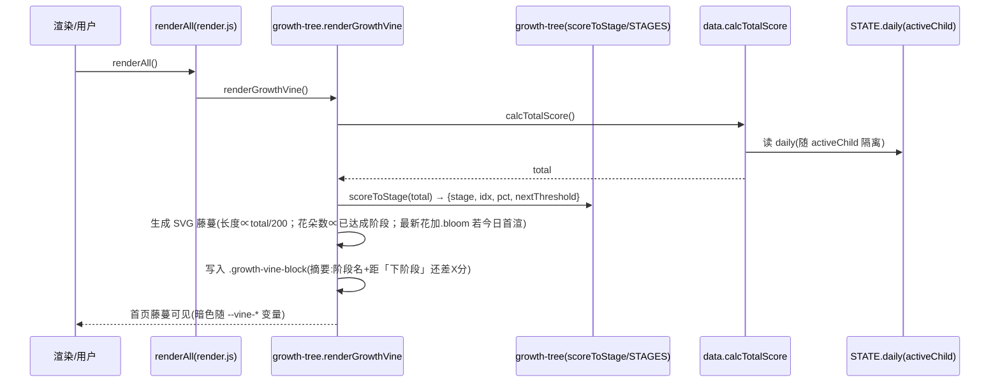
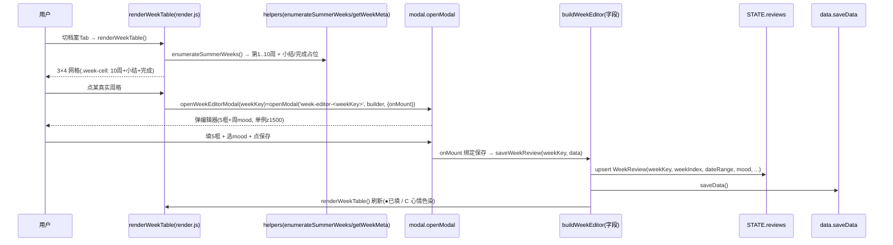
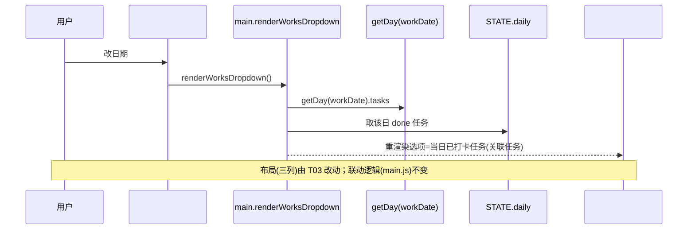
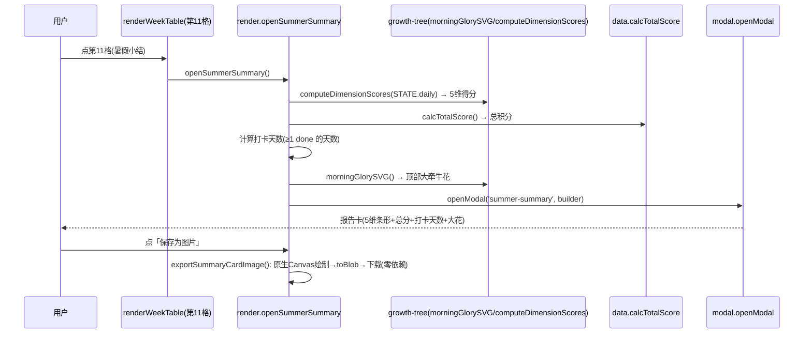
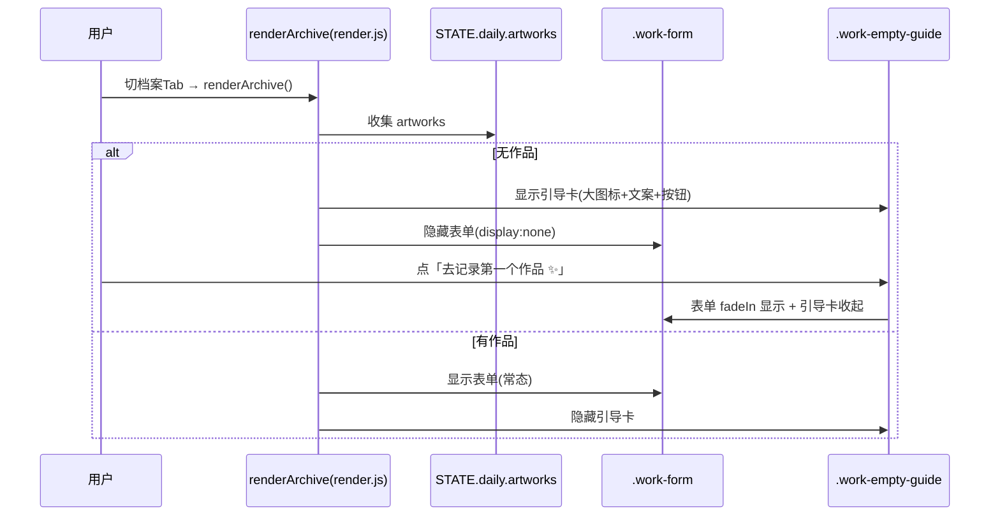
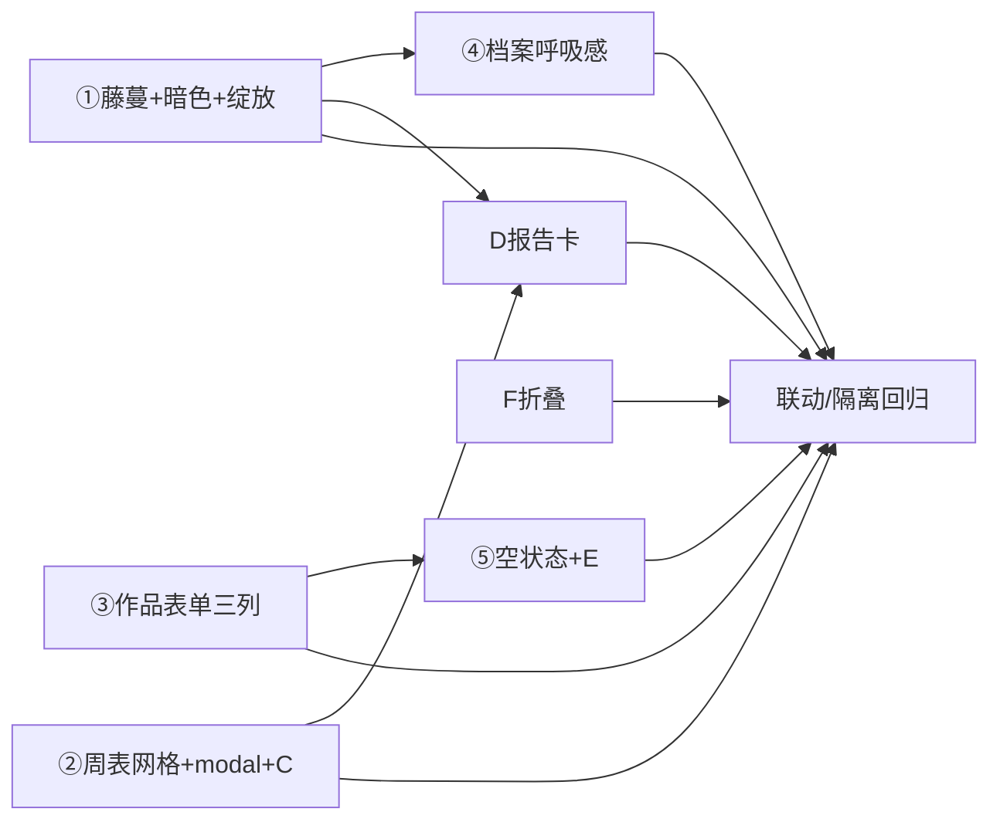

# 儿童暑期成长银行 PWA · UI 微调（UI-polish-2）增量架构设计与任务分解

> 文档类型：架构师交付（高见远 / Gao）｜适用 PRD：`docs/prd-ui-polish-2.md`（增量，①–⑤ + A–G 全部拍板）
> 技术栈：**原生 HTML + CSS + JS（ES Module 多文件，无框架）** + localStorage（STATE）+ IndexedDB（media）+ PWA
> 本轮边界：**纯 UI/体验增量微调**，复用既有能力，不改业务逻辑、不改 E 修复接线、零新依赖。
> 配套图：`docs/class-diagram-ui-polish-2.mermaid`、`docs/sequence-diagram-ui-polish-2.mermaid`

---

## 1. 实现方案 + 框架选型

**框架选型结论**：维持纯前端 ESM，**不引入任何框架/库**。本轮所有新增可视化均为原生实现：

| 模块 | 实现策略 | 关键约束 |
|---|---|---|
| ① 首页藤蔓 | `features/growth-tree.js` 新增 `renderGrowthVine()`，输出**内联 SVG 牵牛花藤蔓**（横贯 `.growth-vine-block`，高 ≤160px）；藤蔓长度用 `stroke-dashoffset` 做"在爬"生长动画，花朵用 `transform:scale` 依次绽放 | 纯 SVG 矢量，**无位图/无外部依赖**；三色取自 CSS 变量 |
| A 藤蔓暗色 | 在 `:root` 及 5 个 `body[data-theme=...]` 块定义 `--vine-stem/--vine-leaf/--vine-flower`；在 `@media (prefers-color-scheme: dark)` 内提亮这三色 | 随 `applyTheme()` 切换自动更新；暗色下花朵蓝紫提亮可见 |
| B 每日绽放 | 模块级 `_vineBloomedToday` 标记，当天首次 `renderGrowthVine()` 给最新一朵花加 `.bloom` 触发 CSS `@keyframes vineBloom`（0.6s） | 纯 CSS，无 JS 动画库 |
| ② 周表 3×4 | `render.js` 的 `renderWeekTable()` 重写为 `grid-template-columns:repeat(3,1fr)` 的 12 格：10 真实周 + 第11格「暑假小结」+ 第12格「全部完成🎉」 | 复用 `enumerateSummerWeeks`/`getWeekMeta` |
| ② modal 编辑器 | 新增 `openWeekEditorModal(weekKey)` 包裹 `openModal('week-editor-<weekKey>', builder, {onMount})`；编辑器字段平移自 `buildWeekEditor` | 单例复用 `modal.js`；存储结构不变 |
| C 心情色染 | 周格背景按 `mood` 染淡色；已填叠加绿色描边 | 周 mood 仅 happy/neutral/sad |
| ③ 作品表单 | `index.html` 内 `.work-form` 改 `grid-template-columns:repeat(3,1fr)`；顺序 `workDate→workTask→workTitle`；`workNote` 满宽；上传+存入并排；≤640px 坍缩单列 | 字段 `id` 不变；`renderWorksDropdown` 联动保留 |
| ④ 档案呼吸感 | `index.html` 删 `#growthTree` 列（仅留徽章墙）；区块头加 `.sec-bar`（4px 竖条）+ 放大字号；区块间距 28–36px + 细线；圆角16 + 轻阴影 + hover；徽章墙 flex-wrap | 糖果色；已填绿描边/未填灰 |
| ⑤ 空状态引导卡 | `render.js` 的 `renderArchive()` 空分支渲染 `.work-empty-guide`（大图标+文案+按钮） | 原纯文本 `empty-state` 不再用于作品空态 |
| E 空状态交互 | 空态隐藏 `.work-form`、显示引导卡；点按钮表单 `fadeIn`、引导卡收起 | 表单 DOM 保持在列表上方（不改 DOM 顺序） |
| D 报告卡 | 新增 `openSummerSummary()`：经 `openModal('summer-summary')` 弹卡；5 维得分复用 `computeDimensionScores`；总分 `calcTotalScore()`；打卡天数自算；顶部大牵牛花用 `morningGlorySVG()`；「保存为图片」**原生 Canvas 手绘导出（零依赖）** | 不引 html2canvas |
| F 折叠 | 成长地图/趋势图卡片加 header + `.collapse-toggle`；默认地图展开、趋势收起；折叠态记忆（轻量 localStorage 偏好，不破坏 child 隔离） | 绑定放在 `render.js` 的 `renderMap`/`renderTrendChart`（**不碰 main.js 接线**） |

**不变清单（回归护栏）**：暑假日历、成长地图/趋势图渲染逻辑本体、PWA、`toggleTask` 计分、`saveData` 子快照解构、`openModal` 既有契约、`STATE.reviews` 周表数据结构（沿用 `WeekReview` 含独立 `mood`）、`main.js`/`runtime.js`/`parent-center.js` 中 bug E 修复的接线、既有 88 单测。

---

## 2. 文件列表及相对路径

> 说明：本项目 **CSS 全部内联于 `index.html` 的 `<style>` 区块**（无外部样式表）。凡涉及样式，均标注「修改 `index.html` 的 `<style>`」。

| 文件 | 动作 | 本轮职责 |
|---|---|---|
| `features/growth-tree.js` | **改** | 新增 `renderGrowthVine()`（SVG 藤蔓+生长+绽放+主题变量配色+摘要文案）、`morningGlorySVG(size)`（D 大牵牛花，供 D 复用）；新增模块级 `_vineBloomedToday` 绽放标记；复用既有 `scoreToStage`/`STAGES`/`computeDimensionScores`/`calcTotalScore` |
| `features/render.js` | **改** | ① `renderAll()` 中 `renderGrowthTree()` 调用 → `renderGrowthVine()`；② `renderWeekTable()` 重写 3×4 网格 + 新增 `openWeekEditorModal(weekKey)` 包裹 `openModal`；`buildWeekEditor()` 字段平移为 modal 内容；新增 `openSummerSummary()`（D，含原生 Canvas 导出）；④ 无（④ 全在 index.html）；⑤ `renderArchive()` 空分支渲染引导卡 + E 显隐切换；F `renderMap()`/`renderTrendChart()` 加折叠头与绑定 + 读偏好 |
| `index.html` | **改** | ① 日历 Tab「暑假日历」panel 后加 `.growth-vine-block`；删档案页 `#growthTree` 列；`<style>` 加 `--vine-*` 主题变量（`:root`+5 主题+暗色）+ `.growth-vine-block` + `@keyframes vineBloom`；② `#weekTable` 容器保留，`<style>` 加 `.week-grid`/`.week-cell`/`.week-cell.filled`/`.week-cell.mood-*`；③ `.work-form` 内部顺序与栅格 + ≤640px 媒体查询；④ 区块头 `.sec-bar`/`.sec-title--*`、`#growthTree` 列删除、`.badge-wall` flex-wrap、`.archive-section`/`.archive-card` 圆角/阴影/hover、间距细线；⑤ 新增 `.work-empty-guide` 容器/结构 + CSS；F 成长地图(#mapGrid)/趋势图(#trendChart) 容器加 header + `.collapse-toggle` + 折叠态 CSS |
| `features/modal.js` | **不改** | 复用 `openModal`/`closeModal` 单例（z1500） |
| `core/helpers.js` | **不改** | 复用 `enumerateSummerWeeks`/`getWeekMeta`/`getWeekKey` 等 |
| `core/data.js` | **不改** | 复用 `calcTotalScore`/`saveData`/`getDay`；`saveData` 子快照解构保持 child 隔离 |
| `core/state.js` | **不改** | `STATE` 单源真相 |
| `main.js` | **不改（E 接线保护）** | `renderWorksDropdown`（L363）+ `#workDate` change（L391）联动保留；仅布局变动不丢联动 |
| `features/runtime.js` / `features/parent-center.js` | **不改（E 接线保护）** | `applyTheme` 等保持原样 |

---

## 3. 数据结构和接口（类图 mermaid）

> 重点呈现**本轮新增/改动**的藤蔓渲染、周表网格、作品表单、空状态、报告卡、折叠模块，与既有 `render`/`modal`/`growth-tree` 的关系。既有 `WeekReview` 结构沿用（不扩展 mood 字段）。

```mermaid
classDiagram
  class AppState {
    +daily: object
    +reviews: WeekReview[]
    +activeChildId: string
  }
  class WeekReview {
    +weekKey: string
    +weekIndex: number
    +dateRange: string
    +best: string
    +hard: string
    +next: string
    +parent: string
    +support: string
    +mood: 'happy'|'neutral'|'sad'|''
  }
  class GrowthTreeModule {
    +STAGES: {name,threshold}[]
    +scoreToStage(total): {stage,idx,nextThreshold,pct}
    +computeDimensionScores(daily): Record~string,number~
    +morningGlorySVG(size): string
    +renderGrowthVine(): void
    -_vineBloomedToday: boolean
  }
  class WeekGridModule {
    +renderWeekTable(): void
    +openWeekEditorModal(weekKey): HTMLElement
    +buildWeekEditor(weekKey, rec): HTMLElement
    +saveWeekReview(weekKey, data): void
    +openSummerSummary(): HTMLElement
  }
  class EmptyStateModule {
    +renderArchive(): void
  }
  class CollapseModule {
    +renderMap(): void
    +renderTrendChart(): void
  }
  class ModalManager {
    -registry: Map~string,HTMLElement~
    +openModal(id, builder, opts): HTMLElement
    +closeModal(id): void
  }
  AppState "1" *-- "0..*" WeekReview : reviews
  GrowthTreeModule ..> AppState : 经 calcTotalScore 读 daily
  WeekGridModule ..> GrowthTreeModule : scoreToStage / STAGES / morningGlorySVG / computeDimensionScores
  WeekGridModule ..> ModalManager : openModal('week-editor-*'|'summer-summary')
  WeekGridModule ..> AppState : reviews / daily
  EmptyStateModule ..> AppState : daily[date].artworks
  EmptyStateModule ..> ModalManager : 否(仅显隐表单/引导卡)
  CollapseModule ..> ModalManager : 否(仅折叠 body)
  note for GrowthTreeModule "renderGrowthVine 输出到 .growth-vine-block(日历Tab)\n摘要=阶段名+距下阶段差X分"
  note for WeekGridModule "12格=10周+小结入口+完成装饰\n点击真实周格→openWeekEditorModal"
```

**关键接口签名（本轮新增/改动）**

```ts
// features/growth-tree.js（新增）
export function renderGrowthVine(): void;          // 读 calcTotalScore() → SVG 藤蔓 → 写入 .growth-vine-block
export function morningGlorySVG(size?: number): string; // 顶部大牵牛花 SVG（供 D 报告卡）

// features/render.js（新增/改动）
export function renderWeekTable(): void;           // 重写：3×4 网格（10周+小结+完成）
export function openWeekEditorModal(weekKey: string): HTMLElement | null; // 包裹 openModal('week-editor-<weekKey>')
export function openSummerSummary(): HTMLElement | null;                  // D：openModal('summer-summary') + Canvas 导出
export function renderArchive(): void;             // 改动：空分支渲染引导卡 + E 显隐
export function renderMap(): void;                 // 改动：加折叠头 + 绑定 + 读偏好
export function renderTrendChart(): void;          // 改动：加折叠头 + 绑定 + 读偏好
// 既有保留：buildWeekEditor(weekKey, rec) / saveWeekReview(weekKey, data)

// 折叠态偏好（非 child 隔离，普通 localStorage）
const COLLAPSE_PREF_KEY = 'sbg_ui_collapse';       // { map: boolean, trend: boolean }
```

---

## 4. 程序调用流程（时序图 mermaid）

### ① 首页藤蔓 render（读 activeChild 总积分 → scoreToStage → SVG 生成）



### ② 周表方块点击 → openModal(buildWeekEditor) → saveWeekReview（存储不变）



### ③ 作品表单日期 change → renderWorksDropdown 刷新关联任务



### ④ D 暑假小结报告卡（openSummerSummary + 原生 Canvas 导出）



### ⑤ E 空状态引导卡（renderArchive 空分支 + 显隐切换）



---

## 5. 任务列表（实现顺序 + 依赖，细到可直接照写）

> 分组遵循主理人建议：T01 藤蔓(①+A+B) → T02 周表方块(②+C) → T03 作品表单(③) → T04 档案呼吸感(④) → T05 空状态(⑤+E) → T06 报告卡(D) → T07 折叠(F) → T08 联动/隔离回归。
> 所有 CSS 落点均为「`index.html` 的 `<style>`」；源码改动仅限 `growth-tree.js` / `render.js` / `index.html`（不碰 main.js/runtime.js/parent-center.js 接线）。

### T01 〔①+A+B〕首页藤蔓长条（P0，无依赖）
- **文件**：`features/growth-tree.js`（改）、`index.html`（改）、`features/render.js`（改）
- **改什么**：
  - `growth-tree.js`：新增 `renderGrowthVine()`——null 安全读 `document.getElementById('growth-vine-block')`；`calcTotalScore()` → `scoreToStage(total)` 得 `{stage,idx,pct,nextThreshold}`；`TARGET=200`（=结果阈值）算 `progress=min(1,total/200)`；生成内联 SVG 藤蔓：一条波浪 `<path>`（id 供 `stroke-dashoffset` 动画）、沿路径按 `STAGES` 阈值放置花朵（`<g class="vine-flower">`，已达成阶段 `threshold<=total` 才"开"）；最新开放花在 `_vineBloomedToday===false` 时加 `.bloom` 并置 `_vineBloomedToday=true`；SVG 三色用 `var(--vine-stem/--vine-leaf/--vine-flower)`；摘要行复用 `tree-stage-label`/`tree-next` 文案（"🌱 {stage}" + 距下阶段差 X 分）。新增 `morningGlorySVG(size=120)` 返回顶部大牵牛花 SVG 字符串（供 T06）。
  - `index.html`：在 `#mtab-calendar` 的「暑假日历」panel（`#calGrid` 之后、成长地图 `#mapGrid` 之前）插入 `<div class="growth-vine-block" id="growth-vine-block"></div>`；删 `#mtab-archive` 内 `<div class="achievement-col">…<div id="growthTree">…</div></div>` 整列；`<style>` 加 `--vine-stem/--vine-leaf/--vine-flower`（`:root` 默认 + 5 个 `body[data-theme=...]` 各主题色 + `@media (prefers-color-scheme: dark)` 提亮三色）、`.growth-vine-block` 样式（高 ≤160px、横贯、overflow hidden）、`@keyframes vineBloom { from{transform:scale(0);opacity:0} to{transform:scale(1);opacity:1} }`、`.vine-flower.bloom{animation:vineBloom .6s ease-out}`、`.growth-vine-vine{stroke:var(--vine-stem);stroke-dasharray:…;stroke-dashoffset:…;transition:stroke-dashoffset .8s}` 等。
  - `render.js`：`renderAll()` 第 120 行 `renderGrowthTree();` 改为 `renderGrowthVine();`（`renderStreak`/`renderBadges` 保持）。
- **依赖**：无
- **优先级**：P0
- **测试要点**：`scoreToStage(0/20/50/100/200)` 边界正确；藤蔓长度/花朵数随 `total` 单调增长；暗色下 `--vine-*` 生效。

### T02 〔②+C〕周表 3×4 方块网格 + modal 编辑器 + 心情色染（P0，依赖：无；建议排 T01 后）
- **文件**：`features/render.js`（改）、`index.html`（改）
- **改什么**：
  - `render.js` 的 `renderWeekTable()`：容器 `#weekTable` 内生成 `grid-template-columns:repeat(3,1fr)`（窄屏 `@media(max-width:640px)` 降 2 列）的 12 格：前 10 格为 `enumerateSummerWeeks()` 真实周，每格 `.week-cell` 含「第N周(大字) + 日期范围(`getWeekMeta(wk).dateRange`) + 心情 emoji(有则显) + 状态点(●已填/○未填)」，已填按既有 `filled` 判定（任一字段或 mood 非空），背景按 `mood` 加 `.mood-happy/.mood-neutral/.mood-sad`（无 mood 不加）；第11格 `.week-cell.cell-summary`「🌞 暑假小结」可点 → `openSummerSummary()`；第12格 `.week-cell.cell-done`「✨ 全部完成 🎉」装饰（不可点）。
  - 新增 `openWeekEditorModal(weekKey)`：`openModal('week-editor-'+weekKey, () => weekEditorInnerHTML(weekKey, rec), { onMount(overlay){ 绑定 .mood-pick 三选一 + .week-save 点击→saveWeekReview(weekKey, data) } })`；`weekEditorInnerHTML` 复用 `buildWeekEditor` 的字段结构（best/hard/next/parent/support + 周 mood 三选一 + 保存按钮），样式套用既有 `.rev-field`/`.week-mood-pick`/`.mood-pick`。**原 `renderWeekTable` 内的内联 `toggleEditor`（insertAdjacentElement 展开）删除**，改走 `openWeekEditorModal`。`buildWeekEditor`/`saveWeekReview` 逻辑保留（字段/存储不变）。
  - `index.html` `<style>`：`.week-grid{display:grid;grid-template-columns:repeat(3,1fr);gap:10px}`、`@media(max-width:640px){.week-grid{grid-template-columns:repeat(2,1fr)}}`、`.week-cell{…圆角12/轻阴影/文字…}`、`.week-cell.filled{…绿色描边…}`、`.week-cell.mood-happy{background:暖黄淡色}`、`.week-cell.mood-neutral{background:淡青}`、`.week-cell.mood-sad{background:淡蓝}`、`.cell-summary/.cell-done{…装饰样式}`。
- **依赖**：无（复用既有 `openModal`/`enumerateSummerWeeks`/`getWeekMeta`/`buildWeekEditor`/`saveWeekReview`）
- **优先级**：P0
- **测试要点**：`renderWeekTable` 后 `.week-cell` 共 12 格（10 真实+小结+完成）；窄屏 2 列；周 mood 与每日 mood 隔离互不影响。

### T03 〔③〕作品表单三列自适应（P0，无依赖）
- **文件**：`index.html`（改）
- **改什么**：`.work-form` 内部子元素顺序改为 `#workDate → #workTask → #workTitle → #workNote（满宽）→ .upload-box + #saveWork（并排）`（当前为 `workTask→workDate→workTitle→workNote→upload-box→saveWork`）；`<style>` 将 `.work-form{display:grid;gap:10px}` 改为 `.work-form{grid-template-columns:repeat(3,1fr)}`，`#workNote{grid-column:1/-1}`（满宽），`.upload-box{grid-column:1/2}`、`#saveWork{grid-column:2/4;align-self:end}` 使上传与存入并排；新增 `@media(max-width:640px){ .work-form{grid-template-columns:1fr} #workNote,.upload-box,#saveWork{grid-column:auto} }` 坍缩单列。字段 `id` 全部不变。
- **依赖**：无（`renderWorksDropdown` 联动由 main.js 保留，不受影响）
- **优先级**：P0
- **测试要点**：改 `#workDate` 后 `#workTask` 选项刷新为当日打卡任务（联动保留）；窄屏单列。

### T04 〔④〕档案页视觉呼吸感（P1，依赖：T01）
- **文件**：`index.html`（改）
- **改什么**：承接 T01 已删除 `#growthTree` 列，「我的成就」仅剩 `#badgeWall`（可保留单列或 `.achievement-grid` 仅含徽章墙，居中收窄）；三区块标题加 `.sec-bar`（左侧 4px 圆角竖条）+ 放大字号，配色固定：成就=橙(`--orange` 或 `#ff9800`)、复盘=蓝(`--sky`)、作品=紫(`--purple`)；新增 `.archive-section`（区块间距 `margin:32px 0`、顶部细线 `border-top:1px solid rgba(...)`）、`.archive-card`（圆角16px + 轻阴影 + `:hover{transform:translateY(-2px)}`）；`.badge-wall{display:flex;flex-wrap:wrap;gap:10px}` 自适应（不再死板 5 列）；已填 `.week-cell.filled`/已解锁 `.badge-slot.unlocked` 加绿色描边+底色（T02 已加 week-cell，此处补 badge）；整体糖果色。
- **依赖**：T01（T01 已移除 `#growthTree` 列，本任务接管区块重排与配色）
- **优先级**：P1
- **测试要点**：三区块橙/蓝/紫分区头 + 4px 竖条；区块间距 28–36px + 细线；圆角16+轻阴影+hover；徽章墙 flex-wrap；仅徽章墙（无成长树）。

### T05 〔⑤+E〕作品空状态引导卡 + 交互（P1，依赖：T03）
- **文件**：`features/render.js`（改）、`index.html`（改）
- **改什么**：
  - `index.html`：`.works-layout` 内（表单上方）新增空状态容器 `<div class="work-empty-guide" id="workEmptyGuide" style="display:none"></div>`；`<style>` 加 `.work-empty-guide{…大图标+文案+按钮卡片…}`、`.work-form.fade-in{animation:…}`（淡入）。表单 DOM 顺序保持（`.work-form` 在 `#workArchive` 列表上方，不改）。
  - `render.js` 的 `renderArchive()`：空分支（当前 `all.length===0` 的 `empty-state` 文本）改为——`#workEmptyGuide` 渲染引导卡（🎨/🌱 大图标 + 文案"还没有作品呢～暑假的每一份努力都值得收藏 ✨" + 按钮「去记录第一个作品 ✨」），并 `document.querySelector('.work-form').style.display='none'`、`#workDateNote` 隐藏、`#workEmptyGuide.style.display=''`；有作品时恢复 `.work-form` 显示、隐藏引导卡。引导卡按钮 `onclick`：`#workEmptyGuide` 收起 + `.work-form` `display=''` 并加 `.fade-in`。**注意**：引导卡仅替换作品空态，不可影响其它区块。
- **依赖**：T03（`.work-form` 结构与字段 `id` 已定，E 仅做显隐，不依赖 T03 内部顺序但需在表单存在后做）
- **优先级**：P1
- **测试要点**：空态显 `.work-empty-guide`（大图标+文案+按钮）；点按钮表单显、引导卡隐；表单在列表上方免滚动。

### T06 〔D〕暑假小结成长报告卡（P1，依赖：T01、T02）
- **文件**：`features/render.js`（改）、`features/growth-tree.js`（改，morningGlorySVG 已在 T01 新增）
- **改什么**：
  - `render.js` 新增 `openSummerSummary()`：`openModal('summer-summary', () => cardHTML, {})`。`cardHTML` 含：顶部 `morningGlorySVG(96)`；5 维得分行（`CATEGORIES` 顺序 学习力/运动力/自控力/探索力/实践力，值= `computeDimensionScores(STATE.daily)[c.title]`，条形 `width = min(100, score/maxScore*100)%` 其中 `maxScore=max(各维得分,1)`）；总积分 `calcTotalScore()`；打卡天数 = `Object.keys(STATE.daily).filter(ds => 该日有≥1 done 任务).length`；底部「保存为图片 📷」按钮（`data-save-img`）。
  - 同文件新增 `exportSummaryCardImage()`：建离屏 `<canvas>`（如 600×760），`ctx` 画背景（取 `--paper` 近似色或白底圆角矩形）、标题"成长报告卡"、5 维条形+数值、总分、打卡天数、顶部大牵牛花（将 `morningGlorySVG` 字符串转 `data:image/svg+xml` 的 `Image` → `drawImage`）；`canvas.toBlob(blob => 触发 <a download="成长报告卡.png">)`。**纯原生，不引第三方**。
  - `openWeekEditorModal` 的第11格（T02 已实现）点击即调 `openSummerSummary()`。
- **依赖**：T01（用 `morningGlorySVG`）、T02（第11格触发入口）
- **优先级**：P1
- **测试要点**：点小结格弹卡含 5 维+总分+打卡天数+大花+保存为图片（原生 Canvas 导出，零依赖）。

### T07 〔F〕成长地图 / 积分趋势 折叠（P1，无依赖；建议排 T02/T05 之后）
- **文件**：`index.html`（改）、`features/render.js`（改）
- **改什么**：
  - `index.html`：成长地图（`#mapGrid` 外层 div）与趋势图（`#trendChart` 外层 div）各加 header：`<div class="collapse-head"><span>🗺 成长地图</span><button class="collapse-toggle" data-collapse="map">⌄</button></div>` + body 包裹（`#mapGrid` 包进 `.collapse-body`）；趋势图同理 `data-collapse="trend"`。`<style>` 加 `.collapse-head{display:flex;justify-content:space-between;align-items:center;cursor:pointer}`、`.collapse-toggle{…箭头旋转}`、`.collapse-body.collapsed{display:none}`。
  - `render.js` 的 `renderMap()`/`renderTrendChart()`：构建后给 `.collapse-toggle` 绑 `click` 切换对应 `.collapse-body.collapsed` 并写回偏好 `localStorage[COLLAPSE_PREF_KEY]`（结构 `{map:false, trend:true}`，默认 map 展开、trend 收起）；渲染开始时读偏好设置初始折叠态（保证重渲染后状态稳定）。**绑定放 render.js，不碰 main.js 接线**。
- **依赖**：无（独立于其它任务；偏好 key 不进 child 快照，不破坏隔离）
- **优先级**：P1
- **测试要点**：两卡右上角箭头；默认地图展开、趋势收起；折叠态记忆（刷新/切 Tab 后保持）。

### T08 〔联动/隔离回归〕（P1/P2，依赖：T01–T07 全部完成）
- **文件**：无新增源码（验证/集成任务）
- **改什么**：跨任务回归核对——① 作品表单 `#workDate` 改后 `#workTask` 仍联动刷新（T03 布局 + main.js 不变）；② 切 `activeChild` 后 `renderGrowthVine()` 按新 child 的 `calcTotalScore()` 重绘、无残留（T01）；③ 周 `mood` 与每日 `daily[date].mood` 隔离互不影响（T02）；④ 既有 88 单测全绿、无因重构回归；⑤ D 报告卡 Canvas 导出在当前浏览器可用；⑥ F 折叠偏好跨重渲染稳定。
- **依赖**：T01、T02、T03、T04、T05、T06、T07
- **优先级**：P1（验收必需）
- **测试要点**：见上；由 QA 按 PRD §6.2 的 G 要点严过关。

---

## 6. 依赖包列表

- **本轮不引入任何新依赖**（运行时零三方库，符合"无框架"约束）。
- D「保存为图片」用**原生 Canvas 2D**（`canvas.toBlob`/`drawImage`/SVG-dataURL `Image`）手绘，不引入 html2canvas 等。
- 藤蔓/大花用**内联 SVG + CSS 变量 + CSS 动画**，不引入位图或动画库。
- 既有开发依赖（不动）：`vitest`（测试）、`jsdom`（测试环境）。
- 运行时零三方库。

---

## 7. 共享约定（跨文件）

1. **藤蔓主题变量命名**：`--vine-stem`（藤深绿）、`--vine-leaf`（叶亮绿）、`--vine-flower`（花蓝紫）。在以下位置统一定义：
   - `:root`（默认/樱花粉基准值）；
   - 每个 `body[data-theme="sakura|ocean|forest|sunset|starry"]` 块（按主题微调三色，使藤蔓随 `applyTheme()` 切换）；
   - `@media (prefers-color-scheme: dark)` 内**提亮**这三色（尤其 `--vine-flower` 蓝紫提亮），保证暗色下可见。
   - SVG 内一律 `stroke="var(--vine-stem)"` / `fill="var(--vine-leaf)"` / `fill="var(--vine-flower)"`，**不得写死十六进制**（否则暗色看不见）。
2. **`openModal` 规范**（复用 `features/modal.js`）：`openModal(id, builder, {onMount, onClose})`；overlay z-index **1500**；单例注册表（同 id 已存在返回 null，不叠加）；关闭三要素（`[data-modal-close]` 按钮 / 遮罩点击 `e.target===overlay` / Esc）。周编辑器 id=`week-editor-<weekKey>`、报告卡 id=`summer-summary`。
3. **storage key 约定**：
   - 子快照：`summerGrowthBankV2_child_<id>`（`saveData` 解构 `children/childName/childGender/theme/activeChildId/parentPasswordHash/customRewards` 后写入，**多孩子隔离天然**）；
   - 主数据：`summerGrowthBankV2`（含元信息，单一真相源）；
   - 折叠偏好（**非 child 隔离**，普通 localStorage）：`sbg_ui_collapse` = `{ map:boolean, trend:boolean }`。
4. **多孩子隔离（不可破坏）**：藤蔓/周表/作品均按 `STATE`（=当前 activeChild 快照）渲染；`renderAll()` 在切 child 后会重算 → 藤蔓即时重绘、无残留（因每次 `innerHTML` 整体重建）。任何新增 UI **只读 STATE，不新增持久化字段**到 child 快照（F 偏好除外，且不进快照）。
5. **周 mood 三态枚举**：`WeekReview.mood` 仅 `'happy' | 'neutral' | 'sad' | ''`，与每日 `daily[date].mood` 虽同名但**不同对象、互不影响、不扩字段**（PRD 已修正原"😡"笔误：映射为 暖黄(😊)/淡青(😐)/淡蓝(😢)/灰(无)）。
6. **阶段模型复用**：藤蔓进度沿用 `STAGES`（种子0/发芽20/幼苗50/开花100/结果200）与 `scoreToStage(total)`，不改语义；`TARGET=200` 作藤蔓满长基准。
7. **不动清单**：暑假日历、成长地图/趋势图渲染本体、PWA、`toggleTask` 计分、`saveData` 子快照解构、`STATE.reviews` 结构、`openModal` 契约、`main.js`/`runtime.js`/`parent-center.js` 中 bug E 修复的接线、既有 88 单测。

---

## 8. 待明确事项

**无。** 本轮方案（①–⑤ + A–G）已由 PM/主理人全部拍板（回合数=0），各条目技术约束（SVG 矢量藤蔓、阶段阈值沿用 `scoreToStage`、周 mood 独立、表单 `id` 不变、`openModal` 复用、零新依赖、暗色走 CSS 变量）均已明确，无遗留歧义需升级。

> 唯一非阻塞提示（已在 PRD 标注，非待确认）：周 mood 实际仅三态，"😡淡红"为需求笔误，已按三态映射，不扩 `WeekReview.mood` 字段（与"存储结构不变"一致）。

---

## 附：任务依赖图（Mermaid）



---

## 给主理人的两点强调

- **实现顺序**：`T01 → T02 → T03 → T04 → T05 → T06 → T07 → T08`（T02/T03/T07 可并行于 T01 之后；T04 依赖 T01 删除 `#growthTree` 列；T05 依赖 T03 表单结构；T06 依赖 T01 的 `morningGlorySVG` 与 T02 的第11格入口；T08 为最终回归）。
- **最大风险点**：**T06〔D〕报告卡的原生 Canvas 导出**——需确保 SVG→`Image`→`drawImage` 在目标浏览器（含 iOS Safari）可用，且 `toBlob` 触发下载不被 PWA 弹窗拦截；落地后务必真机/浏览器实测「保存为图片」。其次要风险：**T01 暗色适配**——务必在 `@media (prefers-color-scheme: dark)` 下肉眼确认藤蔓三色（尤其花朵蓝紫）清晰可见，且 SVG 不得写死颜色。其余任务均为既有函数/结构的平移与样式调整，风险低。
