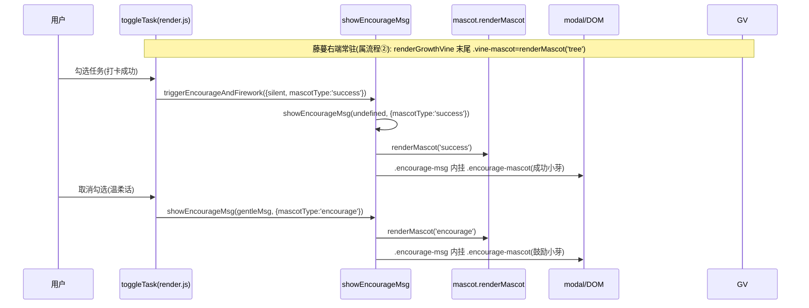
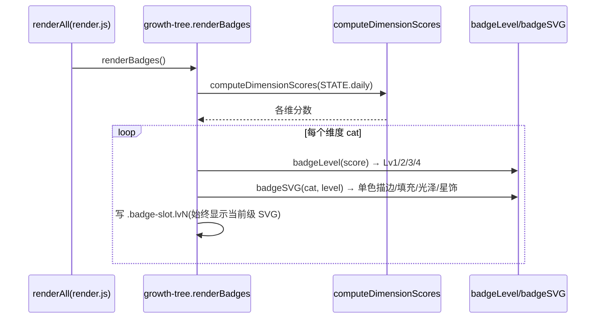
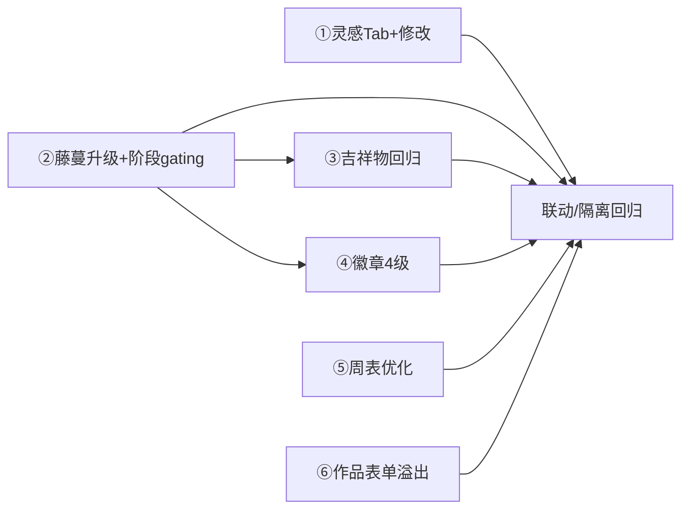

# 儿童暑期成长银行 PWA · UI 打磨（UI-polish-3）增量架构设计与任务分解

> 文档类型：架构师交付（高见远 / Bob）｜适用 PRD：`docs/prd-ui-polish-3.md`（增量，①–⑥ 全拍板）
> 技术栈：**原生 HTML + CSS + JS（ES Module 多文件，无框架）** + localStorage（STATE）+ IndexedDB（media）+ PWA
> 本轮边界：**纯 UI/体验增量打磨**，复用既有能力，不改业务逻辑、不动 bug-E 接线、零新依赖。
> 配套图：`docs/class-diagram-ui-polish-3.mermaid`、`docs/sequence-diagram-ui-polish-3.mermaid`
> 现状代码已精读：`index.html` / `features/render.js` / `features/ideas.js` / `features/mascot.js` / `features/growth-tree.js` / `features/modal.js` / `core/helpers.js` / `core/state.js` / `core/data.js`

---

## Part A：系统设计与接口

### 1. 实现方案 + 框架选型

**框架选型结论**：维持纯前端 ESM，**不引入任何框架/库**。本轮所有新增可视化均为原生实现（与 UI-polish-2 一致）：

| 模块 | 实现策略 | 关键约束 / 复用 |
|---|---|---|
| ① 灵感五维 Tab + 修改 | `ideas.js`：弹窗顶部 6 胶囊 Tab（全部/五维），点 Tab 就地过滤列表；「仅参考」→「修改」按钮；`openIdeaEditModal` 复用 `openModal` 单例编辑 title/pts（cat 只读冻结）；自定义覆盖存 `summerGrowthBankV2.customIdeas`（全局，与 `customRewards` 同模式，不进 child 快照） | 复用 `openModal`/`IDEA_LIBRARY`/`findIdeaById`/`ideaIdOf`；不改默认库、不改 `addIdeaAsTask` 的 hash 逻辑 |
| ② 藤蔓视觉升级 + 严格阶段开花 | `growth-tree.js`：`renderGrowthVine` 茎改**贝塞尔曲线**、`vineLeaf` 改**心形/卵形锯齿叶**、`vineFlower` 改**喇叭漏斗花**、新增 `vineBud`(半开花苞)/`vineSeed`(种子)/`vineTendril`(卷须)/渐变 `<defs>`（唯一 ID，避免与 `morningGlorySVG` 冲突）；按 `scoreToStage` 的 `info.idx` **严格 gating**（种子无花无叶→发芽仅2小叶→长叶多叶+花苞→开花盛花→繁茂满屏+新苞）；`STAGES` 仅改显示名（幼苗→长叶、结果→繁茂，阈值 0/20/50/100/200 不变） | 复用 `scoreToStage`/`STAGES`/`calcTotalScore`；**三色走 `--vine-*` 变量**（沿用 polish-2 暗色适配） |
| ③ 吉祥物回归 | `renderGrowthVine` 末尾追加 `.vine-mascot` 容器挂 `renderMascot('tree',{size:48})`；`render.js` `showEncourageMsg` 按 `opts.mascotType` 挂 `renderMascot('success')`/`renderMascot('encourage')`；`toggleTask` 成功路径传 `mascotType:'success'`、温柔(uncheck)路径传 `mascotType:'encourage'` | `mascot.js` 内部逻辑**不动**，仅补挂载调用；成功/鼓励放置位已存在（`PLACEMENTS` 已有 success/encourage） |
| ④ 徽章墙 4 级 | `growth-tree.js`：`renderBadges` 调 `computeDimensionScores` → `badgeLevel(score)`(0–9/10–24/25–49/50+ → Lv1–Lv4) → `badgeSVG(cat,level)`（5 维共用奖牌 motif，按级：单色描边→填充→光泽渐变→星饰光晕）；替换原 🔒/icon 二元 | 复用 `computeDimensionScores`/`CATEGORIES`；配色走新增 `--badge-*` CSS 变量（暗色可见） |
| ⑤ 周表方块优化 | `render.js` `renderWeekTable`：单元高度减半、周次+日期挤一行、下方大图 mood emoji、`isFutureWeek` 灰禁点不绑编辑器、小结格加「📅 截至 {今日}」 | 复用 `enumerateSummerWeeks`/`getWeekMeta`/`getWeekKey`/`openWeekEditorModal` |
| ⑥ 作品表单横屏溢出 | `index.html` `.work-form` 第一排 `grid-template-columns:auto 1fr 1fr`；`.work-form-actions`（新增包裹 `.upload-box`+`#saveWork`）`display:flex;flex-wrap:wrap` 防溢出；`#workNote` 满宽；≤640px 仍单列 | 字段 `id` 全部不变；`main.js` `renderWorksDropdown`/`#workDate` change 联动保留 |

**不变清单（回归护栏）**：`main.js` / `runtime.js` / `parent-center.js` 中 bug-E 修复接线（已确认 `parent-center.js:10` 的 `from './runtime.js'` 不动）；`openModal` 单例契约（z1500、关闭三要素）；`STATE.reviews` 周表结构；周 mood 三态；`morningGlorySVG`/`openSummerSummary`/`exportSummaryCardImage` 等 polish-2 成果；`saveData` 子快照解构（customIdeas 走主数据全局，不入 child 快照）；既有 103 单测 + 29 E2E。

---

### 2. 文件列表及相对路径

> 说明：本项目 **CSS 全部内联于 `index.html` 的 `<style>` 区块**。凡样式改动，均标注「修改 `index.html` 的 `<style>`」并给出落点锚点。

| 文件 | 动作 | 本轮职责 / 落点 |
|---|---|---|
| `features/ideas.js` | **改** | ① 弹窗加 6 胶囊 Tab（`IDEA_TABS` + 模块级 `_activeIdeaTab='全部'`）；列表「仅参考」→「修改」按钮；新增 `openIdeaEditModal`（复用 `openModal`）、`loadCustomIdeas`/`saveCustomIdea`/`resetCustomIdea`/`getIdeaView`；`customIdeas` 存主数据 `summerGrowthBankV2.customIdeas`（全局，不进 child 快照） |
| `features/growth-tree.js` | **改** | ② `renderGrowthVine` 改写（贝塞尔茎/`vineLeaf` 心形/`vineFlower` 喇叭/`vineBud`/`vineSeed`/`vineTendril`/渐变 defs/按 `info.idx` 阶段 gating/末尾 `.vine-mascot` 挂 `renderMascot('tree')`）；`STAGES` 改名（idx2 幼苗→长叶、idx4 结果→繁茂，阈值不变）；④ `renderBadges` 重写 + 新增 `badgeLevel`/`badgeSVG`；`morningGlorySVG` 不动 |
| `features/render.js` | **改** | ③ `showEncourageMsg` 按 `opts.mascotType` 挂 `renderMascot('success'|'encourage')`；`triggerEncourageAndFirework`/`toggleTask` 两路径传 `mascotType`；⑤ `renderWeekTable` 高度减半/周次+日期同行/大图 mood/`isFutureWeek` 灰禁点/小结格带今日日期 |
| `index.html` | **改** | `<style>` 落点：`.idea-cat-tabs`/`.idea-tab`（①）；`.growth-vine-block`/`.vine-flower`/新增 `.vine-bud`/`.vine-seed`/`.vine-tendril`/`.vine-mascot`（②③④）+ 渐变 `<defs>` 配色；`.badge-slot.lv1..lv4` + `--badge-*` 变量（④）；`.week-cell` 高度减半/`.week-cell.future`/`.week-mood` 放大（⑤）；`.work-form{grid-template-columns:auto 1fr 1fr}` + `.work-form-actions` flex-wrap（⑥）；`.encourage-mascot`（③）；DOM：`.work-form` 内 `.upload-box`+`#saveWork` 包进 `.work-form-actions`（⑥，id 不变） |
| `tests/growth-tree.test.js` | **改** | ② 同步阶段名断言：`'幼苗'`→`'长叶'`、`'结果'`→`'繁茂'`（scoreToStage(50)/(200)/(999)），保证 103 单测不回归 |
| `features/mascot.js` | **不改** | 仅被调用 `renderMascot('tree'|'success'|'encourage')`，内部 `PLACEMENTS`/SVG 逻辑不动 |
| `features/modal.js` | **不改** | 复用 `openModal`/`closeModal` 单例（z1500、关闭三要素） |
| `core/helpers.js` | **不改** | 复用 `CATEGORIES`/`enumerateSummerWeeks`/`getWeekMeta`/`getWeekKey`/`getTodayStr`/`esc` |
| `core/data.js` | **不改** | 复用 `calcTotalScore`/`getDay`/`saveData`；`saveData` 子快照解构保持 child 隔离 |
| `core/state.js` | **不改** | `STATE` 单源真相 |
| `main.js` / `features/runtime.js` / `features/parent-center.js` | **不改（bug-E 接线保护）** | 接线保持原样；⑥ 仅布局变动不丢 `#workDate`→`#workTask` 联动 |

**核心改动文件共 4 个**：`features/ideas.js`、`features/growth-tree.js`、`features/render.js`、`index.html`（另含 1 个测试文件 `tests/growth-tree.test.js` 同步改名）。

---

### 3. 数据结构和接口（类图 mermaid）

> 重点呈现**本轮新增/改动**的灵感 Tab+修改、藤蔓阶段 gating、吉祥物常驻+弹层、徽章 4 级、周表状态、作品表单，与既有 `render`/`modal`/`mascot`/`growth-tree` 的关系。完整类图见 `docs/class-diagram-ui-polish-3.mermaid`。

```mermaid
classDiagram
  class AppState {
    +daily: object
    +reviews: WeekReview[]
    +activeChildId: string
  }
  class WeekReview {
    +weekKey: string
    +weekIndex: number
    +dateRange: string
    +best/hard/next/parent/support: string
    +mood: 'happy'|'neutral'|'sad'|''
  }
  class IdeaModule {
    +IDEA_TABS: string[]
    -_activeIdeaTab: string
    -_customIdeas: object
    +renderIdeaLibrary(): void
    +openIdeaEditModal(id): HTMLElement
    +loadCustomIdeas(): object
    +saveCustomIdea(id, title, pts): void
    +resetCustomIdea(id): void
    +getIdeaView(idea): object
  }
  class GrowthTreeModule {
    +STAGES: {name, threshold}[]   %% idx2 长叶 / idx4 繁茂（改名）
    +scoreToStage(total): {stage, idx, nextThreshold, pct}
    +renderGrowthVine(): void        %% 贝塞尔/心形叶/喇叭花/卷须/阶段gating/.vine-mascot
    +renderBadges(): void            %% 4级 badgeLevel/badgeSVG
    +badgeLevel(score): number
    +badgeSVG(cat, level): string
    +morningGlorySVG(size): string
  }
  class WeekTableModule {
    +renderWeekTable(): void          %% 高度减半/周次+日期同行/大图mood/未来灰禁/小结带日期
    +openWeekEditorModal(weekKey): HTMLElement
  }
  class EncourageModule {
    +showEncourageMsg(msg, opts): void   %% opts.mascotType: 'success'|'encourage'
    +triggerEncourageAndFirework(opts): void
  }
  class MascotModule {
    +renderMascot(placement, opts): string  %% tree/success/encourage 不变
  }
  class ModalManager {
    -registry: Map~string,HTMLElement~
    +openModal(id, builder, opts): HTMLElement
    +closeModal(id): void
  }
  AppState "1" *-- "0..*" WeekReview : reviews
  IdeaModule ..> ModalManager : openModal('idea-library'|'idea-edit-<id>')
  IdeaModule ..> AppState : 读 daily(activeChild) + 写 customIdeas(主数据全局)
  GrowthTreeModule ..> AppState : calcTotalScore/daily(随 child 隔离)
  GrowthTreeModule ..> MascotModule : renderMascot('tree',{size:48})
  GrowthTreeModule ..> GrowthTreeModule : scoreToStage/STAGES/computeDimensionScores
  WeekTableModule ..> ModalManager : openModal('week-editor-<weekKey>')
  WeekTableModule ..> AppState : reviews / daily
  WeekTableModule ..> Helpers : enumerateSummerWeeks/getWeekMeta/getWeekKey
  EncourageModule ..> MascotModule : renderMascot('success'|'encourage')
  note for GrowthTreeModule "STAGES 改名: idx2 幼苗→长叶, idx4 结果→繁茂\n阈值 0/20/50/100/200 不变\n阶段gating: 发芽无花,长叶仅花苞,开花/繁茂盛花"
  note for IdeaModule "customIdeas 存 summerGrowthBankV2.customIdeas(全局)\n覆盖默认 title/pts, cat 冻结, 不进 child 快照"
```

**关键接口签名（本轮新增/改动）**

```ts
// ===== features/ideas.js（改 + 新增）=====
export function renderIdeaLibrary(): void;                 // 弹窗顶部 6 胶囊 Tab + 列表过滤 + 「修改」按钮
export function openIdeaEditModal(id: string): HTMLElement | null; // 复用 openModal('idea-edit-<id>')
export function loadCustomIdeas(): Record<string,{title:string,pts:number}>; // 读 summerGrowthBankV2.customIdeas
export function saveCustomIdea(id: string, title: string, pts: number): void; // 写覆盖
export function resetCustomIdea(id: string): void;         // 删覆盖 → 恢复默认
export function getIdeaView(idea: {id:string,title:string,pts:number,cat:string}): {id,title,pts,cat}; // 合并默认+自定义

// ===== features/growth-tree.js（改 + 新增）=====
export const STAGES: {name:string, threshold:number}[];    // 改名: 长叶/繁茂（阈值不变）
export function renderGrowthVine(): void;                  // 贝塞尔藤蔓 + 阶段 gating + .vine-mascot(树)
export function renderBadges(): void;                      // 4 级 SVG 徽章
export function badgeLevel(score: number): 1|2|3|4;        // 0–9/10–24/25–49/50+
export function badgeSVG(cat: string, level: 1|2|3|4): string; // 共用 motif 按级变复杂
// 既有保留: scoreToStage / computeDimensionScores / calcTotalScore / morningGlorySVG

// ===== features/render.js（改）=====
export function showEncourageMsg(customMsg?: string, opts?: {silent?:boolean, mascotType?:'success'|'encourage'}): void;
// 既有保留: renderWeekTable / openWeekEditorModal / triggerEncourageAndFirework

// ===== 共享约定（非 child 隔离，主数据全局）=====
// customIdeas 落点: localStorage['summerGrowthBankV2'].customIdeas
```

---

### 4. 程序调用流程（时序图 mermaid）

> 6 条核心流程（①②③④⑤⑥）。完整时序见 `docs/sequence-diagram-ui-polish-3.mermaid`（含 6 段 sequenceDiagram）。

**① 灵感 Tab 切换 → 过滤渲染；点「修改」→ openModal 编辑 → 写 customIdeas**

```mermaid
sequenceDiagram
  participant U as 用户
  participant IL as ideas.renderIdeaLibrary
  participant M as modal.openModal
  participant D as 主数据 customIdeas
  participant S as STATE.daily(activeChild)
  U->>IL: 点「🌟 任务灵感」
  IL->>M: openModal('idea-library', builder, {onMount})
  M-->>U: 弹层(顶部6胶囊Tab + 5维列表, 用 getIdeaView 显 title/pts)
  U->>IL: 点某 Tab(如「运动力」)
  IL->>IL: _activeIdeaTab='运动力'; 就地替换 .idea-list(仅显该维)
  U->>IL: 点某条「修改」
  IL->>M: openIdeaEditModal(id)=openModal('idea-edit-<id>', builder, {onMount})
  M-->>U: 编辑框(标题可改/分值可改/cat只读)
  U->>IL: 改完点「保存修改」
  IL->>D: saveCustomIdea(id, title, pts) → 写 summerGrowthBankV2.customIdeas[id]
  IL->>M: closeModal('idea-edit-<id>'); renderIdeaLibrary() 刷新
  U->>IL: 点「恢复默认」
  IL->>D: resetCustomIdea(id) → 删覆盖
  IL->>M: closeModal; renderIdeaLibrary() 回默认
```

**② 藤蔓 `renderGrowthVine` 按 `scoreToStage` 阶段严格 gating 控制花朵**

```mermaid
sequenceDiagram
  participant RA as renderAll(render.js)
  participant GV as growth-tree.renderGrowthVine
  participant GT as scoreToStage/STAGES
  participant D as calcTotalScore(STATE.daily)
  participant SC as state STATE(activeChild)
  RA->>GV: renderGrowthVine()
  GV->>D: calcTotalScore()
  D->>SC: 读 daily(随 activeChild 隔离)
  D-->>GV: total
  GV->>GT: scoreToStage(total) → {stage, idx, pct}
  alt idx=0 种子(0–19)
    GV->>GV: 仅 vineSeed(); 无茎/无叶/无花
  else idx=1 发芽(20–49)
    GV->>GV: 贝塞尔短茎 + 2 小葉(vineLeaf); 无花
  else idx=2 长叶(50–99)
    GV->>GV: 贝塞尔茎 + 多叶 + vineBud(半开花苞, 非盛花); 无盛花
  else idx=3 开花(100–199)
    GV->>GV: 茎繁茂 + vineFlower(喇叭盛花, 仅 milestone≥100)
  else idx=4 繁茂(200+)
    GV->>GV: 满屏 vineFlower + 持续冒 vineBud
  end
  GV->>GV: 末尾追加 .vine-mascot → renderMascot('tree',{size:48})
  GV->>GV: 写 .growth-vine-block(摘要: 阶段名 + 距下阶段差X分)
```

**③ 藤蔓右端常驻小芽 + 打卡成功/鼓励弹层挂吉祥物**



**④ 徽章 `renderBadges` 按 `computeDimensionScores` 分 4 级**



**⑤ 周表 `renderWeekTable` 未到周禁用 + 小结日期**

```mermaid
sequenceDiagram
  participant U as 用户
  participant WT as render.renderWeekTable
  participant H as helpers(enumerateSummerWeeks/getWeekMeta/getWeekKey)
  participant M as modal.openWeekEditorModal
  U->>WT: 切档案Tab → renderWeekTable()
  WT->>H: enumerateSummerWeeks() → 第1..10周
  WT->>H: todayKey = getWeekKey(getTodayStr())
  loop 每真实周
    WT->>WT: isFutureWeek = wk > todayKey ?
    alt 未来周
      WT->>WT: 加 .future(灰 + pointer-events:none + 无 cursor); 不绑 openWeekEditorModal
    else 已到/过去周
      WT->>WT: 周次+日期一行 + 大图 mood + 状态点; 绑点击→openWeekEditorModal(wk)
    end
  end
  WT->>WT: 小结格加「📅 截至 {getTodayStr()}」
  U->>WT: 点已到周格
  WT->>M: openWeekEditorModal(wk)
```

**⑥ 作品表单 `grid-template-columns:auto 1fr 1fr` 自适应不溢出**

```mermaid
sequenceDiagram
  participant U as 用户
  participant WF as .work-form(index.html)
  participant ACT as .work-form-actions(flex-wrap)
  participant WD as #workDate(change)
  participant RWD as main.renderWorksDropdown
  Note over WF: 第一排 grid-template-columns:auto 1fr 1fr(日期自适应/任务/作品名平分)
  Note over WF: #workNote grid-column:1/-1(满宽)
  Note over ACT: .upload-box + #saveWork 包进 .work-form-actions; display:flex;flex-wrap:wrap
  U->>WD: 改日期(375/1920/2560+ 均不溢出)
  WD->>RWD: renderWorksDropdown() → 刷新 #workTask 选项
  Note over WF: ≤640px 仍单列; 字段 id 不变
```

---

### 5. 待明确事项

**无。** 本轮方案（①–⑥）已全部拍板（回合数=0），各条目技术约束（胶囊 Tab 过滤、`openModal` 复用编辑框、`customIdeas` 存主数据全局、藤蔓 `scoreToStage` 阶段 gating、吉祥物仅补挂载不改内部、徽章 4 级 SVG 复用 `computeDimensionScores`、周表高度减半/未来周灰禁点/小结带日期、表单 `auto 1fr 1fr`）均已明确，无遗留歧义需升级。唯一需在落地时同步的**非歧义动作**：`tests/growth-tree.test.js` 中旧阶段名断言（`幼苗`/`结果`）必须同步改为 `长叶`/`繁茂`，否则既有单测会失败（已列入 T02 任务）。

---

## Part B：任务分解

### 6. 依赖包列表

- **本轮不引入任何新依赖**（运行时零三方库，符合"无框架"约束）。
- 藤蔓/牵牛花/徽章/吉祥物全部**内联 SVG + CSS 变量 + CSS 动画**，无位图、无动画库。
- 既有开发依赖（不动）：`vitest`（单测）、`jsdom`（测试环境）。运行时零三方库。
- 作品表单溢出修复纯 CSS Grid/Flex，无 JS 新增。

---

### 7. 任务列表（实现顺序 + 依赖，细到可直接照写）

> 分组遵循主理人建议：T01 灵感(①) → T02 藤蔓(②) → T03 吉祥物(③) → T04 徽章(④) → T05 周表(⑤) → T06 表单(⑥) → T07 联动/隔离回归。
> 所有 CSS 落点均为「`index.html` 的 `<style>`」；源码改动仅限 `ideas.js` / `growth-tree.js` / `render.js` / `index.html`（不碰 main.js/runtime.js/parent-center.js 接线）。

#### T01 〔①〕灵感五维胶囊 Tab + 可编辑（P0，无依赖）
- **文件**：`features/ideas.js`（改）、`index.html`（改 `<style>`）
- **改什么**：
  - `ideas.js`：
    - 新增模块级 `IDEA_TABS = ['全部','学习力','运动力','自控力','探索力','实践力']` 与 `_activeIdeaTab = '全部'`、`_customIdeas` 缓存。
    - `renderIdeaLibrary()` builder 顶部加 `<div class="idea-cat-tabs">` 渲染 6 个 `.idea-tab`（选中加 `active`）；列表仅渲染 `_activeIdeaTab==='全部' || cat===_activeIdeaTab` 的维度；每条用 `getIdeaView(idea)` 取 title/pts，「仅参考」按钮删除、改为「修改」按钮（`.idea-edit-btn`，`data-idea-id`）。
    - `onMount`：`idea-tab` 点击 → 更新 `_activeIdeaTab` 并**就地**重渲染 `.idea-list`（直接替换 `ov.querySelector('.idea-list').innerHTML`，不重开弹层，避免 `openModal` 同 id 单例不刷新）；`idea-edit-btn` 点击 → `openIdeaEditModal(id)`；`idea-set-btn` 逻辑保持。
    - 新增 `openIdeaEditModal(id)`：`openModal('idea-edit-<id>', () => 编辑框, {onMount})`；编辑框含 标题 input(`#ideaEditTitle`)、分值 number(`#ideaEditPts`)、分类 input(`value=idea.cat` `readonly disabled`)、「保存修改」(`#ideaEditSave`) + 「恢复默认」(`#ideaEditReset`)；保存→`saveCustomIdea(id,title,pts)`→`closeModal('idea-edit-<id>')`+`closeModal('idea-library')`+`renderIdeaLibrary()` 刷新；恢复→`resetCustomIdea(id)`→同样刷新。
    - 新增 `loadCustomIdeas()`（读 `localStorage['summerGrowthBankV2'].customIdeas`，带 `_customIdeas` 缓存）、`saveCustomIdea(id,title,pts)`（写回主数据）、`resetCustomIdea(id)`（删除覆盖）、`getIdeaView(idea)`（有覆盖返回 `{...idea,title,pts}`，否则返回默认；cat 取默认）。
  - `index.html` `<style>`：加 `.idea-cat-tabs{display:flex;gap:6px;flex-wrap:wrap;margin-bottom:12px}`、`.idea-tab{padding:6px 12px;border-radius:999px;font-size:12px;font-weight:800;color:#6d5c50;background:rgba(255,255,255,.8);border:1.5px solid rgba(var(--leaf-rgb),.18)}`、`.idea-tab.active{color:#fff;background:linear-gradient(90deg,var(--leaf),var(--rose));border-color:transparent}`；编辑框复用 `.modal-box`。
- **依赖**：无
- **优先级**：P0
- **测试要点**：弹窗顶部 6 胶囊 Tab（选中高亮/未选灰底）；点 Tab 过滤维度；「仅参考」消失、「修改」出现；保存写 `customIdeas[id]` 覆盖默认、`恢复默认` 清覆盖回默认；默认不被删；刷新后仍生效（存主数据全局）。

#### T02 〔②〕藤蔓视觉升级 + 严格阶段开花（P0，无依赖）
- **文件**：`features/growth-tree.js`（改）、`index.html`（改 `<style>`）、`tests/growth-tree.test.js`（改）
- **改什么**：
  - `growth-tree.js`：
    - `STAGES` 改名：`{name:'幼苗',threshold:50}`→`{name:'长叶',threshold:50}`；`{name:'结果',threshold:200}`→`{name:'繁茂',threshold:200}`；阈值 0/20/50/100/200 不变。
    - `renderGrowthVine()` 重写：
      - `vineStemPath` → 贝塞尔曲线（用 `C`/`Q` 命令，自然弯曲，非折线）。
      - `vineLeaf(x,y,dir,size)` → **心形/卵形带锯齿** SVG `<path>`（牵牛真叶形）。
      - `vineFlower(x,y,r,bloom)` → **喇叭漏斗形**（5 瓣漏斗 + 花心，非圆）。
      - 新增 `vineBud(x,y)`（半开花苞）、`vineSeed(x,y)`（种子图标，仅阶段0）、`vineTendril(x,y,dir)`（卷须螺旋）。
      - 新增渐变 `<defs>`（唯一 ID，如 `vineStemGrad`/`vineFlowerGrad`，避免与 `morningGlorySVG` 冲突）；茎/花心用 `url(#...)` 渐变。
      - **严格阶段 gating（关键修复）**：`info.idx` 分支——
        - idx 0 种子(0–19)：仅 `vineSeed`，无茎/无叶/无花/无苞；
        - idx 1 发芽(20–49)：贝塞尔短茎 + 2 小葉（`vineLeaf` 小尺寸），**无花无苞**；
        - idx 2 长叶(50–99)：贝塞尔茎 + 多叶 + **`vineBud` 花苞（半开，非盛花）**，无盛花；
        - idx 3 开花(100–199)：茎繁茂 + **`vineFlower` 盛花**（仅 `milestone>=100` 即阈值 100/200 且 `total>=th`）；
        - idx 4 繁茂(200+)：满屏 `vineFlower` + 持续冒 `vineBud` 新苞。
      - 摘要文案沿用 `tree-stage-label`/`tree-next`（"🌱 {stage}" + 距下阶段差 X 分），显示名与改名一致（长叶/繁茂）。
      - 末尾追加 `.vine-mascot` 容器（见 T03，本任务先预留 `<div class="vine-mascot">${renderMascot('tree',{size:48})}</div>`，也可在 T03 补，但建议本任务一并输出避免二次改 `innerHTML`）。
    - `morningGlorySVG` 不动。
  - `index.html` `<style>`：`.growth-vine-block`/`.growth-vine-svg`/`.growth-vine-stem` 微调；新增 `.vine-bud`/`.vine-seed`/`.vine-tendril` 样式与半开 `bloom` 动画；确保茎/花心渐变在暗色（`--vine-*` 变量）下可见。
  - `tests/growth-tree.test.js`：**同步阶段名断言**——`scoreToStage(50)` 期望 `stage:'长叶'`、`scoreToStage(200)` 与 `scoreToStage(999)` 期望 `stage:'繁茂'`（原 `幼苗`/`结果`）。
- **依赖**：无
- **优先级**：P0
- **测试要点**：茎为贝塞尔曲线、叶为心形、花为喇叭、有卷须、茎/花心渐变；纯 SVG 无位图；暗色 `--vine-*` 可见；**按 idx 严格 gating**——发芽无花、长叶仅花苞、开花/繁茂盛花；`STAGES` 改名后单测仍绿。

#### T03 〔③〕吉祥物回归（常驻 + 两弹层）（P0，依赖 T02）
- **文件**：`features/growth-tree.js`（改，vine 右端；依赖 T02 的 `renderGrowthVine` 重写）、`features/render.js`（改，`showEncourageMsg`）、`index.html`（改 `<style>`）
- **改什么**：
  - `growth-tree.js` `renderGrowthVine` 末尾（与 T02 同一次改写）：在 `.growth-vine-block` 内 SVG 之后追加 `<div class="vine-mascot">${renderMascot('tree',{size:48})}</div>`（随阶段微表情/姿态变化由 `mascot.js` 既有 `tree` placement 决定，本任务不改 mascot 内部）。
  - `render.js`：
    - `showEncourageMsg(customMsg, opts)` 扩展 `opts.mascotType`：`'success'`→`renderMascot('success')`、`'encourage'`→`renderMascot('encourage')`，挂到 `.encourage-msg` 内的 `.encourage-mascot`；`mascotType` 缺省（如「请先设置宝贝信息」）不挂。
    - `triggerEncourageAndFirework(opts)` 透传 `opts`（含 `mascotType`）给 `showEncourageMsg`。
    - `toggleTask` 成功路径：`triggerEncourageAndFirework(played ? { silent:true, mascotType:'success' } : { mascotType:'success' })`；温柔(uncheck)路径：`showEncourageMsg(pickGentleMessage('uncheck',{streak}), { mascotType:'encourage' })`。
  - `mascot.js` **不改**（仅调用）。
  - `index.html` `<style>`：加 `.vine-mascot{display:flex;justify-content:flex-end;margin-top:4px}`（右端定位）；`.encourage-mascot{display:block;margin:0 auto 8px}`（弹层内定位，置于文案上方）。
- **依赖**：T02（vine 右端 mascot 在 `renderGrowthVine` 内，T02 已重写该函数；render.js `showEncourageMsg` 部分独立于 T02 可并行）
- **优先级**：P0
- **测试要点**：首页藤蔓右端常驻小芽（随阶段微变化）；打卡成功弹层有 `success` 吉祥物、鼓励弹层有 `encourage` 吉祥物；`mascot.js` 内部逻辑未改。

#### T04 〔④〕徽章墙 4 级（P0，依赖 T02 文件排序）
- **文件**：`features/growth-tree.js`（改，`renderBadges`+`badgeLevel`+`badgeSVG`）、`index.html`（改 `<style>`）
- **改什么**：
  - `growth-tree.js`：
    - 新增 `badgeLevel(score)`：阈值 `0–9→Lv1`、`10–24→Lv2`、`25–49→Lv3`、`50+→Lv4`（默认阈值，可据实测微调不影响方案）。
    - 新增 `badgeSVG(cat, level)`：5 维共用奖牌/星 motif；Lv1 单色描边（无填充、灰）、Lv2 填充 `var(--badge-<cat>)`、Lv3 填充 + 光泽渐变（高光椭圆）、Lv4 填充 + 星饰 + 外圈光晕；颜色走 CSS 变量（暗色可见）。
    - `renderBadges()` 重写：复用 `computeDimensionScores(STATE.daily)` → 每维 `level=badgeLevel(s)` → `badgeSVG(cat,level)`；输出 `<div class="badge-slot lv${level} ...">`（保留 `unlocked` 类当 level>=2 以兼容既有 glow 样式），显示当前级 SVG + 维度名 + `${s}分`（不再用 🔒 二元）；`badge-slot` 始终显示当前级。
    - `BADGE_THRESHOLD`/`isBadgeUnlocked` 保留不动（不影响）。
  - `index.html` `<style>`：`:root` 加 5 个维度色变量 `--badge-learning:#4c88b8; --badge-physical:#2f947f; --badge-discipline:#e7ac2c; --badge-exploration:#7e57c2; --badge-practice:#ef8f72;`（暗色 `@media` 可微调提亮）；`.badge-slot.lv1`(描边/灰) / `.lv2`(填充) / `.lv3`(光泽) / `.lv4`(星饰光晕) 视觉；保留 `.badge-slot` 基础与 `.badge-wall` flex-wrap。
- **依赖**：T02（同文件 `growth-tree.js`，建议 T02 藤蔓改写完成后再改 `renderBadges` 以避免同文件编辑冲突；二者函数独立）
- **优先级**：P0
- **测试要点**：每维 4 级 SVG（描边→填充→光泽→星饰）；按各维积分定级；复用 `computeDimensionScores`；不再 🔒 二元；暗色下 `--badge-*` 可见。

#### T05 〔⑤〕周表方块优化（P0，无依赖）
- **文件**：`features/render.js`（改，`renderWeekTable`）、`index.html`（改 `<style>`）
- **改什么**：
  - `render.js` `renderWeekTable()`：除 `.week-cell` 模板——周次+日期合并一行（如 `第1周 6/29–7/5`，用 `meta.weekIndex` + `meta.dateRange`）；下方 `.week-mood` 放大 emoji；`isFutureWeek = wk > getWeekKey(getTodayStr())` → 加 `.future` 类且**不绑** `openWeekEditorModal`、无 `cursor:pointer`；小结格（第11格）文案加「📅 截至 {getTodayStr()}」；`moodMap`/`filled` 判定保持；窄屏 `@media(max-width:640px)` 仍 2 列（沿用 polish-2）。
  - `index.html` `<style>`：`.week-cell{ min-height:~48px }`（原 84→约 48，减半）；`.week-cell.future{ background:rgba(0,0,0,.06); pointer-events:none; cursor:default }`（灰 + 不可点）；`.week-mood{ font-size:28–32px; min-height:28px }`（大图）；`.week-cell-top` 一行容纳周次+日期；窄屏 `@media(max-width:640px){ .week-grid{grid-template-columns:repeat(2,1fr)} }` 保留。
- **依赖**：无
- **优先级**：P0
- **测试要点**：单元高度减半；周次+日期同行；心情大图；未来周灰+不可点；小结格带当前日期；窄屏 2 列不变；周 mood 与每日 mood 隔离。

#### T06 〔⑥〕作品表单横屏溢出修复（P0，无依赖）
- **文件**：`index.html`（改 `<style>` + DOM 包裹）
- **改什么**：
  - `index.html` `<style>`：`.work-form{grid-template-columns:auto 1fr 1fr}`（日期 `#workDate` 自适应宽、关联任务 `#workTask` 与作品名 `#workTitle` 各 1fr 平分剩余）；`#workNote{grid-column:1/-1}`（满宽不变）；新增 `.work-form-actions{display:flex;flex-wrap:wrap;gap:10px;grid-column:1/-1}` 包裹 `.upload-box`(`flex:1 1 220px`) 与 `#saveWork`(`flex:1 1 140px`)，用 `flex-wrap` 防 2560+ 溢出；`@media(max-width:640px){ .work-form{grid-template-columns:1fr} #workNote,.work-form-actions{grid-column:auto} .work-form-actions{flex-direction:column} }` 仍单列。
  - `index.html` DOM：`.work-form` 内把 `.upload-box` 与 `#saveWork` 两个元素包进新增 `<div class="work-form-actions">`（**字段 `id` 全部不变**：`#workDate`/`#workTask`/`#workTitle`/`#workNote`/`#saveWork`/`#workMedia` 保持），`main.js` 的 `renderWorksDropdown`/`#workDate` change 联动不受影响。
- **依赖**：无（`renderWorksDropdown` 联动由 main.js 保留，不受影响）
- **优先级**：P0
- **测试要点**：375px/1920px/2560+ 三档均不横向溢出；窄屏单列；字段 `id` 不变、改 `#workDate` 后 `#workTask` 选项刷新联动保留。

#### T07 〔联动/隔离回归〕（P1，依赖 T01–T06 全部完成）
- **文件**：无新增源码（验证/集成任务）
- **改什么**：跨任务回归核对——
  1. ① 灵感 Tab 过滤 + 修改写 `customIdeas` 刷新后生效（T01）；默认灵感不被删、`恢复默认` 回默认。
  2. ② 藤蔓按 `scoreToStage` 阶段严格 gating（发芽无花、长叶仅花苞、开花/繁茂盛花），`STAGES` 显示名 `长叶`/`繁茂`，单测 `growth-tree.test.js` 改名后全绿。
  3. ③ 藤蔓右端常驻小芽、成功/鼓励弹层吉祥物出现；`mascot.js` 内部未改。
  4. ④ 徽章 4 级 SVG 按各维积分定级，暗色 `--badge-*` 可见。
  5. ⑤ 周表未来周灰禁点、小结格带今日日期、高度减半。
  6. ⑥ 作品表单三档屏宽不溢出、联动保留。
  7. **多孩子隔离**：切 `activeChild` 后 `renderGrowthVine`/`renderBadges`/`renderWeekTable`/作品按新 child `calcTotalScore`/快照重绘，无残留；`customIdeas` 为全局主数据偏好（不随 child 变），灵感自定义全局生效。
  8. 既有 **103 单测 + 29 E2E 全绿**（不可因重构回归）。
- **依赖**：T01、T02、T03、T04、T05、T06
- **优先级**：P1（验收必需）
- **测试要点**：见上；由 QA 按 PRD §6 严过关。

---

### 8. 共享知识（跨文件约定）

1. **`openModal` 契约**（复用 `features/modal.js`）：`openModal(id, builder, {onMount, onClose})`；overlay z-index **1500**；单例注册表（同 id 已存在返回 null，不叠加）；关闭三要素（`[data-modal-close]` 按钮 / 遮罩点击 `e.target===overlay` / Esc）。本轮新增 id：`idea-edit-<id>`（灵感修改框）；既有 `idea-library`/`week-editor-<weekKey>`/`summer-summary` 不变。注意：弹层内**就地刷新列表**用直接 DOM 替换（勿重复 `openModal` 同 id，否则单例不刷新）。
2. **storage key 约定**：
   - 主数据：`summerGrowthBankV2`（含元信息 + `customRewards` + **`customIdeas`（本轮新增，全局）**），单一真相源；
   - 子快照：`summerGrowthBankV2_child_<id>`（`saveData` 解构 `children/childName/childGender/theme/activeChildId/parentPasswordHash/customRewards` 后写入，**多孩子隔离天然**）；
   - **`customIdeas` 走主数据全局、不进 child 快照**（与 `customRewards` 一致）：读写经 `localStorage['summerGrowthBankV2'].customIdeas`，因 `saveData` 读取既有主数据再写回，`customIdeas` 不会被 `saveData` 冲掉。
3. **多孩子隔离（不可破坏）**：藤蔓/徽章/周表/作品均按 `STATE`（=当前 activeChild 快照）渲染；`renderAll()` 切 child 后整体重算 → 即时重绘、无残留（每次 `innerHTML` 重建）。灵感 `customIdeas` 为全局偏好，**不随 child 切换变化**（所有孩子共享同一份灵感自定义）。
4. **周 mood 三态枚举**：`WeekReview.mood` 仅 `'happy' | 'neutral' | 'sad' | ''`，与每日 `daily[date].mood` 同名但**不同对象、互不影响、不扩字段**。
5. **藤蔓阶段模型 + 配色变量**：藤蔓进度沿用 `STAGES`（种子0/发芽20/**长叶**50/开花100/**繁茂**200，改名不改阈值）与 `scoreToStage(total)`；SVG 茎/叶/花三色走 `--vine-stem`/`--vine-leaf`/`--vine-flower`（`:root` + 5 主题块 + 暗色 `@media` 提亮），SVG 内一律 `stroke/fill="var(--vine-*)"`，**不得写死十六进制**。
6. **徽章维度配色变量**：4 级徽章配色走新增 `--badge-learning/physical/discipline/exploration/practice`（`:root` 定义 + 暗色可微调），替代写死十六进制，保证暗色可见。
7. **吉祥物放置位**：`renderMascot(placement, opts)` 仅调用，放置位 `tree`(藤蔓右端常驻)/`success`(打卡成功弹层)/`encourage`(鼓励弹层)/`empty`(空状态) 内部逻辑不动；尺寸 `opts.size` 默认 64，藤蔓右端用 `{size:48}`。
8. **不动清单**：暑假日历、成长地图/趋势图渲染本体、PWA、`toggleTask` 计分、`saveData` 子快照解构、`STATE.reviews` 结构、`openModal` 契约、`main.js`/`runtime.js`/`parent-center.js` 中 bug-E 修复的接线、既有 103 单测 + 29 E2E。
9. **CSS 落点统一**：所有样式内联于 `index.html` 的 `<style>`；新增 class 命名前缀与既有一致（`.idea-*`/`.vine-*`/`.badge-slot.lv*`/`.week-cell.future`/`.work-form-actions`/`.encourage-mascot`）。

---

### 9. 任务依赖图（Mermaid）



---

## 给主理人的两点强调

- **实现顺序**：`T01 → T02 → T03 → T04 → T05 → T06 → T07`（T03/T04 依赖 T02 在同文件 `growth-tree.js` 的顺序；T01/T05/T06 相互独立可并行于 T02 之后；T07 为最终回归）。
- **最大风险点**：**T02 藤蔓阶段 gating**——务必肉眼确认发芽阶段（20–49）绝无花朵、长叶阶段（50–99）只显花苞不显盛花、开花/繁茂（≥100）才盛花，且 `STAGES` 改名后 `tests/growth-tree.test.js` 断言同步改 `长叶`/`繁茂`（否则 103 单测回归）。其次 **T06 表单溢出**——需在 375/1920/2560+ 三档真机/浏览器实测横向不溢出，且 `#workDate` 改后 `#workTask` 联动保留。其余任务均为既有函数/结构的平移与样式调整，风险低。
