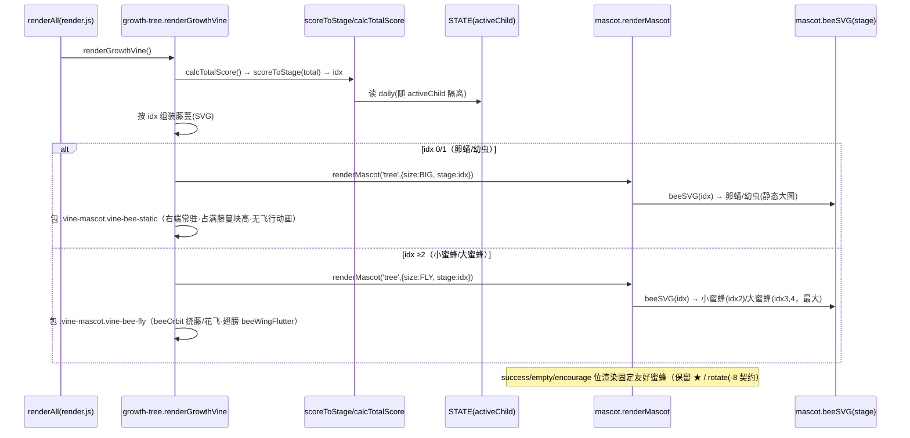
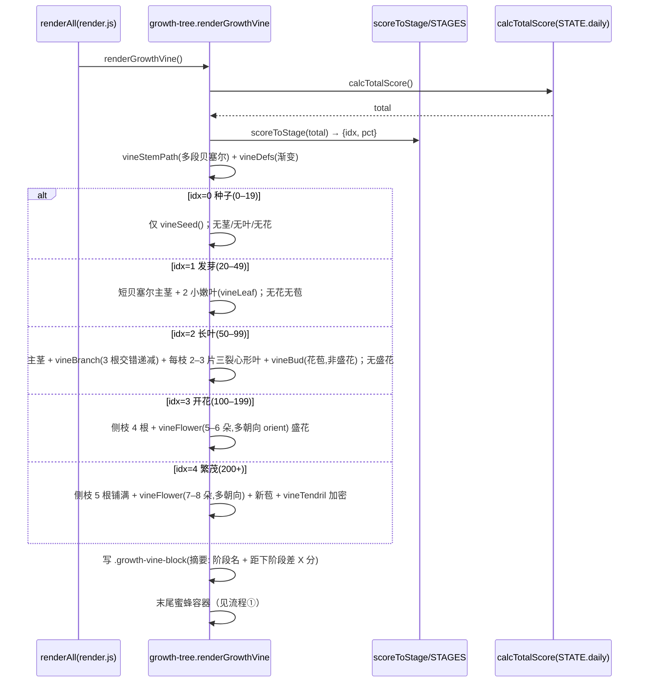
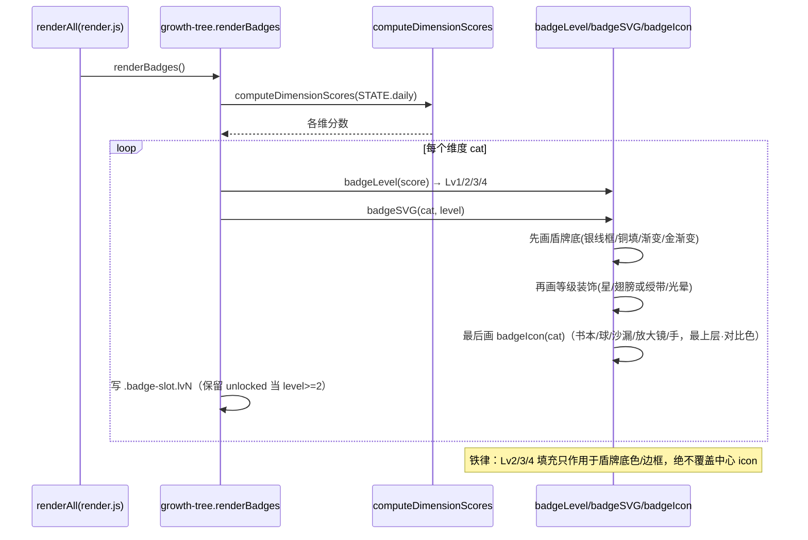
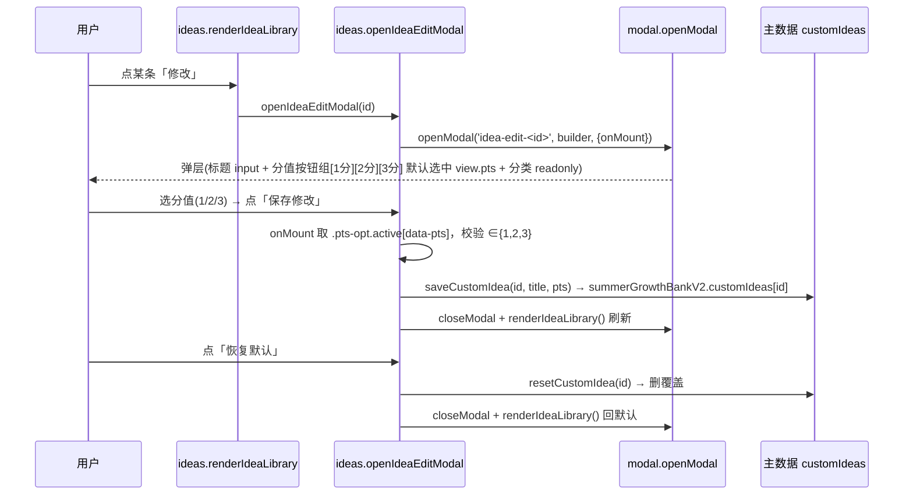
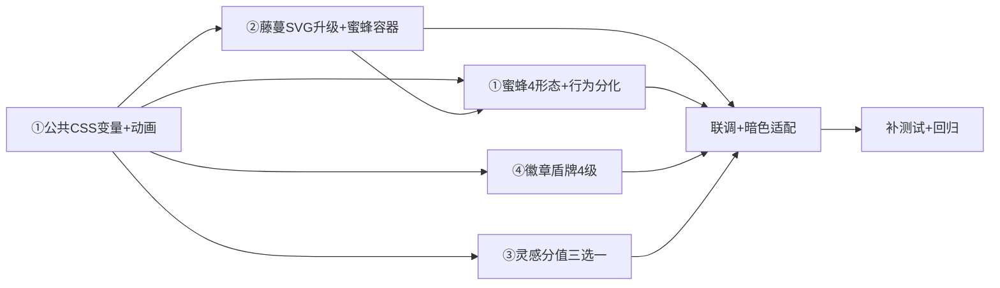

# 儿童暑期成长银行 PWA · UI 打磨（UI-polish-4）增量架构设计与任务分解

> 文档类型：架构师交付（高见远 / Bob）｜适用 PRD：`docs/prd-ui-polish-4.md`（增量，①–④ 拍板，⑤ 暂缓）
> 技术栈：**原生 HTML + CSS + JS（ES Module 多文件，无框架）** + localStorage（STATE）+ IndexedDB（media）+ PWA
> 本轮边界：**纯 UI/体验增量打磨**，复用既有能力，不动业务逻辑、不动 bug-E 接线、零新依赖。
> 配套图：`docs/class-diagram-ui-polish-4.mermaid`、`docs/sequence-diagram-ui-polish-4.mermaid`
> 现状代码已精读：`index.html` / `features/render.js` / `features/ideas.js` / `features/mascot.js` / `features/growth-tree.js` / `tests/mascot.test.js` / `tests/ui-polish-3.test.js` / `tests/ui-polish-3-qa.test.js` / `tests/growth-tree.test.js`

---

## Part A：系统设计与接口

### 1. 实现方案 + 框架选型

**框架选型结论**：维持纯前端 ESM，**不引入任何框架/库**。本轮所有新增可视化均为原生实现（与 UI-polish-2/3 一致）：

| 模块 | 实现策略 | 关键约束 / 复用 |
|---|---|---|
| ① 小蜜蜂吉祥物（4 阶段 + 行为分化） | `mascot.js`：`renderMascot` 内部由「小芽」改写为「小蜜蜂」，`beeSVG(stage)` 按 `scoreToStage(calcTotalScore()).idx` 自推导阶段（tree 位）；success/empty/encourage 位渲染固定友好蜜蜂形态 | **保留公开契约**：`<svg class="mascot mascot-${key} ${p.anim}">`、`.mascot-tree/.mascot-sway`、success 的 `★`、empty 的 `rotate(-8` 标记全部保留 → 现有 `mascot.test.js` / `ui-polish-3-qa.test.js` 断言**零改动全绿**；配色走 `--bee-*`/`--metal-*` 变量，禁硬编码 hex |
| ① 蜜蜂容器切换 | `growth-tree.js` `renderGrowthVine` 末尾：保留外层 `.vine-mascot` 容器（qa 测试依赖），追加 modifier `.vine-bee-static`（idx0/1，右端常驻、静态、占满藤蔓块高）或 `.vine-bee-fly vine-bee-fly-${idx}`（idx≥2，CSS `beeOrbit` 绕飞） | 调用点近零改动（`renderMascot('tree',{size,stage})` 自推导）；`render.js` 的 `showEncourageMsg`/`renderCheckinExtras` 调用点**不改** |
| ② 牵牛花藤蔓细节升级 | `growth-tree.js`：`vineStemPath` 增强多段贝塞尔；新增 `vineBranch(x,y,dir,thick)`（侧枝 3–5 根、左右交错、粗细递减）；`vineLeaf` 改心形/三裂真叶（每侧枝 2–3 片、随 idx 增大）；`vineFlower(x,y,r,bloom,orient)` 增 `orient`（左垂/右垂/正上/侧开）；`vineTendril` 加密；`renderGrowthVine` 按 idx 组装侧枝+叶+花（5–8 朵），严格 gating 不变 | 复用 `scoreToStage`/`STAGES`/`calcTotalScore`/`vineDefs`；茎/叶/花三色走既有 `--vine-*` 变量（暗色/多主题已覆盖） |
| ③ 灵感分值改「三选一」 | `ideas.js`：`openIdeaEditModal` 的分值 `<input type=number>` 改为 **1分/2分/3分 按钮组**（`.pts-options` + `.pts-opt[data-pts]`），默认选中 `view.pts`，`onMount` 取 `.pts-opt.active` 的 `data-pts` 并校验 ∈{1,2,3}；分类只读不变，仅标题+分值可改 | 复用 `openModal` 单例 / `getIdeaView` / `saveCustomIdea` / `resetCustomIdea` / `customIdeas` 主数据全局落点 |
| ④ 徽章墙重做盾牌 + 4 级精确分级 | `growth-tree.js`：`badgeSVG(cat,level)` 由圆形奖牌改写为**盾牌**；新增 `badgeIcon(cat)` 返回各维抽象图标（书本/球/沙漏/放大镜/手）**最后绘制、常驻最上层、白/深色对比色**；Lv1 银灰线框 / Lv2 铜色单填+1★ / Lv3 渐变+2★+翅膀或绶带 / Lv4 金渐变+3★+光晕；填充只作用于盾牌底色/边框 | 复用 `computeDimensionScores` / `badgeLevel`（阈值 0–9/10–24/25–49/50+ 不变）；金属色走新增 `--metal-*` 变量（暗色可见） |

**不变清单（回归护栏）**：`main.js` / `runtime.js` / `parent-center.js` 中 bug-E 修复接线不动；`openModal` 单例契约（z1500、关闭三要素）不动；`STATE.reviews` 周表结构不动；周 mood 三态（`happy`/`neutral`/`sad`）不扩字段；多孩子隔离逻辑不动；既有单测 + 29 E2E 须全绿（R1 蜜蜂改写须保持 `mascot.test.js` 等现有断言全绿）。

---

### 2. 文件列表及相对路径

> 说明：本项目 **CSS 全部内联于 `index.html` 的 `<style>` 区块**。为避免多任务并发改 `index.html` 产生编辑冲突，**全部新增/调整 CSS 集中由 T01 一次性落地**（含 `--bee-*`/`--metal-*` 变量、动画 keyframes、`.vine-bee-*`、`.pts-options`、`.badge-slot.lv1..lv4` 盾牌视觉、暗色/5 主题/reduced-motion 覆盖）。后续 T02–T05 仅改动 JS 文件，不再碰 `index.html`。

| 文件 | 动作 | 本轮职责 / 落点 |
|---|---|---|
| `features/mascot.js` | **改（重写内部）** | `renderMascot` 由小芽→小蜜蜂；新增 `beeSVG(stage, placement)`（卵蛹/幼虫/小蜜蜂/大蜜蜂 4 形态，tree 位 stage 缺省由 `scoreToStage(calcTotalScore()).idx` 自推导）；翅膀加 `class="bee-wing"`（CSS `beeWingFlutter`）；success 位保留 `★` 眼、empty 位保留 `rotate(-8` 倾斜；`PLACEMENTS` 动画类（`mascot-sway`/`mascot-pop`/`mascot-blink`）与 `mascot-${key}` 类名**全部保留**；配色一律 `var(--bee-*)`/`var(--metal-*)`，禁硬编码 hex |
| `features/growth-tree.js` | **改** | ② `renderGrowthVine` 改写：增强 `vineStemPath`（多段贝塞尔）+ 新增 `vineBranch`(侧枝 3–5 根交错递减)/`vineLeaf` 改三裂心形真叶/`vineFlower` 增 `orient` 多朝向/`vineTendril` 加密；按 idx 严格 gating 组装侧枝+叶+花（5–8 朵）；末尾蜜蜂容器按 idx 切 `.vine-mascot.vine-bee-static`(idx0/1)/`.vine-mascot.vine-bee-fly`(idx≥2) + 传 `stage`/`size`；④ `badgeSVG` 重写盾牌 + 新增 `badgeIcon(cat)`（常驻最上层、对比色）；`badgeLevel`/`scoreToStage`/`STAGES`/`computeDimensionScores`/`renderBadges`/`morningGlorySVG` 语义与阈值**不变** |
| `features/ideas.js` | **改** | ③ `openIdeaEditModal` builder：分值 `<input type=number>` → 按钮组 `<div class="pts-options"><button class="pts-opt" data-pts="1/2/3">`；默认 `data-pts===view.pts` 选中；`onMount` 取 `.pts-opt.active` 的 `data-pts` 校验 ∈{1,2,3} 后 `saveCustomIdea(id,title,pts)`；分类只读不变；`loadCustomIdeas`/`saveCustomIdea`/`resetCustomIdea`/`getIdeaView`/`IDEA_TABS` 不变 |
| `index.html` | **改（仅 T01 集中持有全部 CSS）** | `<style>` 落点：`:root` + 5 主题块(`sakura`/`ocean`/`forest`/`sunset`/`starry`) + 暗色 `@media` 新增 `--bee-body`/`--bee-stripe`/`--bee-wing`/`--bee-stroke`/`--bee-cheek`/`--metal-silver`/`--metal-copper`/`--metal-gold`/`--metal-glow`；`.vine-bee-static`(右端常驻·占满藤蔓块高·静态) / `.vine-bee-fly`(覆盖藤蔓区·`beeOrbit` 轨道动画) + `@keyframes beeOrbit`/`beeWingFlutter`；`.pts-options`/`.pts-opt`(默认灰底、`.active` 高亮)；`.badge-slot.lv1..lv4` 重定义为盾牌视觉(银线框/铜填/渐变/金光晕)；`.badge-icon` 保持中心图标最上层；`@media (prefers-reduced-motion:reduce)` 降级 beeOrbit；`.growth-vine-block{position:relative}` 保留 |
| `docs/architecture-ui-polish-4.md` | **新增** | 本文档 |
| `docs/class-diagram-ui-polish-4.mermaid` | **新增** | 类图（本轮 ①–④ 关键改动） |
| `docs/sequence-diagram-ui-polish-4.mermaid` | **新增** | 时序图（①–④ 四条核心流程） |
| `tests/ui-polish-4.test.js` | **新增** | 新增断言：蜜蜂 4 形态(stage→svg)、盾牌 4 级(不写死 hex / 中心图标最上层 / 填充不盖图标)、分值三选一(仅 1/2/3、默认带原值)、暗色下 `--bee-*`/`--metal-*` 变量齐备 |
| `tests/mascot.test.js` `tests/ui-polish-3.test.js` `tests/ui-polish-3-qa.test.js` `tests/growth-tree.test.js` | **回归（不破）** | 现有断言须全绿；R1 蜜蜂改写通过保留 `mascot-tree`/`mascot-sway`/`★`/`rotate(-8`/`.vine-mascot` 契约实现零改动通过；`badgeLevel` 阈值与 `renderBadges` 5 槽位/lvN 输出不变；`scoreToStage`/`STAGES` 阈值不变 |

**受保护、本轮不改的文件**：`main.js` / `features/runtime.js` / `features/parent-center.js`（bug-E 接线）；`features/modal.js`（`openModal` 单例）；`core/helpers.js` / `core/data.js` / `core/state.js`（复用）；`features/render.js`（调用点无需改，R1 蜜蜂自推导阶段）。

**核心改动文件共 4 个源码 + 1 个 `index.html`**：`features/mascot.js`、`features/growth-tree.js`、`features/ideas.js`、`index.html`（外加 1 个新增测试 `tests/ui-polish-4.test.js` 与 3 个 mermaid/文档）。

---

### 3. 数据结构和接口（关键函数签名）

> 重点呈现**本轮新增/改动**的蜜蜂、藤蔓升级、徽章盾牌、灵感三选一，与既有 `renderMascot`/`renderGrowthVine`/`badgeSVG`/`openIdeaEditModal` 的关系。完整类图见 `docs/class-diagram-ui-polish-4.mermaid`。

```ts
// ===== features/mascot.js（重写内部，公开契约保留）=====
export function renderMascot(
  placement: 'tree'|'success'|'empty'|'encourage',
  opts?: { size?: number; stage?: number }   // stage 缺省时由 scoreToStage(calcTotalScore()).idx 自推导
): string;   // 返回 <svg class="mascot mascot-${key} ${p.anim}">...</svg>
// 内部：beeSVG(stage, placement) → 卵蛹(stage0/1)/幼虫(1)/小蜜蜂(2)/大蜜蜂(3,4)
// 颜色一律 var(--bee-*)/var(--metal-*)，禁硬编码 hex
// 契约保留：mascot-${key} 类 / mascot-sway|pop|blink 动画 / success 含 '★' / empty 含 'rotate(-8'

// ===== features/growth-tree.js（改 + 新增）=====
export function renderGrowthVine(): void;
// 重写：增强 vineStemPath + vineBranch/vineLeaf(三裂心形)/vineFlower(orient)/vineTendril(加密)
// 末尾蜜蜂容器：idx0/1 → <div class="vine-mascot vine-bee-static">renderMascot('tree',{size:BIG,stage:idx})</div>
//            idx≥2 → <div class="vine-mascot vine-bee-fly vine-bee-fly-${idx}">renderMascot('tree',{size:FLY,stage:idx})</div>
function vineBranch(x:number,y:number,dir:1|-1,thick:number): string;     // 侧枝（3–5 根、左右交错、粗细递减）
function vineLeaf(x:number,y:number,dir:1|-1,size:number,idx:number): string; // 心形/三裂真叶（随 idx 增大）
function vineFlower(x:number,y:number,r:number,bloom:boolean,orient:'left'|'right'|'up'|'side'): string; // 喇叭花多朝向
function vineTendril(x:number,y:number,dir:1|-1): string;             // 螺旋卷须（加密）
function vineStemPath(progress:number,W:number,H:number): string;         // 多段贝塞尔（增强）

export function badgeLevel(score:number): 1|2|3|4;   // 阈值不变：0–9/10–24/25–49/50+
export function badgeSVG(cat:string, level:1|2|3|4): string;  // 重写为盾牌 + badgeIcon 常驻最上层
function badgeIcon(cat:string): string;  // 📚书本/⚽球/⌛沙漏/🔍放大镜/✋手，最后绘制、对比色
export function renderBadges(): void;   // 契约不变：5 槽位、lvN 类、level>=2 加 unlocked
// 既有保留：STAGES / scoreToStage / computeDimensionScores / calcTotalScore / morningGlorySVG / BADGE_THRESHOLD

// ===== features/ideas.js（改 openIdeaEditModal）=====
export function openIdeaEditModal(id:string): HTMLElement|null;
// builder：标题 input + 分值按钮组 .pts-options>.pts-opt[data-pts=1|2|3]（默认选中 view.pts）+ 分类 readonly
// onMount：取 .pts-opt.active 的 data-pts，校验 ∈{1,2,3} → saveCustomIdea(id,title,pts)；恢复默认 → resetCustomIdea(id)
// 不再出现 <input type=number> 的分值框
// 既有保留：IDEA_TABS / loadCustomIdeas / saveCustomIdea / resetCustomIdea / getIdeaView / addIdeaAsTask / renderIdeaLibrary

// ===== 共享约定 =====
// customIdeas 落点：localStorage['summerGrowthBankV2'].customIdeas（全局主数据，不进 child 快照）
// 维度图标映射（已确认锁定）：学习力→📚书本 / 运动力→⚽球 / 自控力→⌛沙漏 / 探索力→🔍放大镜 / 实践力→✋手
```

---

### 4. 程序调用流程（时序图 mermaid）

> 4 条核心流程（①②③④）。完整时序见 `docs/sequence-diagram-ui-polish-4.mermaid`（含 4 段 sequenceDiagram）。

**① 小蜜蜂 4 阶段渲染 + 行为分化（tree 位自推导 stage）**



**② 牵牛花藤蔓升级：严格阶段 gating（高度 ≤160px，密度提升）**



**③ 徽章盾牌 4 级（中心维度图标常驻最上层）**



**④ 灵感修改弹窗：分值改为三选一（仅 1/2/3）**



---

## Part B：任务分解

### 5. 任务列表（实现顺序 + 依赖，细到可直接照写）

> 分组遵循主理人建议：T01 公共 CSS 变量+动画 → T02 藤蔓 SVG 升级+蜜蜂容器切换 → T03 蜜蜂吉祥物 4 形态 → T04 徽章盾牌 4 级 → T05 灵感分值三选一 → T06 联调+暗色适配 → T07 补测试+回归。
> **CSS 落点统一**：T01 一次性集中持有 `index.html` 的全部新增/调整 `<style>`；T02–T05 只改 JS，避免并发编辑 `index.html` 冲突。

#### T01 〔公共 CSS 变量 + 动画 keyframes〕（P0，无依赖）
- **文件**：`index.html`（改 `<style>`，**集中持有本轮全部 CSS**）
- **改什么**：
  - `:root` 新增 `--bee-body`/`--bee-stripe`/`--bee-wing`/`--bee-stroke`/`--bee-cheek` 与 `--metal-silver`/`--metal-copper`/`--metal-gold`/`--metal-glow`；在 5 个主题块（`body[data-theme="sakura"|"ocean"|"forest"|"sunset"|"starry"]`）与暗色 `@media (prefers-color-scheme:dark)` 中**全部定义**（金属色暗色提亮保证可见）。
  - 蜜蜂容器与动画：`.growth-vine-block{position:relative}`（保留）；`.vine-bee-static{position:absolute;right:6px;bottom:6px;width:104px;height:116px;pointer-events:none}`（占满藤蔓块高、静态）；`.vine-bee-fly{position:absolute;inset:0;pointer-events:none}` + `@keyframes beeOrbit{...}`（绕藤/花轨道）+ `.bee-wing{animation:beeWingFlutter .25s ease-in-out infinite}` + `@keyframes beeWingFlutter{...}`。
  - 灵感分值三选一：`.pts-options{display:flex;gap:8px}` / `.pts-opt{padding:8px 14px;border-radius:10px;font-weight:800;color:var(--muted);background:rgba(var(--leaf-rgb),.08);border:1.5px solid rgba(var(--leaf-rgb),.2);cursor:pointer}` / `.pts-opt.active{color:#fff;background:linear-gradient(90deg,var(--leaf),var(--rose));border-color:transparent;box-shadow:0 3px 10px rgba(var(--leaf-rgb),.3)}`。
  - 徽章盾牌视觉：`.badge-slot.lv1{...银灰线框}` / `.lv2{...铜色填充边框}` / `.lv3{...渐变+翼/绶带}` / `.lv4{...金渐变+光晕}`；`.badge-icon{...确保中心图标最上层、对比色可见}`（`.badge-slot` 布局高度不变、盾牌 SVG 尽量放大）。
  - 藤蔓细节微调（配合 T02）：`.vine-branch`/`.vine-leaf`(三裂心形 transform-origin)/`.vine-flower`(多朝向 orient)/`.vine-tendril` 朝向微调；SVG `max-height:160px` 不变。
  - 无障碍：`@media (prefers-reduced-motion:reduce){ .vine-bee-fly{animation:none} .bee-wing{animation:none} }`（覆盖全局 reduced-motion）。
- **依赖**：无
- **优先级**：P0
- **测试要点**：暗色 + 5 主题下 `--bee-*`/`--metal-*` 变量齐备（供 T07 断言）；`.vine-bee-*`/`.pts-opt`/`.badge-slot.lv*` 样式存在；reduced-motion 降级生效。

#### T02 〔② 牵牛花藤蔓 SVG 升级 + 蜜蜂容器切换〕（P0，依赖 T01）
- **文件**：`features/growth-tree.js`（改）
- **改什么**：
  - `vineStemPath` 增强：多段贝塞尔（自然摆动，非折线），保留既有 `vinePoint` 波动模型。
  - 新增 `vineBranch(x,y,dir,thick)`：侧枝 3–5 根、左右交错（`dir` 交替）、粗细递减（4→3→2.5→2→1.5px，随 idx 递增数量）。
  - `vineLeaf(x,y,dir,size,idx)`：真实牵牛叶（心形/三裂），每侧枝 2–3 片、随 idx 增大（`idx` 影响 size/orient）。
  - `vineFlower(x,y,r,bloom,orient)`：增 `orient` 参数（左垂/右垂/正上/侧开），喇叭形 5 瓣；花数 5–8 随 idx（繁茂铺满）。
  - `vineTendril` 加密（枝梢螺旋须）。
  - `renderGrowthVine` 重写：按 `info.idx` 严格 gating 组装侧枝+叶+花（发芽无花、长叶仅花苞、开花/繁茂盛花，阈值不变）；高度仍 ≤160px（SVG `max-height:160px`）。
  - **蜜蜂容器切换**（关键）：末尾保留外层 `.vine-mascot`，按 idx 追加 modifier——
    - `idx 0/1` → `<div class="vine-mascot vine-bee-static">${renderMascot('tree',{size:104,stage:idx})}</div>`（右端常驻、静态、占满藤蔓块高）；
    - `idx≥2` → `<div class="vine-mascot vine-bee-fly vine-bee-fly-${idx}">${renderMascot('tree',{size:idx>=4?72:56,stage:idx})}</div>`（脱离右端、beeOrbit 绕飞、繁茂最大）；
    - `size` 随阶段（繁茂最大），`stage` 显式传入（亦可由 mascot 自推导，二者皆可）。
  - `morningGlorySVG` 不动；`vineDefs` 渐变唯一 ID 保留（避免与 `morningGlorySVG` 冲突）。
- **依赖**：T01（CSS 变量与 `.vine-bee-*` 类已就绪）
- **优先级**：P0
- **测试要点**：茎为贝塞尔、侧枝 3–5 根交错递减、叶为三裂心形、花 5–8 朵多朝向、卷须加密；纯 SVG 无位图；暗色 `--vine-*` 可见；按 idx 严格 gating（发芽无花、长叶仅花苞、开花/繁茂盛花）；高度 ≤160；`.vine-mascot` 容器仍在（qa 测试契约）；蜜蜂容器带正确 `vine-bee-static`/`vine-bee-fly` modifier。

#### T03 〔① 小蜜蜂吉祥物 4 形态 + 行为分化〕（P0，依赖 T01、T02）
- **文件**：`features/mascot.js`（改，重写内部）
- **改什么**：
  - `renderMascot(placement, opts)`：保留返回 `<svg class="mascot mascot-${key} ${p.anim}">` 结构与 `PLACEMENTS`（tree→sway / success→pop / empty→blink+tilt / encourage→sway）动画类；`opts.stage` 缺省时 `stage = scoreToStage(calcTotalScore()).idx`。
  - 新增 `beeSVG(stage, placement)`：
    - `stage 0/1`：卵/蛹形态（椭圆茧 + 呼吸纹，静态大图）；
    - `stage 1`：破壳幼虫（带小翅芽、sleepy 表情）；
    - `stage 2`：小蜜蜂（身体 + 黄黑条纹 `var(--bee-stripe)` + 翅膀 `class="bee-wing"` + 触角 + 表情）；
    - `stage 3/4`：采蜜大蜜蜂（更大、蜜囊满载、星星眼/微笑，idx4 最大）。
    - 全部 `fill/stroke` 走 `var(--bee-*)`/`var(--metal-*)`，**禁硬编码 hex**。
  - **契约保留（兼容性铁律）**：success 位眼睛仍输出 `★`（`mascot.test.js` 断言）；empty 位 `<g>` 仍 `transform="rotate(-8 50 54)"`（`mascot.test.js` 断言）；`mascot-tree`/`mascot-success`/`mascot-empty`/`mascot-encourage` 类名与 `mascot-sway`/`mascot-pop`/`mascot-blink` 动画类**一字不改** → 现有 `tests/mascot.test.js` 与 `tests/ui-polish-3-qa.test.js` 的 `.vine-mascot .mascot-tree` / `.mascot-success` / `.mascot-encourage` 断言零改动全绿。
  - 调用点（`renderGrowthVine`/`showEncourageMsg`/`renderCheckinExtras`）**无需改**——tree 位 stage 由 mascot 自推导。
  - `index.html` 动画类（`.bee-wing`/`beeOrbit`）已在 T01 落地，本任务不碰 `index.html`。
- **依赖**：T01（--bee-*/--metal-* 变量与 beeWingFlutter 动画）、T02（`.vine-bee-*` 容器由 renderGrowthVine 产出）
- **优先级**：P0
- **测试要点**：4 形态 SVG 随 stage 变化；tree 位自推导 stage；success 含 `★`、empty 含 `rotate(-8`、四类 `mascot-*${key}` 与动画类保留；无硬编码 hex（暗色/多主题可见）；既有 mascot/qa 测试全绿。

#### T04 〔④ 徽章盾牌 + 4 级精确分级〕（P0，依赖 T01）
- **文件**：`features/growth-tree.js`（改，`badgeSVG` + `badgeIcon`）
- **改什么**：
  - `badgeSVG(cat, level)` 重写：盾牌 `<path>` 基底（在 `.badge-slot` 格子高度内尽量放大）；**先画盾牌底**，再画等级装饰，最后画 `badgeIcon(cat)`（见下）。
    - **Lv1**：银灰线框（`stroke="var(--metal-silver)"`、无填充）；
    - **Lv2**：铜色单填（`fill="var(--metal-copper)"`）+ 1★；
    - **Lv3**：渐变填充（`url(#badgeGrad${uid})`，银→铜）+ 2★ + 翅膀或绶带；
    - **Lv4**：金渐变填充（`url(#badgeGold${uid})`）+ 3★ + 外圈光晕（`opacity` 光环）。
    - **铁律**：Lv2/3/4 的 `fill`/`stroke` 只作用于盾牌底色与边框，**绝不覆盖中心维度图标**。
  - 新增 `badgeIcon(cat)`：返回各维抽象图标 SVG——学习力→书本📚 / 运动力→球⚽ / 自控力→沙漏⌛ / 探索力→放大镜🔍 / 实践力→手✋；**最后绘制、常驻最上层**，填充用 `var(--badge-gloss)`（白）或深色对比色，保证暗色/多主题下可见。
  - `badgeLevel` 阈值（0–9/10–24/25–49/50+）**不变**；`renderBadges` 输出 5 槽位 + `lvN` 类 + `unlocked`(level>=2) **不变**（qa/单测契约）。
- **依赖**：T01（`--metal-*`/`--badge-*` 变量与 `.badge-slot.lv*` 盾牌视觉已就绪）
- **优先级**：P0
- **测试要点**：盾牌造型（非圆形）；中心抽象图标常驻最上层、对比色可见；4 级视觉精确区分（银线框→铜填+1★→渐变+2★+翼/绶带→金渐变+3★+光晕）；`badgeSVG` 不写死 hex（`var()`/`rgba`）；铁律——Lv2/3/4 填充不盖中心图标（断言图标节点在 DOM/SVG 顺序最后或 z 最上）；等级阈值沿用 `badgeLevel`；既有 `ui-polish-3.test.js` 的 `badgeLevel`/`renderBadges` 5 槽位/lvN 断言全绿。

#### T05 〔③ 灵感分值改「三选一」〕（P0，无依赖）
- **文件**：`features/ideas.js`（改 `openIdeaEditModal`）
- **改什么**：
  - `openIdeaEditModal(id)` builder：标题保留 `<input id="ideaEditTitle">`；**分值**由 `<input type=number>` 改为按钮组：
    `<div class="pts-options">` + 三个 `<button type="button" class="pts-opt" data-pts="1">1分</button>` / `data-pts="2"` / `data-pts="3"`，默认 `data-pts===String(view.pts)` 的按钮加 `.active`；**禁止自由填写**（无 number input）。
  - 分类 `<input>` 仍 `readonly disabled`（五维不变）。
  - `onMount`：取 `ov.querySelector('.pts-opt.active')?.dataset.pts`，`Number` 后校验 `∈{1,2,3}`（兜底防越界），再 `saveCustomIdea(id, title, pts)`；「恢复默认」→ `resetCustomIdea(id)`；两者均 `closeModal` + `renderIdeaLibrary()` 刷新。
  - `loadCustomIdeas`/`saveCustomIdea`/`resetCustomIdea`/`getIdeaView`/`IDEA_TABS`/`renderIdeaLibrary` 不变；`customIdeas` 仍写主数据全局（不进 child 快照）。
- **依赖**：无（`.pts-options`/`.pts-opt` 样式已在 T01 落地）
- **优先级**：P0
- **测试要点**：修改弹窗分值只能 1/2/3 三选一（无 number input）；默认带原值高亮；保存写 `customIdeas[id]`、可「恢复默认」回默认；分类只读不变；刷新后生效（主数据全局）。

#### T06 〔联调 + 暗色/多主题适配 + reduced-motion〕（P1，依赖 T01–T05）
- **文件**：`index.html`（查漏补缺，必要时极小补充）、`features/*`（联调验证，不新增功能）
- **改什么**：
  - 暗色 + 5 主题下 `--bee-*`/`--metal-*` 全部齐备（T01 已定义，本任务做最终扫漏：确认每个主题块与 `@media dark` 都声明了全部新变量，无遗漏导致某主题下蜜蜂/盾牌不可见）。
  - `prefers-reduced-motion:reduce` 下 `beeOrbit`/`beeWingFlutter` 降级（T01 已加，本任务用真机/模拟器验证蜜蜂静态居中、不绕飞）。
  - 跨模块联调：切 `activeChild` 后 `renderGrowthVine`（蜜蜂 stage/容器随新 child 重算）、`renderBadges`（盾牌等级随新 child 重算）即时重绘、无残留；`customIdeas` 全局偏好不随 child 变。
  - 高度回归：藤蔓 ≤160px；徽章 `.badge-slot` 高度不变、盾牌尽量放大。
- **依赖**：T01、T02、T03、T04、T05
- **优先级**：P1（验收必需）
- **测试要点**：暗色 + 5 主题蜜蜂/盾牌/藤蔓均可见；reduced-motion 蜜蜂静态；多孩子隔离在 ①/④ 上同样成立；既有单测 + 29 E2E 全绿。

#### T07 〔补测试 + 回归〕（P1，依赖 T06）
- **文件**：`tests/ui-polish-4.test.js`（新增）、`tests/mascot.test.js`/`tests/ui-polish-3.test.js`/`tests/ui-polish-3-qa.test.js`/`tests/growth-tree.test.js`（回归，不破）
- **改什么**：
  - 新增 `tests/ui-polish-4.test.js`：
    1. 蜜蜂 4 形态：`renderMascot('tree')` 默认 stage 推导 + `beeSVG(0/1/2/3/4)` 形态差异（卵蛹/幼虫/小蜜蜂/大蜜蜂 SVG 含 `bee-wing` 等）；success 含 `★`、empty 含 `rotate(-8`、四类 `mascot-*` 类名与动画类保留。
    2. 徽章盾牌：`badgeSVG(cat,lv)` 返回盾牌 path（非圆形奖牌）；`badgeIcon` 中心图标节点在 SVG 中**最后绘制/最上层**；`badgeSVG` 不出现 `fill="#`/`stroke="#`/`stop-color="#`；Lv2/3/4 填充不覆盖中心图标（断言图标节点在装饰之后）；4 级差异（银线框/铜填+★/渐变+★★/金+★★★+光晕）。
    3. 分值三选一：`openIdeaEditModal` 弹层含 `.pts-options` 与 3 个 `.pts-opt[data-pts=1|2|3]`、无 `type=number` 分值框；默认 `.active` 命中 `view.pts`；选 2 分保存后 `customIdeas[id].pts===2`。
    4. 暗色变量齐备：`document.documentElement` 或各主题下 `--bee-body`/`--bee-stripe`/`--bee-wing`/`--bee-stroke`/`--bee-cheek`/`--metal-silver`/`--metal-copper`/`--metal-gold` 均非空。
  - 回归核对（现有断言须全绿，R1 通过保留契约实现零改动）：
    - `tests/mascot.test.js`：`.mascot-tree`+`mascot-sway`、success `★`、`empty rotate(-8`、encourage `mascot-sway`、未知回退 `mascot-tree` —— **全部保持不变通过**。
    - `tests/ui-polish-3-qa.test.js`：`#growth-vine-block .vine-mascot .mascot-tree` 存在、success/encourage mascot 挂载、藤蔓 `var(--vine-*)` 无硬编码 hex、徽章 `badgeSVG` 无 `#`、5 槽位 lv1..lv4 —— 全绿。
    - `tests/ui-polish-3.test.js`：`badgeLevel` 阈值、`badgeSVG` 不写死 hex、`renderBadges` 5 槽位随积分 —— 全绿。
    - `tests/growth-tree.test.js`：`scoreToStage`/`STAGES` 阈值（种子/发芽/长叶/开花/繁茂）不变 —— 全绿。
  - 既有 **单测 + 29 E2E 全绿**（不可因重构回归）。
- **依赖**：T06
- **优先级**：P1（验收必需）
- **测试要点**：见上；由 QA 按 PRD §6 严过关。

---

### 6. 依赖包列表

- **本轮不引入任何新依赖**（运行时零三方库，符合"无框架"约束）。
- 藤蔓/牵牛花/徽章/蜜蜂全部**内联 SVG + CSS 变量 + CSS 动画**，无位图、无动画库。
- 既有开发依赖（不动）：`vitest`（单测）、`jsdom`（测试环境）。运行时零三方库。
- 作品表单/灵感弹窗等均为原生 DOM/CSS，无 JS 新增依赖。

---

### 7. 共享知识（跨文件约定）

1. **CSS 变量命名与定义位置**：新增 `--bee-body`/`--bee-stripe`/`--bee-wing`/`--bee-stroke`/`--bee-cheek`（蜜蜂配色）与 `--metal-silver`/`--metal-copper`/`--metal-gold`/`--metal-glow`（徽章金属色，银→铜→金映射 Lv1→Lv2→Lv3/Lv4）。**必须在 `:root` + 5 主题块(`sakura`/`ocean`/`forest`/`sunset`/`starry`) + 暗色 `@media (prefers-color-scheme:dark)` 全部声明**，保证暗色与多主题下可见。所有 SVG `fill/stroke/stop-color` 一律 `var(--xxx)`。
2. **SVG 分层顺序铁律（徽章）**：绘制顺序 = ① 盾牌底（Lv1 仅线框 / Lv2 铜填 / Lv3 渐变 / Lv4 金渐变）→ ② 等级装饰（星 / 翅膀或绶带 / 光晕）→ ③ **中心维度图标 `badgeIcon(cat)` 最后绘制、常驻最上层**。填充色（铜/渐变/金）**只作用于盾牌底色与边框，绝不覆盖中心图标**。维度图标用 `var(--badge-gloss)`（白）或深色对比色填充，保证暗色下可读。
3. **维度图标映射表（已确认锁定）**：学习力→📚书本 / 运动力→⚽球 / 自控力→⌛沙漏 / 探索力→🔍放大镜 / 实践力→✋手形。代码库五维不变（学习力/运动力/自控力/探索力/实践力），`CATEGORIES`/`IDEA_LIBRARY`/`BADGE_COLORS` 一致，不引入创造力/生活力/社交力 等新命名。
4. **吉祥物公开契约（兼容性铁律）**：`renderMascot` 返回 `<svg class="mascot mascot-${key} ${p.anim}">`；四类 `mascot-tree`/`mascot-success`/`mascot-empty`/`mascot-encourage` 类名与 `mascot-sway`/`mascot-pop`/`mascot-blink` 动画类**保留不改**；success 位眼睛仍输出 `★`、empty 位 `<g>` 仍 `rotate(-8 50 54)`。此契约使现有 `tests/mascot.test.js` 与 `tests/ui-polish-3-qa.test.js` 断言**零改动全绿**。`beeSVG(stage)` 形态：stage 0/1 卵蛹、1 幼虫、2 小蜜蜂、3/4 大蜜蜂；tree 位 `stage` 缺省由 `scoreToStage(calcTotalScore()).idx` 自推导，调用点近零改动。
5. **阶段模型与 gating 不变**：`STAGES` 阈值 0/20/50/100/200、`scoreToStage`/`vineDefs` 语义不变；藤蔓 gating（发芽无花、长叶仅花苞、开花/繁茂盛花）严格保持；`badgeLevel` 阈值 0–9/10–24/25–49/50+ 不变；`renderBadges` 5 槽位 + `lvN` 输出不变。
6. **多孩子隔离**：藤蔓/徽章随 `STATE`（=当前 activeChild 快照）渲染；`renderGrowthVine`/`renderBadges` 切 child 后整体重算即时重绘、无残留；`customIdeas` 为全局主数据偏好（不随 child 变），灵感自定义全局生效。
7. **暗色 / 多主题铁律**：SVG 与 JS 内**禁止硬编码 hex 颜色**，一律走 CSS 变量（`var(--vine-*)`/`var(--badge-*)`/`var(--bee-*)`/`var(--metal-*)`）；新增变量须在 `:root` + 5 主题块 + 暗色 `@media` 全定义。`prefers-reduced-motion:reduce` 下蜜蜂 `beeOrbit`/`beeWingFlutter` 降级为静态。
8. **不动清单（回归护栏）**：`main.js`/`runtime.js`/`parent-center.js` 中 bug-E 接线；`openModal` 单例契约；`STATE.reviews` 结构；周 mood 三态；`modal.js`/`core/*`；既有单测 + 29 E2E。CSS 落点统一由 T01 集中持有 `index.html` 的 `<style>`。

---

### 8. 任务依赖图（Mermaid）



---

## Part C：给主理人的两点强调

- **实现顺序**：`T01 → T02 → T03 / T04 / T05（可并行）→ T06 → T07`。T01 集中持有全部新增 CSS（避免并发改 `index.html` 冲突）；T02–T05 仅改 JS；T03 依赖 T02 的 `.vine-bee-*` 容器与 T01 的 `--bee-*` 变量；T04/T05 与 T03 相互独立可并行；T06 联调 + 暗色扫漏；T07 补测 + 回归。
- **最大风险点**：
  1. **T03 蜜蜂改写的测试兼容性**——务必保留 `mascot-tree`/`mascot-sway`/`★`/`rotate(-8`/`.vine-mascot` 公开契约，否则 `tests/mascot.test.js` 与 `tests/ui-polish-3-qa.test.js` 现有断言会回归。这是"现有测试须保持全绿"铁律的生死线。
  2. **T04 盾牌"填充不盖中心图标"铁律**——`badgeIcon(cat)` 必须最后绘制、`beeSVG`/`badgeSVG` 内零硬编码 hex，且 Lv2/3/4 填充只作用于盾牌底/边框。
  3. **T02 藤蔓阶段 gating**——肉眼确认发芽（20–49）绝无花朵、长叶（50–99）只显花苞不显盛花、开花/繁茂（≥100）才盛花；高度仍 ≤160px。
  4. **暗色/多主题变量齐备**——T01/T06 须确认 `--bee-*`/`--metal-*` 在 `:root`+5 主题+暗色全部声明，任一遗漏都会让某主题下蜜蜂/盾牌不可见。
