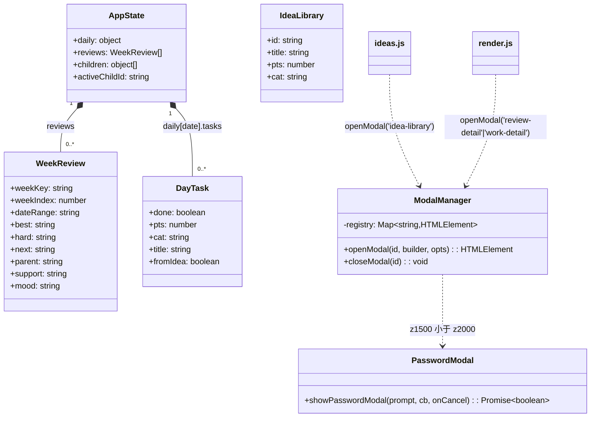
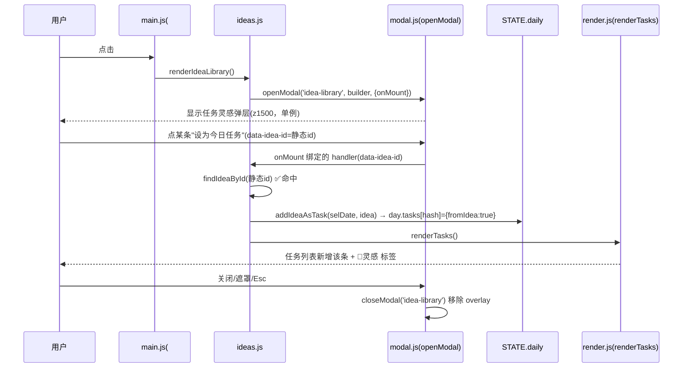
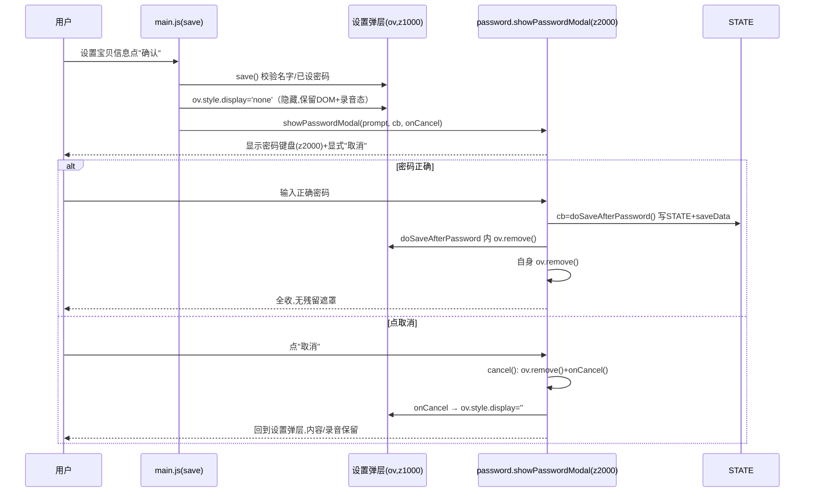
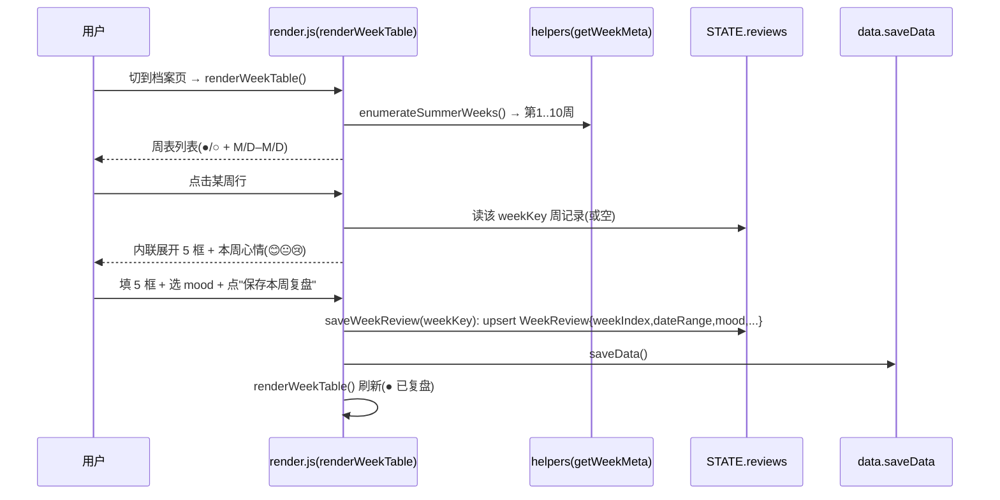
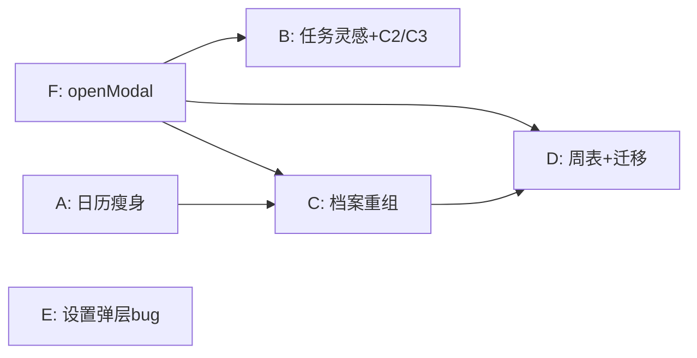

# 暑假成长积分银行 · UI 重排 + 3 真 bug 修复 —— 架构设计与任务分解

> 文档类型：架构师交付（高见远 / Gao）｜适用 PRD：`docs/prd-ui-rework.md`（增量）
> 技术栈：**原生 HTML + CSS + JS（ES Modules 多文件，无框架）** + localStorage（STATE）+ IndexedDB（media）+ PWA
> 本轮边界：**仅 UI 重排 + 修 3 真 bug（C2/C3/E）**；不新增功能、不改业务逻辑计算、不破坏多孩子隔离与 58 单测全绿。

---

## 1. 实现方案 + 框架选型

**框架选型结论**：维持纯前端 ESM，**不引入任何框架/库**。所有弹层、周表、双排网格均用原生 DOM + 内联样式/少量 `<style>` 规则实现。`openModal` 为纯原生单例工具，零依赖。

**各模块改造策略（按已拍板的 Q1–Q5）**：

| 模块 | 改造策略 | 关键点 |
|---|---|---|
| F 统一弹层 | 新增 `features/modal.js`，导出 `openModal(id, builder, opts)` / `closeModal(id)`；模块级 `Map` 作单例注册表 | 根治 C3 类叠加遮罩；z-index 1500 档（< 密码 2000） |
| B 任务灵感 | 改名"任务灵感" + 醒目引导卡 + **方案甲**修 C2（按钮 `data-idea-id` 改静态 id）+ `openModal` 修 C3 + 🌟灵感标签 + 仅今天显示 | `day.tasks` 键与"已添加"判定仍用 `ideaIdOf` 哈希（内部一致，无旧数据迁移） |
| A 日历瘦身 | 删除 `.streak-block`(#streakInfo) / `.growth-block`(#growthTree) / `.badge-block`(#badgeWall) | `renderStreak`/`renderGrowthTree`/`renderBadges` 均 null 安全，仅删 DOM 即可 |
| C 档案重组 | 接收成长树+徽章（"我的成就"双列）；周表与作品纵向单页；作品日期前置双排；删 `#archiveSubTabs` | 仅改 DOM 挂载点与 `renderArchive` 渲染模板 |
| D 周表（最大） | `STATE.reviews` 由"按日数组"→"按 weekKey 的周记录数组"；新增 `weekIndex`/`dateRange`/`mood`；旧数据在 `loadData` 同周合并基础上补全字段迁移 | `weekKey` 复用现有；`dateRange` 由 `getWeekMeta(weekKey)` 还原 |
| E 设置弹层 | 确认前把设置弹层 `display:none`（保留 DOM+录音态）；密码键盘加显式"取消"按钮；成功→移除两者，取消→`onCancel` 恢复设置层 | `showPasswordModal` 增加第 3 参 `onCancel`；修一处潜在"错误密码提前 resolve(false)" |

**不变清单（回归护栏）**：暑假日历、成长地图、积分趋势图、PWA（manifest+sw.js）、积分/兑换逻辑、`toggleTask` 计分逻辑、`saveData` 子快照解构、`STATE.reviews` 仍随 `summerGrowthBankV2_child_<id>` 隔离。

---

## 2. 文件列表及相对路径（要改/新增）

| 文件 | 动作 | 本轮职责 |
|---|---|---|
| `features/modal.js` | **新增** | `openModal` / `closeModal` 单例弹层工具 + 模块级 `registry` |
| `features/ideas.js` | 改 | 改名"任务灵感"；按钮 `data-idea-id`→静态 id（修 C2）；改用 `openModal`（修 C3）；导出 `findIdeaById` |
| `features/render.js` | 改 | `renderTaskGrid` 🌟灵感标签（B5）；`renderCheckinExtras` 仅今天显示灵感卡（B6）；`renderArchive` 作品双排日期前置（C3）；`renderAll` 用 `renderWeekTable` 替 `renderReviewTimeline`（D）；新增 `renderWeekTable`/`buildWeekEditor`/`saveWeekReview`；`openReviewDetail` 改用 `openModal`（F） |
| `features/password.js` | 改 | `showPasswordModal(prompt, cb, onCancel?)`；新增显式"取消"按钮；统一 `cancel()`；修错误密码提前 resolve |
| `core/helpers.js` | 改 | 新增 `SUMMER_START`/`SUMMER_END`/`getWeekIndex`/`getWeekDateRange`/`getWeekMeta`/`enumerateSummerWeeks` |
| `core/data.js` | 改 | `loadData`：在现有"同 weekKey 合并"基础上补全 `weekIndex`/`dateRange`/`mood`，去 `editIdx`（D4 迁移） |
| `core/state.js` | **不改** | `freshState().reviews=[]` 已兼容新结构；仅注释标注 WeekReview 形态 |
| `index.html` | 改 | ① 日历 Tab 删 3 块（A1/A2）；② 打卡 Tab `.idea-row`→醒目引导卡 `#ideaPromptCard`（B2/B6）；③ 档案页删 `#archiveSubTabs`、重组为"我的成就/每周复盘/成长作品"单页（C1/C4）、`asub-review` 换为 `#weekTable`（D2）；④ `<style>` 新增样式 |
| `main.js` | 改 | 删 `#archiveSubTabs` 切换逻辑（C4）；`saveReview` 旧处理器移除（D 由 `render.js` 内联保存接管）；宝贝信息 `save()` 隐藏设置层+传 `onCancel`（E1/E2）；切档案 tab 触发 `renderWeekTable` |

> 测试文件（新增/调整见 §5、§8）：`tests/ideas.test.js`、`tests/weekly-review.test.js`(新)、`tests/password.test.js`(新)。

---

## 3. 数据结构（JSON Schema + 类图）

### 3.1 周记录 `WeekReview`（存于 `STATE.reviews[]`，主键 `weekKey`）

```json
{
  "weekKey":   "2026-06-29",            // 主键：当周周一日期串（getWeekKey 产出），复用现有
  "weekIndex": 1,                       // 1-based：暑假第 N 周（7/1 所在周=1，顺排至 8/31 所在周=10）
  "dateRange": "6/29–7/5",             // 由 weekKey 还原：周一 M/D + 周日 M/D（– 为 en dash）
  "best":    "", "hard": "", "next": "",
  "parent":  "", "support": "",
  "mood":    ""                         // 本周心情：'happy'|'neutral'|'sad'|'' —— 与每日 mood 完全独立
}
```

> `STATE.reviews` 为**稀疏数组**（仅含写过复盘/心情的周），UI 用 `enumerateSummerWeeks()` 生成全量周列表后按 `weekKey` 查表判 ●/○。

### 3.2 `fromIdea` 任务（存于 `STATE.daily[date].tasks[hash]`，方案甲）

```json
{
  "done":     false,
  "pts":      1,
  "cat":      "学习力",
  "title":    "背一首喜欢的古诗",
  "fromIdea": true
}
```
- **键**：仍用 `ideaIdOf(idea)` 哈希（`'idea_' + 哈希`）。按钮 `data-idea-id` 改**静态 id** 仅为让 `findIdeaById` 命中；`addIdeaAsTask` 与"已添加"判定内部仍哈希键 → 内部一致，**不引旧数据迁移**。
- 展示标签：`renderTaskGrid` 中 `from-idea` 行加 `🌟灵感` 小标签（B5）。

### 3.3 `openModal` 签名与内部状态（`features/modal.js`）

```ts
type ContentBuilder = () => string;            // 返回 overlay 内部 HTML（含 .modal-box）
type MountHook = (overlay: HTMLElement) => void;
interface OpenModalOpts { onMount?: MountHook; onClose?: () => void; }
function openModal(id: string, builder: ContentBuilder, opts?: OpenModalOpts): HTMLElement | null;
function closeModal(id: string): void;
```
- **单例注册表**：模块级 `const registry = new Map<string, HTMLElement>()`；同 `id` 已存在则 `openModal` 直接 `return null`（根治 C3 叠加）。
- **关闭约定**：弹层内任意 `[data-modal-close]` 按钮、遮罩点击（`e.target === overlay`）、`Esc` 三者统一走 `closeModal(id)` → 移除 DOM + 解绑 Esc + `registry.delete(id)` + `onClose?.()`。
- **z-index**：固定 `1500`（低于密码键盘 `2000`，高于常规内容）。

### 3.4 类图（Mermaid）



---

## 4. 程序调用流程（Mermaid 时序图）

### ① 打开任务灵感弹层 → 设今日任务 → 任务列表出现 🌟标签（B + 修 C2/C3）



### ② 设置弹层确认 →（有密码）隐藏设置层 → 密码键盘 → 成功/取消（E 修 bug）



### ③ 周表点击某周 → 展开 5 框 + 心情 → 保存（D）



---

## 5. 有序任务列表（实现顺序 + 依赖）

> 实现顺序严格遵循主理人建议分组 **F → B → A → C → D → E**（共 6 个任务，超出默认 ≤5 护栏，以主理人分组为准）。依赖关系确保：弹层工具先行；日历瘦身(A)先于档案承接(C)；周表(D)依赖档案容器与弹层。

### T01 〔F〕统一弹层工具 `openModal`（P0，无依赖）
- **文件**：`features/modal.js`（新）
- **改什么**：实现 `openModal(id, builder, opts)` / `closeModal(id)`；模块级 `registry = new Map()` 单例；`overlay.style.zIndex='1500'`；统一关闭（关闭按钮 `data-modal-close`、遮罩点击、Esc）；`onMount` 钩子供调用方绑事件。
- **依赖**：无
- **测试**：纯逻辑，单元自测即可（可不单列测试）；确保同 id 重复调用只一个实例。

### T02 〔B〕任务灵感：改名+显眼化+修 C2/C3/B5/B6（P0，依赖 T01）
- **文件**：`features/ideas.js`、`index.html`（`.idea-row`→`#ideaPromptCard`）、`features/render.js`（`renderTaskGrid` 标签、`renderCheckinExtras` 仅今天显示）
- **改什么**：
  - `ideas.js`：弹层标题"活动灵感"→"任务灵感"；按钮 `data-idea-id` 改用 `idea.id`（静态）使 `findIdeaById` 命中（C2）；`renderIdeaLibrary` 改用 `openModal('idea-library', ...)`（C3 单例）；导出 `findIdeaById`。
  - `index.html`：打卡 Tab 心情行下新增醒目引导卡 `#ideaPromptCard`（文案"不知道做什么？小芽帮你挑一个🌱" + `#ideaBtn` 文案"任务灵感"）。
  - `render.js`：`renderTaskGrid` 的 `from-idea` 行标签改 `🌟灵感`；`renderCheckinExtras` 中按 `isToday(STATE.selDate)` 显隐 `#ideaPromptCard`（非今天隐藏，B6）。
- **依赖**：T01
- **测试**：`tests/ideas.test.js` 新增 `findIdeaById('idea-l-study-poem')` 命中断言（C2 根因已修）；现有 `ideas.test.js`/`integration-ideas.test.js` 因仍用 `ideaIdOf` 哈希键而保持全绿（方案甲）。

### T03 〔A〕日历 Tab 瘦身 + 移出成长树/徽章（P0，无依赖）
- **文件**：`index.html`（日历 Tab 删 `.streak-block`/`#streakInfo`、`.growth-block`/`#growthTree`、`.badge-block`/`#badgeWall`）
- **改什么**：仅删 DOM 容器；保留顶栏 `#streakBadge`（`renderStreak` 仍更新它）；`renderStreak`/`renderGrowthTree`/`renderBadges` 因 `getElementById` null 安全无需改。
- **依赖**：无
- **测试**：无需新增；`growth-tree.test.js`（纯函数）不受影响。

### T04 〔C〕档案页重组（我的成就双列 + 作品双排 + 删子Tab）（P0，依赖 T03、T01）
- **文件**：`index.html`（档案页单页纵向：我的成就模块含 `#growthTree`+`#badgeWall` 双列、每周复盘 `#weekTable` 占位、成长作品 `#workArchive`；删 `#archiveSubTabs` 及 `asub-*` 包裹）、`features/render.js`（`renderArchive` 改日期前置双排网格）、`main.js`（删 `#archiveSubTabs` 切换监听；切档案 tab 触发 `renderArchive`+`renderWeekTable`）
- **改什么**：
  - 我的成就：桌面 `display:grid;grid-template-columns:1fr 1fr`（左成长树/右徽章），手机单列（media query）。
  - 作品：`renderArchive` 每个卡日期作醒目小标题最前、下接任务名；`.work-archive` 改 `grid` 双列（桌面 2 / 手机 1）。
  - 删子 Tab：移除 `#archiveSubTabs` 与其 JS 切换，所有模块常显。
- **依赖**：T03（承接移动来的容器）、T01（作品详情 `openWorkDetail` 改用 `openModal`，可选）
- **测试**：建议新增轻量 jsdom 测试验证 `renderArchive` 双排+日期前置（P1，非阻断）。

### T05 〔D〕周表：数据结构 + UI + 旧数据迁移（P0，最大风险，依赖 T04、T01）
- **文件**：`core/helpers.js`（新增 `SUMMER_START`/`SUMMER_END`/`getWeekIndex`/`getWeekDateRange`/`getWeekMeta`/`enumerateSummerWeeks`）、`core/data.js`（`loadData` 合并后补全 `weekIndex`/`dateRange`/`mood`、去 `editIdx`）、`features/render.js`（新增 `renderWeekTable`/`buildWeekEditor`/`saveWeekReview`；`renderAll` 用其替 `renderReviewTimeline`；`openReviewDetail` 改用 `openModal`）、`index.html`（`asub-review` 旧 5 静态 textarea+`#reviewTimeline`+`#saveReview` → `<div id="weekTable">`；保留 `#moodTrend`）、`main.js`（移除旧 `saveReview` 监听）
- **改什么**：
  - 数据：`STATE.reviews` 为 `WeekReview[]`（见 §3.1）。`loadData` 在现有"同 weekKey 合并"循环后，对每条 `_merged` 记录补 `weekIndex`/`dateRange`（经 helper）、`mood` 默认 `''`、删 `editIdx`。**旧"按日多条"仅保留合并后的周快照，不保留每日明细**（即在合并时已丢弃）→ 不丢、不报错。
  - UI：`renderWeekTable` 用 `enumerateSummerWeeks()` 生成第1..10周行（"第N周 M/D–M/D ●/○"），点行内联展开 `buildWeekEditor(weekKey)`（5 textarea 唯一 id `revX__{weekKey}` + 心情三选一 + "保存本周复盘"）。
  - 保存：`saveWeekReview(weekKey)` 读该周编辑器内容 upsert 入 `STATE.reviews`（`weekIndex`/`dateRange` 由 `getWeekMeta` 还原），`saveData()` 后 `renderWeekTable()`。`openReviewDetail(weekKey)` 经 `openModal` 只读展示（F 复用点）。
- **依赖**：T04（档案"每周复盘"容器）、T01（`openReviewDetail` 复用）
- **测试**：**新增 `tests/weekly-review.test.js`**（给 QA，迁移单测必须）：① `getWeekIndex('2026-06-29')===1`、`getWeekDateRange('2026-06-29')==='6/29–7/5'`、`getWeekIndex('2026-08-31')===10`；② 旧"按日多条"复盘经 `loadData` 合并为 1 条周记录且含 `weekIndex`/`dateRange`/`mood`；③ 周 `mood` 与每日 `daily[date].mood` 互不影响（隔离）；④ `enumerateSummerWeeks().length===10`（或按计算值）。

### T06 〔E〕设置弹层确认 bug 修复（P0，无依赖）
- **文件**：`features/password.js`、`main.js`（宝贝信息 `save()`）
- **改什么**：
  - `password.js`：`showPasswordModal(prompt, cb, onCancel?)`；UI 加显式"取消"按钮；新增 `cancel()`（移除密码 overlay + `onCancel?.()` + `resolve(false)`），绑定到取消按钮与遮罩点击；**修错误密码分支**：去掉原 `else` 内提前 `resolve(false)`（原会致弹窗卡留），改为仅抖动重试，仅在成功/取消时 resolve。
  - `main.js`：`save()` 在 `showPasswordModal` 之前 `ov.style.display='none'`（保留 DOM 与录音态）；传 `onCancel = () => { ov.style.display=''; }` 使取消后回到设置层且内容/录音保留。成功路径 `doSaveAfterPassword` 内 `ov.remove()` 仍移除设置层。
- **依赖**：无（独立，可并行于其他任务；列最后因其为独立收尾）
- **测试**：新增 `tests/password.test.js`：`showPasswordModal` 在取消时 `resolve(false)` 且调用 `onCancel`（可 stub  keypad/不触发 crypto）。浏览器验证见 PRD §7（E 真 bug）。

---

## 6. 依赖包列表

- **本轮不引入任何新依赖**。`openModal` 为纯原生 DOM 实现。
- 既有开发依赖（不动）：`vitest`（测试）、`jsdom`（测试环境，见 `tests/setup.js`）。
- 运行时零三方库，符合"无框架"约束。

---

## 7. 共享约定（跨文件）

1. **暑假锚点常量**（放 `core/helpers.js`）：`SUMMER_START='2026-07-01'`、`SUMMER_END='2026-08-31'`。改暑假区间只动这两常量。
2. **周划分**：沿用 `getWeekKey`（周一为一周起点）。`weekKey` = 当周周一日期串。
3. **周记录还原**：`getWeekMeta(weekKey)` → `{weekIndex, dateRange}`；`dateRange` 格式 `M/D–M/D`（en dash `–`）。
4. **`openModal` 规范**：overlay z-index **1500**；单例注册表 `registry` 放 `features/modal.js` 模块级 `Map`；关闭三要素（关闭按钮 `data-modal-close`、遮罩点击 `e.target===overlay`、Esc）。
5. **多孩子隔离（不可破坏）**：所有 UI 仍读写 `STATE`；`saveData` 子快照解构
   `const { children, childName, childGender, theme, activeChildId, parentPasswordHash, customRewards, ...childData } = STATE;`
   保持不变；移动/重组只改 DOM 挂载点，不改持久化字段。`reviews` 本就在 `STATE` 内，随 `summerGrowthBankV2_child_<id>` 自动隔离（Q5 确认无风险）。
6. **灵感任务键（方案甲）**：`day.tasks` 键与"已添加"判定继续用 `ideaIdOf(idea)` 哈希；展示标签文案 **`🌟灵感`**。
7. **周 mood 独立**：周记录字段名 `mood`（字符串 `happy`/`neutral`/`sad`/`''`）；与每日 `daily[date].mood` 完全独立，互不读写（`renderMoodTrend` 仍只读每日 mood）。
8. **不改清单**：暑假日历、成长地图、积分趋势图、PWA、积分/兑换、`toggleTask` 计分逻辑、`renderStreak`/`renderGrowthTree`/`renderBadges` 既有行为。

---

## 8. 待明确事项

**无。** Q1–Q5 已由用户/PM 与主理人拍板，本轮严格按其落地：
- Q1（周表改周、复用 weekKey、旧数据合并保留快照）→ 见 T05 / §3.1 / D4。
- Q2（7/1 起、周一为起点、第1周=7/1 所在周、weekIndex 顺排至 8/31）→ 见 `SUMMER_START`/`getWeekIndex`。
- Q3（方案甲：仅按钮改静态 id）→ 见 T02 / §3.2。
- Q4（确认前 `display:none` 隐藏设置层、密码加取消、成功移除两者/取消恢复）→ 见 T06。
- Q5（多孩子隔离回归）→ 见 §7.5，实现后由 `isolation.test.js` 保证。

> 唯一可调参数：若用户后续调整暑假起止，仅改 `core/helpers.js` 的 `SUMMER_START`/`SUMMER_END` 两常量即可，无需改动其余逻辑。

---

## 附：任务依赖图（Mermaid）



---

## 给主理人的两点强调

- **任务列表实现顺序**：`T01 → T03 → T02 → T04 → T05 → T06`（T02/T03 可在 T01 后并行；T06 独立，可任意时刻收尾，建议放最后）。依赖已在上表与依赖图标注。
- **最大风险点**：**T05〔D〕周表数据结构 + 旧数据迁移**。落地要点：① `loadData` 合并逻辑务必"只补字段、不丢合并后周快照、丢弃每日明细"；② `weekIndex`/`dateRange` 必须由 `weekKey` 经 helper 还原（不要存错/写死）；③ 周 `mood` 与每日 `mood` 字段同名但不同对象，务必隔离读写；④ 必须配套 `tests/weekly-review.test.js` 迁移单测（QA 严过关把关），并实测 58 单测全绿后再合入。E（T06）为次高风险，重点验证"取消返回设置层后录音态/已填内容不丢"。
