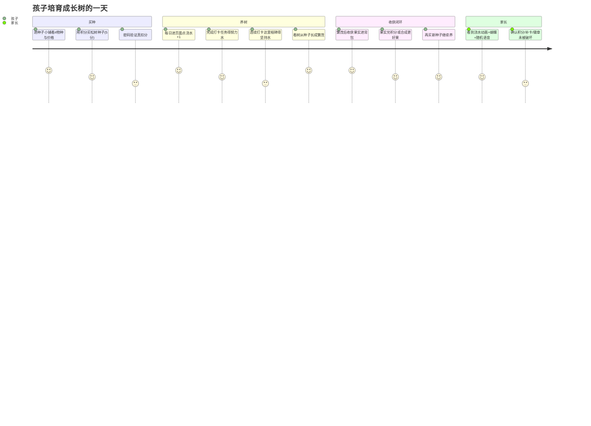

# 暑假成长积分银行 · 成长树独立页面 增量 PRD（简单版）

> 版本：v1.0（增量）｜产品：暑假成长积分银行（纯前端 PWA）｜PM：许清楚
> 关联基线：`docs/prd-growth-improve.md`（成长树 MVP：基于总积分的只读树 + 牵牛花藤蔓）、`docs/prd-ui-polish-4.md`（小蜜蜂吉祥物 + 藤蔓细节）、`docs/architecture-growth-improve.md`
> 本次范围：把"成长树"从「随总积分的只读展示」升级为「主动培育型独立页面」，对齐淘宝芭芭农场 / 京东农场养成感；引入**独立水滴真相源**、种子购买、背包仓库、果实兑换 / 合成、双树同屏、蝴蝶吉祥物；并**清除首页牵牛花藤蔓与旧树区块**。
> 硬约束：**成长树新代码必须放在独立新文件夹，禁止塞进现有 `features/growth-tree.js`**（见 §7）。

---

## 0. 落地约束（给架构师的前置条件）

- **技术栈不变**：原生 HTML + CSS（内联 `<style>`）+ 原生 ES Module JS（PWA），无框架、无构建、无新依赖；localStorage（STATE）+ IndexedDB（media blob，复用 `features/media.js`）。
- **多孩子隔离必须保持**：新增 STATE 顶层字段均需进 `core/state.js` 的 `freshState()`（`hydrateStateFrom` 只回写 `freshState()` 的 key，漏注册 = 切孩丢失）。
- **零新余额字段（铁律）**：积分加 / 扣全部复用现有机制——
  - 加分：`calcTotalScore()` 累加已打卡任务 pts；
  - 扣分：`STATE.redemptions[].cost`（含兑换奖励 + 补卡扣分）；
  - 买种子：push `{cost:grade, reward:"买种子", level:"成长树", date}` 到 `redemptions` + 密码 → 真扣；
  - 果实兑积分：push `STATE.fruitEarnings[]`（`{gain, source:"果实兑换", date}`）+ 密码 → 真加（`calcTotalScore()` 末尾 `+= Σ gain`）。
- **双真相源（故意）**：本页树由**独立水滴**驱动，与总积分解耦；**徽章逻辑暂不动、仍绑总积分**（等树做完再统一改徽章）。
- **主题铁律**：SVG / JS 内禁硬编码 hex，一律走 CSS 变量；新增蝴蝶 / 树 / 果配色变量须在 `:root` + 5 主题块（`sakura/ocean/forest/sunset/starry`）+ 暗色 `@media` 全部定义。
- **复用既有能力**：`showPasswordModal`（买种子 / 果实兑换）、`getMakeupCost / canMakeupDate / isToday`（`features/makeup.js`，补卡接续连续打卡）、`getStreak`（`features/growth-tree.js`，坚持水里程碑）、`voice-encourage`（`features/voice-encourage.js`，浇水随机语音）、`renderMascot`（替换为蝴蝶）。
- **测试底座**：Vitest 单测；现有 **181 用例不可回归**；新增树相关纯函数须有单测（见 §5 单测点）。

---

## 1. 产品目标

**一句话目标**：做一个孩子每天主动来"浇水养树"的养成页面，对标淘宝芭芭农场 / 京东农场，让成长变得可培育、可收获、可循环，强化每日打卡的内在动机。

**成功指标（可观测）**：
1. **培育渗透**：进入成长树页面且当日完成 ≥1 次浇水（每日礼 / 努力水 / 坚持水任一）的孩子日占比可统计上升。
2. **闭环率**：完成「买种 → 种下 → 养到繁茂 → 收获 → 至少 1 次果实兑换 / 合成 → 再买种」完整闭环的孩子占比可统计。
3. **平稳过渡**：树上线后徽章仍绑总积分、不报错不串数据；双真相源并存期间无积分错算（为后续统一改徽章留接口）。

---

## 2. 用户故事（孩子视角 / 家长视角）

### 孩子视角
- **US-C1 买种子开种**：作为一个孩子，我想用成长分买一棵种子（🌲松树 / 🍎苹果 / 🌸樱花 / 🍊橙子），种到地里开始养，这样我有一棵真正属于我的树。
  - 验收：种子小铺列出 4 物种与价格（🌲松树 / 🍎苹果 = 5 分；🌸樱花 / 🍊橙子 = 10 分）；点购买走密码验证并真扣分（push `redemptions`）；种子进背包 `state:'seed'`；**首次进页面不送种子**；允许囤买（不限制背包种子数）。
- **US-C2 每天浇水养树**：作为一个孩子，我每天进成长树页面点"浇水"推进树，完成任务 / 连续打卡还能额外获得水滴，看着树从小芽长成繁茂大树。
  - 验收：每日浇水礼 +1（全局 1/天）；完成打卡任务得努力水 +1（按当天任务去重）；连续打卡里程碑得坚持水（3/7/14/21/28/35 天…）；树阶段随累计水滴实时变化；页面常驻显示「还差多少水到下个等级」。
- **US-C3 收获与兑换**：作为一个孩子，我的树长到繁茂后能看到果实，把果实换成成长分或合成更好的果实，再买新种子继续养。
  - 验收：仅繁茂可收获，按物种随机产果（5 分种 3–6 / 10 分种 5–10）进背包 `state:'fruit'`；果实可兑积分（5 分果 +5 / 10 分果 +10，密码验证，push `fruitEarnings`）或种下当种子；2 个 5 分果可合成 1 个 10 分果（20% 失败，失败净 -1）。
- **US-C4 同屏看两棵**：作为一个孩子，我想同时养两棵不同物种的树对比看。
  - 验收：最多 2 棵 active 树；两棵共用一个全局水滴池、进度永远同步；种 2 棵只为同屏看 2 物种树形 / 果实差异。

### 家长视角
- **US-P1 培育陪伴**：作为一个家长，我希望看到孩子每天主动来养树（浇水动画 + 蝴蝶 + 随机语音），比单纯积分更有陪伴感。
  - 验收：浇水有动画 + 随机家长语音（复用 `voice-encourage`）；每棵树 2 只蝴蝶（替换小蜜蜂）；尊重 `prefers-reduced-motion`。
- **US-P2 不破坏既有体系**：作为一个家长，我希望新成长树不破坏积分 / 兑换 / 补卡 / 徽章，且多孩子数据隔离。
  - 验收：买种 / 兑果实走现有密码门与积分真扣真加；补卡仍可用并接续连续打卡（坚持水随之）；切孩后树 / 背包 / 果实独立；徽章仍绑总积分不受影响。

---

## 3. 需求池（P0 / P1 / P2）

> 每条含：功能点 / 描述 / 验收标准 / 优先级 / 可单测点（Vitest 纯函数）。

### P0（核心闭环，必须做）

#### P0-1 导航入口 + 首页藤蔓 / 旧树删除
- **功能点**：主导航新增 **🌳 成长树** 醒目入口（独立页面，建议作为第 5 个 `main-tab` 或等效路由，复用现有 `#mainTabNav` + `.main-tab-content` 切换机制）；删除首页牵牛花藤蔓（`renderGrowthVine()` 及其 `#growth-vine-block` 调用与容器，位于日历 Tab）；删除旧成长树区块（`renderGrowthTree()` 及其 `#growthTree` 容器，按总积分的只读树）。
- **描述**：新增导航项并接入 `main.js` 的 tab 切换监听；日历 Tab 移除 `growth-vine-block`；档案 / 日历内移除基于 `calcTotalScore` 的旧树区块。首页彻底无树视觉。
- **验收**：① 导航出现 🌳 成长树 且可进入独立页；② 日历 Tab 不再渲染藤蔓（无 `renderGrowthVine` 调用、DOM 无藤蔓内容）；③ 旧树区块移除且无 JS 报错；④ 现有 4 个 Tab 其余功能不受影响；⑤ 现有 181 用例全绿。
- **可单测点**：回归——`tests/growth-tree.test.js` 不再引用已删 render；`grep renderGrowthVine` 在全仓无调用点。

#### P0-2 种子小铺 + 购买（积分真扣）
- **功能点**：`buySeed(species, grade)`：复用 `showPasswordModal` + push `{cost:grade, reward:"买种子", level:"成长树", date}` 到 `STATE.redemptions`；种子进背包 `InventoryItem{species, grade, state:'seed'}`。
- **描述**：种子小铺列出 4 物种 2 档价（🌲松树 / 🍎苹果 = 5；🌸樱花 / 🍊橙子 = 10）；购买时选物种；**首次进页不送种子**；不禁止囤买。
- **验收**：① 4 物种齐全、价格正确；② 点购买弹密码、验证后真扣 `grade` 分（`calcTotalScore` 立减）；③ 扣费记录出现在 redemptions 兑换记录 UI（reward 标「买种子 / 成长树」）；④ 余额不足时密码通过但购买失败并提示（复用现有不足处理，不写状态）；⑤ 种子进背包 `state:'seed'`。
- **可单测点**：`buySeed(species, grade)` 在"已验证"上下文下：redemptions 增加一条 `cost===grade`、背包增加 seed 项；余额不足时返回失败且不写状态。

#### P0-3 水滴真相源（三源 + 全局共享池 + 阶段计算）
- **功能点**：`STATE.growthTree.{totalWater, firstPlantDate, lastDailyWaterDate, effortGranted, claimedMilestones, seasonSeq}`；纯函数 `grantDailyWater()` / `grantEffortWater(taskId, date)` / `grantStreakWater()` / `scoreToTreeStage(water, grade)` / `treeThresholds(grade)`。
- **描述**：
  - **每日浇水礼**：进成长树页面点「浇水」→ `grantDailyWater()`，若 `lastDailyWaterDate !== today` 则 `totalWater += 1` 并记 today（**全局 1/天**）。
  - **努力水**：当天每完成 1 个打卡任务 +1，按当天任务去重（同任务不重复发）→ `grantEffortWater(taskId, today)` 维护 `effortGranted`（按 `date:taskId` 去重）。
  - **坚持水（里程碑一次性）**：连续打卡达 3/7/14/21/28/35 天 分别 +5/10/15/20/25/30；之后每 +7 天再 +5；**断卡清零**（连续计数归零）；**补卡（复用 makeup）后连续天数接续**（按种树后连续天数 getStreakSincePlant，读 STATE.daily，含补卡接续）。已领里程碑记 `claimedMilestones`，**一次性不重复发**。
  - **全局共享**：所有 active 树共用 `totalWater`，永远同步、进度相同。
- **验收**：① 每日浇水全局仅 +1/天（同日幂等）；② 努力水当天每任务去重 +1；③ 坚持水里程碑只发一次（claimed 持久，断卡再达不重发）；④ 断卡后连续计数归零、坚持水不再按旧里程碑发；⑤ 补卡后连续天数接续（坚持水随之）；⑥ 双树共用同一 `totalWater`、阶段一致。
- **可单测点**：`grantDailyWater`（同日幂等、跨天 +1）；`grantEffortWater`（同日同任务幂等、异任务 +1）；`grantStreakWater`（3/7/14/21/28/35 阈值与之后每 +7 天 / +5；claimed 持久；断卡清零）；`scoreToTreeStage(water, grade)`（5 分种 30/70/120/180、10 分种 45/105/180/270 边界）。

#### P0-4 阶段 & 伪 3D 树（4 物种树形 + 果实，分层 SVG + CSS）
- **功能点**：`renderTreeStage(species, grade, stageIdx)` 返回分层内联 SVG（`<g>` 分组：树干 / 枝 / 叶 / 花 / 果），4 物种各一套树形 + 各一套果实 SVG（明显不同）；CSS 透视 / 随风摇摆 / 花瓣飘落做伪立体。
- **描述**：阶段阈值（见 §5 数据模型）：
  - **5 分种**：种子 0 → 发芽 30 → 长叶 70 → 开花 120 → **繁茂 180**。
  - **10 分种（×1.5）**：种子 0 → 发芽 45 → 长叶 105 → 开花 180 → **繁茂 270**。
  - 阶段 = 累计水滴。页面**常驻显示「还差多少水到下个等级」**。
- **验收**：① 5 阶段 SVG 清晰区分；② 4 物种树形 + 4 种果实明显不同；③ 配色走 CSS 变量、暗色与多主题可见、无硬编码 hex；④ 进度随 `totalWater` 实时变化；⑤ 常驻「还差 X 水到[下一阶段]」。
- **可单测点**：`treeThresholds(grade)` 返回正确阈值数组；`scoreToTreeStage` 边界阶段与 `pct∈[0,1]`；`renderTreeStage` 返回含分层 `<g>` 的 `<svg>`。

#### P0-5 种下 / 培育操作栏 / 独立页面框架
- **功能点**：`plantSeed(itemId)`（背包 seed → activeTrees，最多 2）；成长树页面骨架 `renderGrowthTreePage()`：顶部进度条 + 还差多少水、中央大树舞台、底部培育操作栏（浇水 / 种子小铺 / 背包）。
- **描述**：页面为沉浸式独立布局（见 §4）；浇水按钮 → `grantDailyWater`；种下消耗背包 seed 成 active 树；未设宝贝时整页禁用。
- **验收**：① 种下消耗 seed 进 activeTrees（<2 可加，=2 提示先移除）；② 浇水按钮每日限 1 次（已浇显示明日再来）；③ 顶部常驻进度 + 还差多少水；④ 未设宝贝整页禁用 / 隐藏；⑤ 切日 / 切孩 / 打卡后 `renderGrowthTreePage` 自动刷新（接 `renderAll`）。
- **可单测点**：`plantSeed`（<2 成功、=2 失败返回 false）；页面容器存在性 null 安全。

#### P0-6 收获（仅繁茂）+ 果实进背包
- **功能点**：`harvestTree()`：若任意 active 树处于 繁茂 → 按物种随机产果（5 分种 3–6 / 10 分种 5–10，整数随机）push 进 `inventory`（`state:'fruit'`，`grade` 继承该树）；收获后**重置本季**（`totalWater=0`、`seasonSeq++`、`effortGranted={}`），activeTrees 保留（下季从种子重新长）。
- **描述**：仅繁茂可收获；多棵 active 树各自按其 grade 产果（同屏 2 物种各产各的）；收获后两棵同步回到种子、开启新季。
- **验收**：① 非繁茂不可收获；② 繁茂时产果数在区间内随机、进背包 `state:'fruit'`、`grade` 正确；③ 收获后 `totalWater` 归 0、两树回到种子；④ `claimedMilestones` 跨季保留（坚持水不重发）。
- **可单测点**：`harvestTree`（非繁茂返回 false；繁茂返回正确数量果实且重置 totalWater；claimedMilestones 不变）。

#### P0-7 果实兑积分（真加，fruitEarnings，密码）
- **功能点**：`redeemFruit(itemId)`：复用 `showPasswordModal` + push `{gain:grade===5?5:10, source:"果实兑换", date}` 到 `STATE.fruitEarnings`；从背包移除该 fruit。
- **描述**：5 分果 → +5，10 分果 → +10；`calcTotalScore()` 末尾 `+= Σ gain`（不污染现有 redemptions 兑换记录 UI）。
- **验收**：① 弹密码、验证后真加 `gain` 分（`calcTotalScore` 立增）；② `fruitEarnings` 增加一条 `gain` 记录；③ 背包 fruit 移除；④ 余额显示随之更新且不串 child。
- **可单测点**：`redeemFruit(itemId)` 在"已验证"上下文下：fruitEarnings 增加、`calcTotalScore` 增加 `gain`、背包移除。

#### P0-8 背包仓库（种子 + 果实统一 InventoryItem）
- **功能点**：统一结构 `InventoryItem { species, grade:5|10, state:'seed'|'fruit' }`；背包面板列出全部；seed 可「种下」（→ P0-5）、fruit 可「兑换积分」（→ P0-7）或「种下当种子」（→ 以该 fruit 的 `grade` 开一季）。
- **描述**：种子 / 果实统一仓库；果实种下时其 `grade` 决定新树的阈值档（5 分果 → 5 分种，10 分果 → 10 分种）；不禁止囤买 / 囤果。
- **验收**：① 背包含 seed 与 fruit 两类且可区分；② seed「种下」→ activeTrees；③ fruit「兑换积分」走 P0-7；④ fruit「种下当种子」以自身 grade 开种；⑤ 切孩隔离。
- **可单测点**：`plantSeed` / `redeemFruit` / `plantFruitAsSeed` 状态转移正确（seed→active；fruit→gain / fruit→active）。

### P1（应该做）

#### P1-1 蝴蝶吉祥物（替换小蜜蜂）
- **功能点**：重写 `features/mascot.js` 的 `renderMascot` 为**蝴蝶**（替换小蜜蜂）；成长树页每棵树 **2 只蝴蝶**，蝶舞动画（`butterfly-dance` CSS keyframes）；`tree/success/empty/encourage` 放置位均渲染蝴蝶。
- **验收**：① 全局吉祥物为蝴蝶（成功 / 空状态 / 鼓励弹层同步替换）；② 每棵树 2 只蝴蝶、蝶舞动画；③ 配色走 CSS 变量、暗色可见；④ 单文件内联 SVG、无外链。
- **可单测点**：`renderMascot(placement)` 返回含蝴蝶 `<svg>`；placement→class 正确；非法 placement 回退默认。

#### P1-2 浇水随机语音
- **功能点**：浇水动作触发随机家长录音（`voice-encourage` 的 `getEncouragementToPlay` / `playRecording`），无录音则静默（不阻塞动画）。
- **验收**：① 浇水有随机语音（非阻塞）；② 无录音 / 不支持时静默回退，不报错；③ 不重复同一条（会话内去重）。
- **可单测点**：浇水调用 `getEncouragementToPlay` 决策（有列表返回某 id、无则 null 回退）。

#### P1-3 果实合成
- **功能点**：`synthesizeFruit()`：消耗 2 个 5 分果 → 产 1 个 10 分果；**20% 失败**，失败时消耗 2 个中 1 个消失、退回 1 个（净 -1）。
- **验收**：① 需 2 个 5 分果才可合成；② 成功产 1 个 10 分果（背包 5 分果 -2、+1 个 10 分果）；③ 失败（20%）净 -1（2 个中 1 个消失、1 个退回）；④ 结果用种子化随机可单测。
- **可单测点**：`synthesizeFruit(rng)`（成功 / 失败两态背包变化正确；不足 2 个 5 分果返回失败）。

#### P1-4 双树同屏（最多 2 active，共用池同步）
- **功能点**：`activeTrees` 最多 2；`renderGrowthTreePage` 同屏渲染 2 棵（物种不同则树形 / 果实不同）；共用 `totalWater`、进度永远一致。
- **验收**：① 可种下第 2 棵；② 两棵阶段始终一致（同池）；③ 收获时两棵同步重置；④ =2 时再种下提示先移除一棵。
- **可单测点**：`plantSeed` 在 `activeTrees.length>=2` 时返回 false；两树 `scoreToTreeStage(totalWater)` 一致。

### P2（锦上添花，可延后）

#### P2-1 主题联动
- **功能点**：背景走现有 5 套主题；树形 / 花色由物种决定，二者**解耦**（主题换背景、物种换树形果色）。
- **验收**：① 切主题背景变、树形不变；② 切物种树形 / 果色变、背景不变；③ 暗色下均可见。

#### P2-2 动画降级
- **功能点**：尊重 `prefers-reduced-motion`（摇摆 / 飘落 / 蝶舞降级为静态）；低端机降帧（动画时长 / 频率下调）。
- **验收**：① 开启减少动态效果时树 / 蝴蝶静态显示；② 无 JS 报错、无布局错乱。

#### P2-3 培育统计
- **功能点**：页面展示累计浇水次数 / 季节数 / 收获果数 / 当前连浇天数等轻量统计。
- **验收**：① 统计来自 `growthTree` 状态、随 child 隔离；② 无新持久字段（派生或复用已有计数器）。

---

## 4. UI 设计稿（文字 + 结构描述，沉浸式页面布局）

> 独立页面（第 5 个 main tab `🌳 成长树`），沉浸式、纵向分层。复用现有 `#mainTabNav` 切换机制与 CSS 变量体系。

```
┌─────────────────────────────────────────────┐
│ 顶栏（复用现有 header）                        │
│ [🐷 银行] [👧 宝贝] [🪙 123 分] [🔥 连续N天] [👨‍💼] │
├─────────────────────────────────────────────┤
│ 主导航：📅日历 ✓打卡 🎁兑换 📚档案 🌳成长树*    │  ← 新增醒目入口
├─────────────────────────────────────────────┤
│ 【顶部进度条 / 还差多少水】                    │
│ 🌱 发芽 → ▓▓▓▓▓░░░ 70%   还差 50 水到「长叶」  │  ← 常驻
├─────────────────────────────────────────────┤
│ 【中央大树舞台】（伪 3D，分层 SVG）            │
│        🌸(蝴蝶)        🍎(蝴蝶)               │  ← 每树 2 只蝴蝶
│      ╱🌳树形A╲      ╱🌳树形B╲                 │  ← 双树同屏（物种不同）
│      (枝叶花/果分层 <g>) (枝叶花/果分层 <g>)   │
│        🌸(蝴蝶)        🍎(蝴蝶)               │
│   花瓣飘落 / 随风摇摆（CSS 伪立体）            │
├─────────────────────────────────────────────┤
│ 【底部培育操作栏】                            │
│ [💧 浇水 +1](每日限1)  [🌱 种子小铺]  [🎒 背包]│
├─────────────────────────────────────────────┤
│ 【种子小铺面板】（弹层）                       │
│ 🌲松树 5分 [购买]   🍎苹果 5分 [购买]          │
│ 🌸樱花 10分 [购买]  🍊橙子 10分 [购买]         │  ← 选物种，密码真扣
├─────────────────────────────────────────────┤
│ 【背包仓库面板】（弹层，种子+果实统一）        │
│ 🌲松种×2 [种下]   🍎苹果种×1 [种下]            │
│ 🍎果×4 [兑换+5][种下当种]  🍊橙果×2 [兑换+10]  │
│ [🧪 合成：2个5分果→1个10分果]                 │  ← P1-3
└─────────────────────────────────────────────┘
```

- **顶部进度条**：显示当前阶段 + 进度%，常驻「还差 X 水到[下一阶段名]」；繁茂时提示「可收获啦 🎉」。
- **中央舞台**：最多 2 棵树，分层 SVG（树干 / 枝 / 叶 / 花 / 果各 `<g>`），CSS 透视 + 摇摆 + 花瓣飘落；每棵树 2 只蝴蝶（蝶舞）。
- **底部操作栏**：浇水（每日 1 次，已浇置灰显示「明日再来」）、种子小铺入口、背包入口。
- **种子小铺 / 背包 / 合成**：均走现有 `openModal` 单例弹层契约（z1500、关闭三要素）。
- **未设宝贝**：整页禁用 / 隐藏（沿用现有 `!STATE.childName` 闸门）。

---

## 5. 数据模型变更

### 5.1 STATE 顶层新增（须在 `core/state.js` 的 `freshState()` 注册默认值）

| 字段 | 类型 | 默认值 | 隔离 |
|---|---|---|---|
| `fruitEarnings` | `Array<{gain:number, source:'果实兑换', date:string}>` | `[]` | ✅ 随 child 快照自动隔离 |
| `growthTree` | `Object`（见下） | 见下 | ✅ 随 child 快照自动隔离 |

```js
// freshState() 新增（均随 child 快照隔离）：
fruitEarnings: [],
growthTree: {
  firstPlantDate: null,   // 种下首棵当天；此前历史不计入水滴池
  seasonSeq: 0,           // 第几季（每季从 0 重新累计）
  totalWater: 0,          // 当前季全局共享水滴池（累计）
  lastDailyWaterDate: '', // 每日浇水礼去重（按真实日，跨季保留）
  effortGranted: {},      // {'YYYY-MM-DD:taskId':true} 努力水去重（每季清空）
  claimedMilestones: [],  // [3,7,14,21,28,35,...] 坚持水已领（跨季持久，一次性）
  activeTrees: [],        // [{id, species, grade, plantedSeason}] 最多 2
  inventory: [],          // InventoryItem[] {species, grade:5|10, state:'seed'|'fruit'}
}
```

> ⚠️ 新增顶层字段必须加进 `freshState()`，否则 `hydrateStateFrom` 切孩不回写（同 §0 陷阱）。`saveData` 子快照解构已自动把挂在 STATE 上的顶层字段纳入 `childData`，无需改 `saveData`。

### 5.2 `calcTotalScore()` 变更（核心，真加果实分）

`core/data.js` 的 `calcTotalScore()` 末尾，在 `for(const r of STATE.redemptions){ total -= r.cost||0; }` 之后追加：

```js
for(const f of (STATE.fruitEarnings || [])){ total += f.gain || 0; }
return Math.max(0, total);
```

- **不污染现有 redemptions 兑换记录 UI**：果实加分走独立 `fruitEarnings`，兑换记录 UI 仍只渲染 `redemptions`。
- 买种子扣分子段走 `redemptions`（`reward:"买种子"`），与现有扣费同源、真扣。

### 5.3 阶段阈值（独立真相源，不复用旧 `STAGES`）

```js
// 新文件夹内独立定义（与旧 growth-tree.js 的 STAGES 0/20/50/100/200 不同）：
treeThresholds(grade) =>
  grade === 5
    ? [0, 30, 70, 120, 180]   // 种子/发芽/长叶/开花/繁茂
    : [0, 45, 105, 180, 270]; // 10 分种 ×1.5
```

### 5.4 坚持水里程碑表

| 连续天数 | 3 | 7 | 14 | 21 | 28 | 35 | 35+7m | 35+7m… |
|---|---|---|---|---|---|---|---|---|
| 加水 | 5 | 10 | 15 | 20 | 25 | 30 | 30+5m | … |

（`claimedMilestones` 持久一次性；断卡归零后重新达里程碑不重发。）

### 5.5 单测点汇总（Vitest，给 QA 严过关）

| 功能 | 纯函数 / 模块 | 测试要点 |
|---|---|---|
| P0-2 购买 | `buySeed(species, grade)` | 已验证下 redemptions + seed 项、余额不足失败不写 |
| P0-3 水滴 | `grantDailyWater / grantEffortWater / grantStreakWater / scoreToTreeStage / treeThresholds` | 每日幂等、努力去重、里程碑 claimed 持久、断卡清零、双树同池、阈值边界 |
| P0-4 树 | `treeThresholds(grade) / scoreToTreeStage / renderTreeStage` | 阈值正确、边界阶段、pct∈[0,1]、分层 `<g>` |
| P0-5 种下 | `plantSeed(itemId)` | <2 成功、=2 失败 |
| P0-6 收获 | `harvestTree()` | 非繁茂 false、繁茂产果区间、重置 totalWater、claimed 不变 |
| P0-7 兑果 | `redeemFruit(itemId)` | fruitEarnings+、`calcTotalScore`+gain、背包移除 |
| P0-8 背包 | `plantSeed / redeemFruit / plantFruitAsSeed` | 状态转移正确 |
| P1-1 蝴蝶 | `renderMascot(placement)` | 返回蝴蝶 `<svg>`、placement→class |
| P1-3 合成 | `synthesizeFruit(rng)` | 成功 / 失败两态背包变化、不足返回失败 |

---

## 6. 用户旅程图（Mermaid）



---

## 7. 架构边界：代码存放于独立新文件夹（硬约束）

> **用户硬约束**：成长树新功能代码必须新建一个**独立新文件夹**存放，**禁止塞进现有 `features/growth-tree.js`**。具体文件夹命名与路径由架构师定（建议如 `features/tree-garden/` 或 `features/growth-garden/`），本 PRD 仅明确边界与迁移策略。

### 7.1 对现有 `features/growth-tree.js` 的影响与迁移策略

现有 `features/growth-tree.js` 同时承载「首页藤蔓」「旧树区块（按总积分）」「连续打卡 Streak」「维度徽章」四块。本次只移除前两块，**后两块（Streak / 徽章）必须保留**（徽章仍绑总积分，双真相源故意保留）。

| 现有成员 | 处理 | 理由 |
|---|---|---|
| `renderGrowthVine` + 藤蔓辅助（`vinePoint/vineStemPath/vineLeaf/vineBranch/vineFlower/vineBud/vineSeed/vineTendril/vineDefs/morningGlorySVG`） | **删除** | 首页藤蔓按 P0-1 移除 |
| `treeSVG` + `renderGrowthTree`（旧按总积分的树区块） | **删除** | 成长树迁入独立页，由新文件夹实现 |
| `renderStreak` / `getStreak` / `countDoneOn` | **保留** | 顶部徽标 + 日历连续打卡（getStreak 仍用）；坚持水改为按种树后连续天数 getStreakSincePlant（不再复用全局 getStreak） |
| `renderBadges` / `badgeSVG` / `badgeIcon` / `badgeLevel` / `computeDimensionScores` / `isBadgeUnlocked` / `BADGE_THRESHOLD` | **保留** | 徽章暂不动、仍绑总积分（双真相源） |
| `scoreToStage` / `STAGES` / `getStageProgress` | **保留（不删）** | 删除后 `tests/growth-tree.test.js` 会挂；为保 181 用例全绿，保留旧定义，新树用独立的 `scoreToTreeStage` / `treeThresholds` |

**迁移策略**：
1. 从 `features/growth-tree.js` 中**仅删除**藤蔓相关函数与旧树区块渲染函数（P0-1）；Streak / 徽章 / `scoreToStage` 原样保留。
2. 新成长树全部逻辑放在**新文件夹**，自带 `treeThresholds` / `scoreToTreeStage` / 4 物种树形 SVG / 水滴引擎 / 背包 / 种子小铺 / 页面渲染，不 import 旧 `scoreToStage`。
3. 蝴蝶吉祥物：重写现有 `features/mascot.js`（替换小蜜蜂为蝴蝶），属**原地修改既有文件**（非新文件夹），P1-1。
4. 回归：`tests/` 现 181 用例全绿（藤蔓 / 旧树 render 无测试引用；`growth-tree.test.js` 仍测保留的纯函数）。

### 7.2 新文件夹建议结构（供架构师参考，命名可改）

```
features/<tree-garden>/            # 名称由架构师定
  water.js        // 水滴三源引擎：grantDailyWater / grantEffortWater / grantStreakWater / scoreToTreeStage / treeThresholds
  inventory.js    // 背包：InventoryItem、plantSeed / redeemFruit / plantFruitAsSeed / synthesizeFruit / harvestTree
  tree-svg.js     // 4 物种树形 + 4 果实 分层 SVG（伪 3D），renderTreeStage(species, grade, stageIdx)
  seed-shop.js    // 种子小铺购买（buySeed，复用 showPasswordModal + redemptions）
  page.js         // 成长树独立页面渲染 renderGrowthTreePage() + 底部操作栏 + 弹层接线
  index.js        // 挂载出口：导出 mountGrowthTreePage / onTaskChecked / refreshGrowthTree
```

### 7.3 集成契约（新文件夹 → 现有代码的接线点）

- **路由入口**：`main.js` 的 `#mainTabNav` 切换监听新增 `data-maintab="tree"` 分支 → 调用新文件夹 `mountGrowthTreePage()`；首次进入即渲染（`renderGrowthTreePage`）。
- **打卡接水**：`features/render.js` 的 `toggleTask` 成功分支（任务新勾选 done）追加调用新文件夹 `onTaskChecked(taskId, date)` → `grantEffortWater` + `grantStreakWater`；并刷新可见的树页。
- **renderAll 刷新**：`renderAll()` 末尾调用新文件夹 `refreshGrowthTree()`（树页可见时重渲染；不可见时静默）。
- **密码 / 语音 / 补卡**：直接复用 `showPasswordModal`、`voice-encourage`、`makeup.js`（不复制）。
- **多孩子隔离**：新文件夹读写均经 `STATE.growthTree` / `STATE.fruitEarnings`（已注册 `freshState`），随 child 快照自动隔离；不新增其它顶层字段。

---

## 8. 待确认问题（极少遗留）

本 spec 已基本锁死，仅列 2 处实现口径需架构师确认（均非产品分歧）：

1. **「新树每季从 0 开始」的落地口径**：本 PRD 采用——**单一全局 `totalWater` 池驱动所有 active 树（永远同步）；收获繁茂后重置 `totalWater=0` 开启新季（两树同步回到种子），`claimedMilestones` 跨季保留**。若你方希望改为「每棵树独立水量计数器、第二棵种下时跳到第一棵当前阶段」，请在架构阶段明确（会与「永远同步」表述冲突，需二选一）。
2. **第 5 个导航入口形态**：本 PRD 默认作为 `#mainTabNav` 第 5 个 main tab（`🌳 成长树`）；若你方希望是首页浮窗 / 侧边入口，请确认（影响 `index.html` 结构与 `main.js` 路由）。

---

## 9. 影响文件清单（给架构师的实现提示，非完整方案）

- `core/state.js`：`freshState()` 增加 `fruitEarnings:[]` 与 `growthTree:{...}`（**必须**）。
- `core/data.js`：`calcTotalScore()` 末尾 `+= Σ fruitEarnings.gain`（**必须**）。
- `features/growth-tree.js`：**删除** `renderGrowthVine` 及藤蔓辅助、`treeSVG`/`renderGrowthTree`；**保留** Streak / 徽章 / `scoreToStage`。
- `index.html`：移除日历 Tab 的 `#growth-vine-block` 容器与相关 CSS；新增第 5 个导航项与成长树页容器（或独立 `<section class="main-tab-content" id="mtab-tree">`）+ 蝴蝶 / 树 / 果配色变量（`:root`+5 主题块+暗色）+ 相关 keyframes（摇摆 / 飘落 / 蝶舞）。
- `main.js`：`#mainTabNav` 切换监听加 `tree` 分支 → `mountGrowthTreePage()`。
- `features/render.js`：`toggleTask` 成功分支调 `onTaskChecked`；`renderAll` 末尾调 `refreshGrowthTree`。
- `features/mascot.js`：重写为蝴蝶（P1-1）。
- **新文件夹**（§7.2）：`water.js` / `inventory.js` / `tree-svg.js` / `seed-shop.js` / `page.js` / `index.js`。
- `tests/`：新增树相关纯函数单测（§5.5）；回归现有 181 用例全绿。

*文档结束 — 增量 PRD（仅成长树独立页面变更部分）。*
