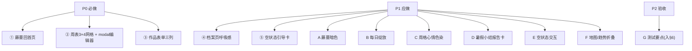

# 儿童暑期成长银行 · UI 微调（UI-polish-2）增量 PRD

> 版本：v1.1（增量，仅描述变更部分）｜产品：暑假成长积分银行（纯前端 PWA）｜PM：许清楚
> 关联：`docs/prd-ui-rework.md`（UI 重排，已验收：代码落地 + 88 单测全绿 + 卡点 bug E 根除）。本轮为其**增量微调**，不重写全量。
> **方案状态：全部条目（①–⑤ + A–G）均已拍板，回合数=0**，本 PRD 严格照此落地，不另起待确认。
> 主理人已定方向：① 藤蔓用 **SVG 矢量绘制**（纯前端、无外部依赖、可 CSS/JS 动画），不用 AI 位图。

---

## 0. 落地约束（沿用 UI-rework，不破坏）

- **技术栈不变**：原生 HTML+CSS+JS（ES Module 多文件），无框架；PWA；localStorage（STATE）+ IndexedDB（media）。
- **多孩子隔离必须保持**：藤蔓/徽章/周表/作品数据均挂在 `STATE`，随 `summerGrowthBankV2_child_<id>` 隔离；移动/重组只改 DOM 挂载点，不改持久化路径。
- **复用既有能力**：② 周表弹窗编辑器复用 `openModal`（modal.js 单例）；③ 表单字段 `id` 保持不变（main.js 保存逻辑零改动，仅调布局）；④⑤ 为主理人授权体验优化。
- **零新依赖**：D「保存为图片」须用原生 Canvas 手绘（不引入 html2canvas 等），维持"无框架"约束。
- **测试底座**：Vitest 单测；改动需保证既有 88 单测不回归。
- **铁律**：本轮 PM 只出文档，不碰 `.js/.html/.css` 源码。

---

## 1. 产品目标（一句话）

把"看得见的生长"带回首页、把复盘与记录做得更轻更顺手——首页藤蔓随积分开花、周表一屏看全、作品表单三列不累赘、档案页有呼吸感、空状态会引导。

---

## 2. 用户故事（每条 1–2 句）

### ① 成长树回首页（藤蔓长条）
- **US-1**：作为孩子/家长，我希望在首页（日历 Tab）就能看到一棵随成长分"生长+开花"的藤蔓长条，而不是要进档案页才看到进度。
  - 验收：日历 Tab 在「暑假日历」下方出现一条横贯的牵牛花藤蔓 SVG；随 `calcTotalScore()` 增长，藤蔓向右延伸、花朵依次绽放；成长树从档案页「我的成就」移除；显示阶段名 + "距下一阶段还差 X 分"。
- **US-1A（暗色）**：作为用户，切换暗色主题时藤蔓仍清晰可见。
  - 验收：藤蔓三色（藤深绿/叶亮绿/花蓝紫提亮）取自主题变量，随 `applyTheme` 切换一并更新。
- **US-1B（绽放）**：作为孩子，每天第一次打开时能看到最新一朵花"绽放"的小惊喜。
  - 验收：当天首次渲染，最新一朵花做 scale+opacity 绽放（0.6s，纯 CSS）。

### ② 每周复盘改 3×4 方块网格
- **US-2**：作为家长，我希望每周复盘以"方块网格"一屏看全 10 周，点方块弹编辑器填写，而不是纵向长列表占空间。
  - 验收：档案页「每周复盘」呈现 3 列 × 4 行 = 12 格方块；每格「第N周 + 日期范围 + 心情 emoji + 状态点」；点方块经 `openModal` 弹含 5 框 + 本周心情的编辑器；第 11 格=暑假小结入口、第 12 格=全部完成🎉装饰卡。
- **US-2C（心情色染）**：作为家长，扫一眼方块颜色就能感知这周心情。
  - 验收：每格背景按本周心情染淡色（😊暖黄 / 😐淡青 / 😢淡蓝 / 无心情灰），已填保留绿色描边。
- **US-2D（报告卡）**：作为家长，点「暑假小结」能看到一张可分享的成长汇总卡。
  - 验收：弹汇总卡含 10 周 5 维平均分 + 总积分 + 打卡天数 + 顶部大牵牛花 + 「保存为图片」。

### ③ 成长作品表单改三列自适应
- **US-3**：作为家长，我希望记录作品时表单更紧凑——日期、关联任务、作品名并排一行，背后故事满宽，上传与存入并排；窄屏自动坍缩单列。
  - 验收：第一排「日期选择 | 关联打卡任务 | 作品名称」（**日期在关联任务之前**）；第二排背后故事满宽；第三排上传 + 存入并排；窄屏单列；字段 `id` 不变；改日期后关联任务下拉刷新（联动保留）。

### ④ 档案页视觉呼吸感
- **US-4**：作为家长，我希望档案页三区块有清晰的视觉区分与留白节奏，已填/未填状态更明显。
  - 验收：三区块用主题色分区头（🌟成就橙 / 📝复盘蓝 / 🎨作品紫）+ 左侧 4px 圆角竖条 + 更大字号；区块间留白 28–36px + 细线；统一圆角 16px + 轻阴影 + hover 微提；成长树移走后「我的成就」仅留徽章墙；徽章墙改 flex-wrap 自适应；糖果色。

### ⑤ 作品档案空状态引导
- **US-5**：作为家长，当还没有作品时，我希望空状态是引导卡（大图标 + 文案 + 按钮），点按钮就地展开表单，而不是只给一行字。
  - 验收：空状态显示引导卡（🎨/🌱 大图标 + 文案 +「去记录第一个作品 ✨」按钮）；**E**：空状态只显引导卡、隐藏作品表单；点按钮后表单淡入、引导卡收起；表单在作品列表上方（DOM 顺序），点完免滚动可见。

### F 成长地图/趋势折叠
- **US-F**：作为用户，首页成长地图与积分趋势图可收起，减少滚动。
  - 验收：两卡右上角加"展开/收起"箭头；默认成长地图展开、积分趋势图收起；折叠态记忆（轻量本地偏好）。

---

## 3. 需求池（P0 / P1 / P2）

> P0 必做（①②③核心）；P1 应做（④⑤ + A暗色 + B绽放 + C心情染 + D报告卡 + E空状态交互 + F折叠）；P2 仅验收标准（G，非需求）。
> "影响文件/锚点"指向当前代码，便于架构师定位（详见 §5）。

### P0

| 编号 | 类型 | 需求 | 验收标准 | 优先级 | 影响文件/锚点 |
|---|---|---|---|---|---|
| R1 | 功能变更 | ① 首页（日历 Tab）「暑假日历」下方新增一条**牵牛花藤蔓长条**（`.growth-vine-block`），横贯页宽、高度 ≤160px，纯 SVG 矢量绘制 | 藤蔓为 SVG（无位图/无外部依赖）；随 `calcTotalScore()` 增长，藤蔓向右延伸、花朵依次绽放；含轻量 CSS 生长/绽放动画 | P0 | `index.html`（#mtab-calendar 内「暑假日历」panel 与「成长地图」#mapGrid 之间加 `.growth-vine-block`）；`features/growth-tree.js`（新增 `renderGrowthVine`，复用 `scoreToStage`/`STAGES`/`calcTotalScore`） |
| R2 | 功能变更 | ① 成长树从档案页「我的成就」移除（`#growthTree` 不再出现在档案页），改为首页藤蔓摘要 | 档案页「我的成就」仅含徽章墙；`renderAll()` 中 `renderGrowthTree()` 调用改为 `renderGrowthVine()`（目标容器 `.growth-vine-block`） | P0 | `index.html`（删 #mtab-archive 内 `#growthTree` 列）；`features/render.js` `renderAll`（L120） |
| R3 | 功能变更 | ① 藤蔓进度沿用现有阶段模型（STAGES：种子0/发芽20/幼苗50/开花100/结果200），首页只显示**摘要版**（藤蔓 + 阶段名 + "距下一阶段还差 X 分"），不展开完整树图 | 阶段/进度由 `scoreToStage(total)` 推导；不改 STAGES 语义；摘要文案沿用旧 `tree-stage-label`/`tree-next`（"距「X」还差 N 分"） | P0 | `features/growth-tree.js` `scoreToStage`/`STAGES` |
| R4 | 功能变更 | ② 周表由纵向 10 行列表改为 **3 列 × 4 行 = 12 格方块网格**（10 周 + 第11格「暑假小结」入口 + 第12格「全部完成 🎉」装饰卡） | `grid-template-columns:repeat(3,1fr)`；展示 10 真实周 + 2 附加格；窄屏 `@media` 降为 2 列 | P0 | `features/render.js` `renderWeekTable`（L1005）；`index.html` `#weekTable` 容器保留；新增 CSS `.week-grid`/`.week-cell` |
| R5 | 功能变更 | ② 每格显示「第N周（大字）+ 日期范围 + 心情 emoji + 状态点（已填实心绿/未填空心灰）」 | 每格含 `第N周`、`getWeekMeta` 还原 `M/D–M/D`、心情 emoji（有则显）、●已填/○未填；已填/未填视觉区分明显 | P0 | `features/render.js` `renderWeekTable` 单元格模板（复用 `enumerateSummerWeeks`/`getWeekMeta`） |
| R6 | 功能变更 | ② 点击方块 → 复用 `openModal` 单例弹编辑器（5 框 + 本周心情），逻辑平移、存储结构不变 | 弹窗 id `week-editor-<weekKey>`（保证单例）；编辑器复用 `buildWeekEditor` 字段（best/hard/next/parent/support + mood）；保存仍走 `saveWeekReview`；关闭/遮罩/Esc 统一 | P0 | `features/render.js` 新增 `openWeekEditorModal(weekKey)` 包裹 `openModal`+`onMount`；`features/modal.js` `openModal` 复用 |
| R7 | 功能变更 | ③ 作品表单第一排三列并排：**日期选择 \| 关联打卡任务（下拉）\| 作品名称**（日期在关联任务之前） | `#workDate` 在 `#workTask` 之前；三列同排；字段 `id` 不变，main.js 保存逻辑零改动 | P0 | `index.html` `#mtab-archive` `.work-form`（当前顺序 workTask→workDate→workTitle→workNote→upload→save） |
| R8 | 功能变更 | ③ 第二排背后故事满宽 textarea；第三排上传文件 + 存入按钮并排 | `#workNote` 跨整行；`.upload-box` 与 `#saveWork` 同排 | P0 | `index.html` `.work-form` 结构；CSS `.work-form{grid-template-columns:repeat(3,1fr)}` + 行/列跨度 |
| R9 | 功能变更 | ③ 响应式：宽屏三列、窄屏（≤640px）自动坍缩单列（`grid auto-fit minmax`） | 窄屏三列坍缩单列；控件最小可点区域不变；日期→关联任务联动保留（详见 R10） | P0 | `index.html` `<style>` 新增/调整 `.work-form` 媒体查询 |

### P1

| 编号 | 类型 | 需求 | 验收标准 | 优先级 | 影响文件/锚点 |
|---|---|---|---|---|---|
| R10 | 功能变更 | ③ 保留日期→关联任务下拉联动：日期一改刷新 `#workTask` 选项为当日打卡任务 | 改 `#workDate` 后调用 `renderWorksDropdown()`（main.js L363/L391）刷新下拉；**仅挪布局，不丢联动**，字段 `id` 不变 | P1 | `main.js` `renderWorksDropdown`（L363）；`#workDate` change 监听（L391） |
| R11 | 体验优化 | ④ 档案页成长树移走后，「我的成就」仅留徽章墙，三区块重排：徽章墙 → 周表方块 → 作品 | 该区改单一徽章墙（全宽/居中收窄）；不再出现成长树占位；区块顺序 成就→复盘→作品 | P1 | `index.html` `#mtab-archive` `.achievement-grid` → 仅 `.badge-wall` |
| R12 | 体验优化 | ④ 主题色分区头：🌟成就(橙) / 📝复盘(蓝) / 🎨作品(紫)；标题左侧 4px 圆角竖条 + 更大字号 | 三区块标题加 `.sec-bar`（4px 圆角竖条）+ 放大字号；颜色固定 橙/蓝/紫（跨主题一致） | P1 | `index.html` 区块标题；新增 CSS `.archive-section`/`.sec-bar`/`.sec-title--achievement\|review\|works` |
| R13 | 体验优化 | ④ 区块间留白 28–36px + 细分隔线；统一圆角 16px + 轻阴影 + hover 微提；配色走"活泼糖果色" | 区块间距 28–36px；区隔细线；卡片圆角 16px + 轻阴影 + hover 上移；整体糖果色 | P1 | `index.html <style>` 新增 `.archive-section`/`.archive-card` 等 |
| R14 | 体验优化 | ④ 状态更醒目：已填卡片绿色描边、未填灰色（不只靠 ●/○）；徽章墙改 flex-wrap 自适应（不再死板 5 列，窄屏自动换行） | 已填方块/已解锁徽章绿色描边+底色；未填弱化但清晰；徽章墙 `display:flex;flex-wrap:wrap` 自适应 | P1 | CSS `.week-cell.filled`/`.badge-slot.unlocked` 强化；`.badge-wall` 改 flex-wrap |
| R15 | 体验优化 | ⑤ 作品空状态升级为引导卡：大图标(🎨/🌱) + 文案 +「去记录第一个作品 ✨」按钮（替代原纯文本空状态） | 空分支渲染引导卡（大图标+文案+按钮）；原纯文本 `empty-state` 不再用于作品空态 | P1 | `features/render.js` `renderArchive` 空分支（L1133） |
| R16 | 功能变更 | **A** 藤蔓暗色主题适配：藤蔓三色（藤深绿/叶亮绿/花蓝紫提亮）用主题变量，随 `applyTheme` 切换一并更新 | 在 `:root` 及所有 `body[data-theme=...]`（含暗色）定义 `--vine-stem/--vine-leaf/--vine-flower`；藤蔓 SVG 用 `var()` 引用；暗色下花朵蓝紫提亮可见 | P1 | `index.html <style>` 主题变量；`features/growth-tree.js` `renderGrowthVine` 用变量 |
| R17 | 功能变更 | **B** 每日绽放微动画：每天首次打开，最新一朵花做 scale+opacity 绽放（0.6s，纯 CSS） | 用轻量键记录"今日已绽放"（如 localStorage/STATE 键含 childId+date）；首次渲染给最新花加 `.bloom` 触发 CSS keyframes（0.6s） | P1 | `features/growth-tree.js` `renderGrowthVine` + 新增 CSS `@keyframes vineBloom` |
| R18 | 体验优化 | **C** 周格心情色染：每格背景按本周心情染淡色（😊暖黄 / 😐淡青 / 😢淡蓝 / 无心情灰），已填保留绿色描边 | 周 mood 仅 happy/neutral/sad 三态（与每日 mood 独立，沿用 UI-rework 隔离）；按 mood 上淡色背景；已填态叠加绿色描边 | P1 | `features/render.js` `renderWeekTable` 单元格模板 + CSS `.week-cell.mood-*` |
| R19 | 功能变更 | **D** 暑假小结成长报告卡：点第 11 格「暑假小结」弹汇总卡 = 10 周 5 维平均分 + 总积分 + 打卡天数 + 顶部大牵牛花 + 「保存为图片」 | 经 `openModal('summer-summary')` 弹卡；5 维（学习/运动/自控/探索/实践）得分复用 `computeDimensionScores`；总积分 `calcTotalScore()`；打卡天数=有≥1 done 的天数；「保存为图片」用原生 Canvas 手绘导出（零依赖） | P1 | `features/render.js` 新增 `openSummerSummary()`；`features/growth-tree.js` 大牵牛花 SVG；原生 Canvas |
| R20 | 功能变更 | **E** 空状态交互：空状态只显引导卡、隐藏作品表单；点按钮后表单淡入、引导卡收起；表单在作品列表上方（DOM 顺序） | 空态 `.work-form` 隐藏（display:none/折叠）、`.work-empty-guide` 显示；点按钮 → 表单 `fadeIn`、引导卡收起；表单 DOM 保持在 `#workArchive` 列表上方（不挪到列表后），点完免滚动可见 | P1 | `index.html` `.works-layout` 结构；`features/render.js` `renderArchive` 空分支控制显隐 |
| R21 | 功能变更 | **F** 成长地图(5维) 与 积分趋势图 两卡右上角加"展开/收起"箭头；默认成长地图展开、积分趋势图收起 | 两卡头部加 `.collapse-toggle`（箭头）；点击切换 body 显隐；默认地图展开、趋势收起；折叠态记忆（轻量本地偏好，不破坏 child 隔离） | P1 | `index.html` 成长地图(#mapGrid)/趋势图(#trendChart) 容器加 header+toggle；`features/render.js` 或 main.js 绑定 |

### P2（非需求，转入 §6 验收标准）

| 编号 | 内容 | 说明 |
|---|---|---|
| G | 测试要点（藤蔓映射 / 12 格 / modal 编辑器+周心情独立 / 表单日期→任务联动 / 空状态引导卡 / 多孩子藤蔓重绘） | 转交 QA 严过关，写入 §6 验收标准，不单列需求 |

### 需求优先级总览（Mermaid）



---

## 4. UI 设计稿（ASCII / 文本草图）

### 4.1 ① 首页藤蔓长条（含暗色/绽放标注）

```
📅 日历 Tab
┌──────────────── 暑假日历 ────────────────┐
│ [◀][今天][▶]  日历格…   选中日期信息    │
└──────────────────────────────────────────┘
┌────── 🌿 成长藤蔓（.growth-vine-block，≤160px）──────┐
│  〰️🍃🌸🍃🌸🍃🌸🍃🌼→        ← SVG 牵牛花藤蔓，横贯满宽
│  阶段：幼苗 · 距「开花」还差 40 分 🌼   │  ← 摘要：阶段名 + 距下阶段差 X 分
│  [暗色] 花蓝紫提亮·藤深绿·叶亮绿（主题变量）│  ← A：随 applyTheme 切换
│  [每日首次] 最新一朵花 scale+opacity 绽放0.6s│  ← B：.bloom CSS 微动画
└──────────────────────────────────────────┘
🗺 成长地图（5维）   📈 本月积分趋势（F：可收起）
```
> 藤蔓纯 SVG（viewBox 自适应宽，高≤160px）；`stroke-dashoffset` 做"藤蔓在爬"生长动画；花朵用 `transform:scale` 依次绽放；三色取自 `--vine-stem/--vine-leaf/--vine-flower` 主题变量。

### 4.2 ② 周表 3×4 方块网格（含小结/完成卡 + 心情色）

```
【每周复盘】
┌────────────┬────────────┬────────────┐
│ 第1周(大字) │ 第2周(大字) │ 第3周(大字) │
│ 7/1–7/7     │ 7/8–7/14   │ 7/15–7/21  │
│ 😊 暖黄底    │ 😐 淡青底    │ ○未填 灰   │  ← C：背景按心情染淡色
│ ●已填(绿描边)│ ○未填(灰)   │ ○未填(灰)  │
├────────────┼────────────┼────────────┤
│ 第4周 …     │ 第5周 …     │ 第6周 …    │
├────────────┼────────────┼────────────┤
│ 第7周 …     │ 第8周 …     │ 第9周 …    │
├────────────┼────────────┼────────────┤
│ 第10周       │ 🌞 暑假小结   │ ✨ 全部完成 🎉│  ← 第11格=小结入口 / 第12格=装饰卡
│ 8/24–8/30   │ (可点→报告卡D)│ (装饰)     │
└────────────┴────────────┴────────────┘
窄屏(≤640px)：降为 2 列
点击任一方块 → openModal('week-editor-<weekKey>') 弹：
┌──── 第1周 · 7/1–7/7 ────┐
│ 最棒的事 [textarea]      │
│ 遇到的困难 [textarea]    │
│ 下周计划 [textarea]      │
│ 家长看见的进步 [textarea]│
│ 孩子希望的支持 [textarea]│
│ 本周心情 😊 😐 😢        │  ← 周 mood，与每日 mood 独立
│      [ 保存本周复盘 ]    │
└─────────────────────────┘
```

### 4.3 ③ 作品表单三列布局（日期→任务联动保留）

```
【成长作品】表单
┌────────────┬────────────┬────────────┐
│ 📅 日期选择  │ 🔗 关联任务  │ ✏️ 作品名称  │  ← 一排三列（日期在关联任务前）
├────────────┴────────────┴────────────┤
│ 📝 背后故事（满宽 textarea）           │
├────────────┬─────────────────────────┤
│ 📎 上传文件  │      [ 存入成长档案 ]   │  ← 上传 + 存入并排
└────────────┴─────────────────────────┘
窄屏(≤640px)：grid auto-fit → 自动坍缩单列
[联动] 改 #workDate → renderWorksDropdown() 刷新 #workTask（选项=当日打卡任务）
```

### 4.4 ④ 档案页糖果色分区（成长树已回首页）

```
📚 成长档案
┌─ ▍🌟 我的成就（橙·4px竖条）────────────┐
│  🏅 徽章墙（flex-wrap 自适应，不再死板5列）│  ← R11：仅徽章墙
└────────────────────────────────────────┘
   ↕ 留白 28–36px + 细线
┌─ ▍📝 每周复盘（蓝·4px竖条）───────────┐
│  3×4 方块网格（见 4.2）+ 情绪趋势卡     │
└────────────────────────────────────────┘
   ↕ 留白 28–36px + 细线
┌─ ▍🎨 成长作品（紫·4px竖条）───────────┐
│  三列表单（见 4.3）+ 作品档案列表       │
└────────────────────────────────────────┘
统一：圆角16px + 轻阴影 + hover 微提；糖果色
已填卡绿色描边 / 未填灰色（不只靠●/○）
```

### 4.5 ⑤ 空状态引导卡（含 E 交互）

```
【作品档案】空状态
┌──────────────────────────────────────────┐
│            🎨 / 🌱  (大图标)              │
│   还没有作品呢～暑假的每一份努力都值得收藏 ✨│
│        [ 去记录第一个作品 ✨ ]             │  ← 按钮：点后就地展开表单
└──────────────────────────────────────────┘
   ↑ 空状态时显示；作品表单(.work-form)隐藏
点击按钮 →
  引导卡收起(display:none) + 作品表单 fadeIn
  表单在作品列表上方(DOM 顺序) → 免滚动可见   ← E
（有作品后：正常显示表单 + 列表，无引导卡）
```

### 4.6 D 暑假小结 · 成长报告卡

```
openModal('summer-summary') 弹：
┌──────── 成长报告卡 ────────┐
│          🌸 大牵牛花(顶部)  │  ← SVG 放大版
│  10 周 5 维得分：           │
│  学习力 ▓▓▓▓░ 82            │  ← computeDimensionScores
│  运动力 ▓▓▓░░ 65            │
│  自控力 ▓▓░░░ 40            │
│  探索力 ▓▓▓▓░ 78            │
│  实践力 ▓▓▓░░ 60            │
│  总积分：325 分             │  ← calcTotalScore
│  打卡天数：42 天            │
│  [ 保存为图片 📷 ]          │  ← 原生 Canvas 导出(零依赖)
└────────────────────────────┘
```

### 4.7 F 成长地图 / 积分趋势 折叠箭头

```
🗺 成长地图（5维）          [⌄ 展开]  ← 默认展开
┌──────────────────────────────┐
│ [学][运][自][探][实] 维度卡   │
└──────────────────────────────┘
📈 本月积分趋势            [› 收起]  ← 默认收起
┌──────────────────────────────┐
│ (body 折叠：仅留 header+箭头) │
└──────────────────────────────┘
[折叠态记忆：轻量本地偏好]
```

---

## 5. 影响文件锚点汇总（给架构师）

| 需求 | 文件 | 动作 | 关键锚点 |
|---|---|---|---|
| ① | `index.html` | 改 | #mtab-calendar 内「暑假日历」panel 后加 `.growth-vine-block`；删 #mtab-archive 内 `#growthTree` 列；`<style>` 加 `--vine-*` 主题变量 + `.growth-vine-block` + `@keyframes vineBloom` |
| ① | `features/growth-tree.js` | 改 | 新增 `renderGrowthVine`（SVG 牵牛花藤蔓 + stroke-dashoffset 生长 + 花朵绽放 + 主题变量配色）；复用 `scoreToStage`/`STAGES`/`calcTotalScore`/`computeDimensionScores`；大牵牛花 SVG 供 D |
| ① | `features/render.js` | 改 | `renderAll`（L120）`renderGrowthTree()` → `renderGrowthVine()`；多孩子隔离天然（calcTotalScore 随 child） |
| ② | `features/render.js` | 改 | `renderWeekTable`（L1005）重写 3×4 网格（10 周 + 小结/完成占位）；新增 `openWeekEditorModal(weekKey)` 包裹 `openModal`；`buildWeekEditor`（L1051）字段定义平移为 modal 内容；新增 `openSummerSummary()`（D） |
| ② | `index.html` | 改 | `#weekTable` 容器保留；新增 `.week-grid`/`.week-cell`/`.week-cell.filled`/`.week-cell.mood-*` 样式 |
| ③ | `index.html` | 改 | `.work-form` 内部顺序改为 `workDate → workTask → workTitle → workNote(满宽) → upload+save(并排)`；字段 `id` 不变；`<style>` 加 `.work-form{grid-template-columns:repeat(3,1fr)}` + 跨度 + ≤640px 坍缩单列 |
| ③ | `main.js` | 不改逻辑 | `renderWorksDropdown`（L363）+ `#workDate` change（L391）联动保留，仅布局变动触发 |
| ④ | `index.html` | 改 | `#mtab-archive` `.achievement-grid` → 仅 `.badge-wall`；`.badge-wall` 改 flex-wrap；区块标题加 `.sec-bar`+`.sec-title--achievement/review/works`；新增 `.archive-section`/`.archive-card` 圆角16/轻阴影/hover；区块间距 28–36px + 细线 |
| ⑤ | `features/render.js` | 改 | `renderArchive` 空分支（L1133）渲染引导卡 `.work-empty-guide` + 按钮；空态 `.work-form` 隐藏、点按钮 `fadeIn` 展开（E） |
| F | `index.html` | 改 | 成长地图(#mapGrid)/趋势图(#trendChart) 容器加 header + `.collapse-toggle` 箭头；`<style>` 折叠态 |
| F | `features/render.js`/`main.js` | 改 | 绑定折叠；默认地图展开、趋势收起；折叠态记忆 |

> **不动清单（回归护栏）**：暑假日历、PWA、积分/兑换、`toggleTask` 计分、`saveData` 子快照解构、`openModal` 既有契约、`STATE.reviews` 周表数据结构（沿用 UI-rework 的 `WeekReview`，含独立 `mood`）、既有 88 单测。

---

## 6. 验收标准（含 G 测试要点，转交 QA 严过关）

### 6.1 功能验收（按需求）
- **① 藤蔓**：SVG 矢量、无位图；随 `calcTotalScore` 生长+开花；摘要显示阶段名+"距下一阶段还差 X 分"；档案页不再含 `#growthTree`。
- **② 周表 12 格**：`renderWeekTable` 渲染 3×4=12 格（10 周 + 暑假小结入口 + 全部完成🎉）；每格含第N周/日期范围/心情 emoji/状态点；点击经 `openModal` 弹 5 框 + 周 mood 编辑器；保存走 `saveWeekReview`。
- **③ 表单三列**：第一排 `workDate→workTask→workTitle`；第二排 `workNote` 满宽；第三排 upload+save 并排；窄屏单列；改 `#workDate` 触发 `renderWorksDropdown` 刷新 `#workTask`。
- **④ 档案呼吸感**：成就(橙)/复盘(蓝)/作品(紫) 分区头 + 4px 竖条；区块间距 28–36px + 细线；圆角16 + 轻阴影 + hover；徽章墙 flex-wrap；仅徽章墙（无成长树）；糖果色；已填绿描边/未填灰。
- **⑤ 引导卡**：空态显示大图标+文案+按钮；替代纯文本。
- **A 暗色**：藤蔓三色取自主题变量，暗色主题下可见（花蓝紫提亮）。
- **B 绽放**：当天首次渲染最新花 0.6s scale+opacity 绽放（纯 CSS）。
- **C 心情色**：周格按 happy/neutral/sad 染暖黄/淡青/淡蓝，无心情灰；已填绿描边。
- **D 报告卡**：点小结格弹卡含 10 周 5 维得分 + 总积分 + 打卡天数 + 大牵牛花 + 保存为图片（原生 Canvas）。
- **E 空状态交互**：空态只显引导卡、隐藏表单；点按钮表单 fadeIn、引导卡收起；表单在列表上方（DOM），免滚动。
- **F 折叠**：两卡右上角箭头；默认地图展开、趋势收起；折叠态记忆。

### 6.2 G 单元测试要点（Vitest，QA 严过关）
| 测试点 | 验证方式 | 期望 |
|---|---|---|
| 藤蔓进度映射 | 复用 `scoreToStage`：total=0/20/50/100/200 边界 | 返回正确 stage/idx/pct；藤蔓长度与花朵数随积分单调增长 |
| 周表 12 格 | 调用 `renderWeekTable` 后统计 `.week-cell` | 共 12 格，含 10 真实周 + 2 占位（小结/完成）；窄屏 2 列 |
| modal 编辑器 + 周 mood 独立 | 打开 `week-editor-<weekKey>`，填 5 框 + 选 mood + 保存 | 写入 `STATE.reviews`；周 `mood` 与 `daily[date].mood` 互不影响（隔离） |
| 作品表单日期→任务联动 | 改 `workDate` 后查 `#workTask` 选项 | 选项 = 该日打卡任务（复用 `renderWorksDropdown`），布局变动不丢联动 |
| 空状态引导卡渲染 | `STATE.daily` 无 artworks 时 `renderArchive` 空分支 | 显示 `.work-empty-guide`（大图标+文案+按钮）；点按钮表单显、引导卡隐 |
| 多孩子切换藤蔓重绘 | 切 activeChild 后 `renderGrowthVine` | 藤蔓按新 child 的 `calcTotalScore` 重绘（隔离正确） |

- 既有 88 单测须全绿（不可因重构回归）。

---

## 7. 待确认问题

**无。** 本轮方案（①–⑤ + A–G）已全部拍板，回合数=0；各条目技术约束（SVG 矢量藤蔓、阶段阈值沿用 `scoreToStage`、周 mood 独立、表单 `id` 不变、`openModal` 复用、零新依赖）均已明确，无遗留歧义需升级。

> 唯一提示（非阻塞、非待确认）：周 mood 实际仅 happy/neutral/sad 三态，"😡淡红"为需求描述笔误，已按三态映射为 暖黄(😊)/淡青(😐)/淡蓝(😢)/灰(无)；如需红色态需扩 `WeekReview.mood` 字段（与"存储结构不变"冲突，故不采用）。

*文档结束 — 增量 PRD（仅变更部分），配合 `docs/prd-ui-rework.md` 与 `docs/architecture-ui-rework.md` 使用。*
