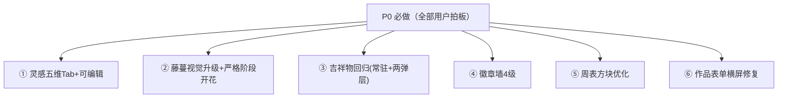

# 儿童暑期成长银行 · UI 打磨（UI-polish-3）增量 PRD

> 版本：v1.0（增量，仅描述变更部分）｜产品：暑假成长积分银行（纯前端 PWA）｜PM：许清楚
> 关联：`docs/prd-ui-polish-2.md` 与 `docs/architecture-ui-polish-2.md`（UI-polish-2 已验收：103 单测 + 29 E2E 全绿）。本轮为其**增量打磨第三轮**，不重写全量。
> **方案状态：全部条目（①–⑥）均已拍板，回合数=0**，本 PRD 严格照此落地，不另起待确认。

---

## 0. 落地约束（沿用前两轮，不破坏）

- **技术栈不变**：原生 HTML+CSS+JS（ES Module 多文件），无框架；PWA；localStorage（STATE）+ IndexedDB（media）。CSS 全部内联于 `index.html` 的 `<style>`。
- **多孩子隔离必须保持**：藤蔓/徽章/周表/作品数据均挂在 `STATE`，随 `summerGrowthBankV2_child_<id>` 隔离；移动/重组只改 DOM 挂载点，不改持久化路径。
- **复用既有能力**：① 修改编辑框、③ 成功/鼓励弹层吉祥物均复用 `openModal`（modal.js 单例）；④ 徽章墙复用 `computeDimensionScores`；② 藤蔓复用 `scoreToStage`/`STAGES`/`calcTotalScore`。
- **零新依赖**：牵牛花/徽章/吉祥物全部内联 SVG + CSS 变量/动画，不引入位图或动画库。
- **测试底座**：Vitest 单测 + E2E；改动须保证既有 103 单测 + 29 E2E 不回归。
- **铁律**：本轮 PM 只出文档，不碰 `.js/.html/.css` 源码。**main.js / runtime.js / parent-center.js 中 bug E 修复的接线一律不动**（见 §5 不动清单）。

---

## 1. 产品目标（一句话）

把"灵感可定制、生长看得见、吉祥物有陪伴、成就分等级、周表更轻、表单不溢出"一次性打磨到位——让首页藤蔓严格按阶段生长开花、吉祥物重新登场、徽章呈现 4 级成长、周表一眼可读、作品表单在任意屏宽都稳稳放下。

---

## 2. 产品定义

### 2.1 产品目标（3 个，正交）

1. **灵感可定制**：灵感库按五维胶囊切换、可改标题/分值并持久化，默认灵感保留为模板、可一键恢复。
2. **生长可信且可爱**：藤蔓视觉升级为真实牵牛花形态，并严格按阶段（种子→发芽→长叶→开花→繁茂）控制花/叶/芽，杜绝"发芽就开花"的错乱；吉祥物回归常驻与弹层。
3. **成就与列表更轻更稳**：徽章分 4 级呈现真实成长梯度；周表方块减半高度、心情大图、未到周灰禁点、小结格带当前日期；作品表单改 `auto 1fr 1fr` 杜绝横屏溢出。

### 2.2 用户故事（每条 1–2 句）

- **① 灵感五维 + 可编辑**：作为孩子/家长，我希望灵感库顶部分维度切换、并随手改一条灵感的标题和分值（分类不动），改完记住、还能恢复默认。验收：灵感库弹窗顶部出现「全部/学习力/运动力/自控力/探索力/实践力」胶囊 Tab（选中高亮、未选灰底），点 Tab 只显该维；每条「仅参考」按钮改为「修改」，弹小编辑框（标题+分值可改、分类只读），保存写入 `customIdeas[id]` 覆盖默认、可「恢复默认」。
- **② 藤蔓视觉升级 + 严格阶段开花**：作为孩子，我希望首页藤蔓是真正的牵牛花（弯曲藤茎、心形叶、喇叭花、卷须、渐变配色），并且只有到了开花阶段才盛开、长叶阶段只冒花苞。验收：`renderGrowthVine` 改贝塞尔曲线茎 + 真实牵牛叶形 + 喇叭形花 + 卷须 + 深浅绿/蓝紫渐变；花朵/花苞严格按 `scoreToStage` 阶段 gating（种子无花无叶、发芽仅 2 小葉、长叶多叶+花苞、开花盛花、繁茂满屏花+新苞）。
- **③ 吉祥物回归**：作为孩子，我希望藤蔓右端常驻一只小芽陪着我长大，打卡成功和鼓励时也能看到小芽。验收：首页藤蔓长条右端常驻 `renderMascot('tree')` 小芽（随阶段微表情/姿态变化）；打卡成功弹层挂 `renderMascot('success')`、鼓励弹层挂 `renderMascot('encourage')`（mascot.js 既有函数，仅补挂载，不改吉祥物内部逻辑）。
- **④ 徽章墙 4 级**：作为家长，我希望徽章不只"亮/灭"两点态，而是按维度积分分成种子→发芽→盛开→硕果 4 级，同一图案随等级变复杂。验收：`renderBadges` 按各维积分（默认 0–9/10–24/25–49/50+ 分 4 级）渲染 SVG（单色描边→填充→光泽渐变→星饰光晕），复用 `computeDimensionScores`。
- **⑤ 周表方块优化**：作为家长，我希望周表方块更矮、周次和日期在一行、下方用大图心情，还没到的周是灰的不能点，小结格带上今天日期。验收：`renderWeekTable` 单元高度减半、周次+日期同行、心情 emoji 放大；未来周灰色 + `pointer-events:none` + 不绑编辑器；小结格加「📅 截至 {今日}」；窄屏仍 2 列。
- **⑥ 作品表单横屏溢出修复**：作为家长，我希望作品表单在手机/桌面/超宽屏都不横向溢出。验收：`.work-form` 第一排改 `grid-template-columns:auto 1fr 1fr`（日期自适应、关联任务与作品名平分剩余）；`workNote` 满宽不变；上传+存入用 `flex-wrap` 防溢出；375/1920/2560+ 三档均不溢出；窄屏仍单列。

---

## 3. 需求池（全部 P0）

> ①–⑥ 均为用户明确拍板需求，**全部 P0**。无 P1/P2 单列（纯体验打磨，无新阻塞项）。
> "影响文件/锚点"指向当前代码，便于架构师定位（详见 §5）。

| 编号 | 类型 | 需求（变更点） | 验收标准 | 优先级 | 影响文件/锚点 |
|---|---|---|---|---|---|
| R1 | 功能变更 | **① 灵感库五维胶囊 Tab + 可编辑**：`renderIdeaLibrary()` 弹窗顶部加 6 个胶囊 Tab（全部/学习力/运动力/自控力/探索力/实践力），选中高亮、未选灰底；点击只显该维灵感（「全部」显全部，保持现状）。每条「仅参考」按钮→「修改」按钮 | 6 个胶囊 Tab（选中高亮/未选灰底）；点 Tab 过滤维度；「仅参考」消失、「修改」出现；默认「全部」 | P0 | `features/ideas.js`（`renderIdeaLibrary` 加 Tab + 改按钮）；`index.html` `<style>` 加 `.idea-cat-tabs`/`.idea-tab` 胶囊样式 |
| R2 | 功能变更 | **① 修改弹框（复用 openModal）**：点「修改」弹小编辑框，仅可改 `title`/`pts`，`cat` 只读冻结；确认写入 `data.customIdeas[id]={title,pts}`（按 id 覆盖默认条目，**不改删默认**），提供「恢复默认」删除该覆盖；默认灵感保留为初始模板、用户改过的走自定义优先级 | 编辑框只暴露标题+分值（分类只读）；保存后该条用自定义 title/pts 渲染；「恢复默认」清掉覆盖回默认；默认条目不被删除 | P0 | `features/ideas.js`（新增 `openIdeaEditModal` 复用 `openModal`；新增 `customIdeas` 读写：`loadCustomIdeas()`/`saveCustomIdea(id,{title,pts})`/`resetCustomIdea(id)`/`getIdeaView(idea)`）；存于主数据 `summerGrowthBankV2.customIdeas`（全局，与 `customRewards` 一致，不进 child 快照） |
| R3 | 功能变更 | **② 藤蔓视觉升级**：`renderGrowthVine` 茎改**贝塞尔曲线**（自然弯曲，非折线）；叶用**真实牵牛叶形**（心形/卵形带锯齿 SVG path）；花用**喇叭形**（5 瓣漏斗状，非圆）；加**藤蔓卷须**细节；配色更丰富（深浅绿渐变茎、蓝紫渐变花心，用 SVG `<linearGradient>`，ID 唯一避免与 `morningGlorySVG` 冲突） | 茎为曲线、叶为心形、花为喇叭、有卷须、茎/花心有渐变；纯 SVG 矢量、无位图、三色走 `--vine-*` 变量（沿用 polish-2 暗色适配） | P0 | `features/growth-tree.js`（`renderGrowthVine`/`vineStemPath`→贝塞尔/`vineLeaf`→心形/`vineFlower`→喇叭；新增 `vineBud`/`vineSeed`/`vineTendril` + 渐变 defs）；`index.html` `.growth-vine-block`/`.vine-flower` 样式微调 |
| R4 | 功能变更 | **② 严格按阶段控制开花**（关键修正）：复用 `scoreToStage`/`STAGES`（阈值 0/20/50/100/200）与 `calcTotalScore`，按 `info.idx` 严格 gating——🌱种子(0–19)无花无叶仅种子图标；🌿发芽(20–49)短藤+2 小葉无花；🍃长叶(50–99)多叶+**花苞(半开,非盛花)**；🌺开花(100–199)藤繁茂+**盛开花朵**；🌸繁茂(200+)满屏花开+**新花苞持续冒出**。阶段显示名改 长叶/繁茂（当前代码 `STAGES` 名为 幼苗/结果，阈值不变，仅改名） | 发芽阶段绝无花朵、长叶阶段只显花苞不显盛花；开花/繁茂才盛花；阶段文案与用户确认名一致（长叶/繁茂） | P0 | `features/growth-tree.js` `renderGrowthVine`（按 idx 分支渲染 seed/leaf/flower/bud）+ `STAGES` 改名（idx2 幼苗→长叶、idx4 结果→繁茂，阈值 50/200 不变） |
| R5 | 功能变更 | **③ 吉祥物回归 · 常驻 + 两弹层挂载**：首页藤蔓长条**右端常驻**一只小芽（`renderMascot('tree',{size:48})` 置于 `.growth-vine-block` 右端，随阶段微表情/姿态变化，复用现有放置位）；打卡成功弹层（`.encourage-msg`，由 `showEncourageMsg` 产出）挂 `renderMascot('success')`；鼓励弹层（同 `.encourage-msg` 在 uncheck/gentle 路径）挂 `renderMascot('encourage')` | 藤蔓右端有小芽常驻；成功庆祝/鼓励弹层内出现对应吉祥物；mascot.js 内部逻辑不动，仅补挂载调用 | P0 | `features/growth-tree.js` `renderGrowthVine`（追加 `.vine-mascot`）；`features/render.js` `showEncourageMsg`（挂载 mascot，按成功/鼓励选 placement）；`index.html` `<style>` 加 `.vine-mascot`/`.encourage-mascot` |
| R6 | 功能变更 | **④ 徽章墙 4 级**：`renderBadges` 每个维度分 4 级——Lv1 种子(单色描边)/Lv2 发芽(填充色)/Lv3 盛开(光泽渐变)/Lv4 硕果(星饰/光晕)；按各维积分区间定级（默认 0–9 Lv1 / 10–24 Lv2 / 25–49 Lv3 / 50+ Lv4，阈值写进设计由架构确认）；SVG 绘制零依赖，5 维共用 motif、按 level 切换描边/填充/渐变/星饰；复用 `computeDimensionScores` | 每维呈现 4 级 SVG（非 🔒 二元）；等级随该维积分递增；同维同一图案复杂度递增 | P0 | `features/growth-tree.js` `renderBadges`（新增 `badgeLevel(score)`/`badgeSVG(cat,level)` 替换原 🔒/icon 二元）；`index.html` `.badge-slot` 加 `.lv1..lv4` 视觉 |
| R7 | 功能变更 | **⑤ 周表方块优化**：单元高度减半（`min-height` 84→约 48）；周次+日期挤一行（`第1周 6/29–7/5`）；下方放**大图心情 emoji**；**未到的周**灰色 + `pointer-events:none` + 无 `cursor:pointer`（不绑 `openWeekEditorModal`）；暑假小结格加当前日期（`📅 截至 {getTodayStr()}`）；窄屏(≤640px)仍 2 列 | 单元明显变矮、周次日期同行、心情大图；未来周灰且不可点；小结格带今日日期；窄屏 2 列不变 | P0 | `features/render.js` `renderWeekTable`（模板合并周次+日期、放大 mood、加 `isFutureWeek` 判定）；`index.html` `.week-cell` 高度/`.week-cell.future`/`.week-mood` 大图样式 |
| R8 | 功能变更 | **⑥ 作品表单横屏溢出修复**：`.work-form` 第一排改 `grid-template-columns:auto 1fr 1fr`（日期自适应宽、关联任务与作品名 1fr 平分剩余）；`workNote` 满宽不变；上传 + 存入按钮用 `flex-wrap` 防溢出 | 375px(手机)/1920px(桌面)/2560px+(超宽屏) 三档均不横向溢出；窄屏(≤640px)仍单列；字段 `id` 不变 | P0 | `index.html` `<style>` `.work-form`（改栅格 + 上传/存入 `flex-wrap`）；字段 `id` 不变（`#workDate`/`#workTask`/`#workTitle`/`#workNote`/`#saveWork` + `renderWorksDropdown` 联动保留） |

### 需求优先级总览（Mermaid）



---

## 4. UI 设计稿（ASCII / 文本草图）

### 4.1 ① 灵感库 · 五维胶囊 Tab + 修改弹框

```
【打卡页 · 灵感库弹窗（renderIdeaLibrary）】
┌──────────────── 任务灵感 ────────────────┐
│ [全部] [学习力] [运动力] [自控力] [探索力] [实践力]  ← 五维胶囊 Tab（选中高亮·未选灰底）
│ ──────────────────────────────────────── │
│ 📖 学习力                                    │  ← 选「学习力」仅显该维；选「全部」显全部(现状)
│   • 背一首喜欢的古诗      +1分  [修改]        │  ← 「仅参考」→「修改」
│   • 用英语说 3 个新单词   +1分  [修改]
│ 🏃 运动力
│   • 跳绳 100 个           +1分  [修改]
│   …（其余维度同结构，点 Tab 过滤）
└──────────────────────────────────────────┘

点 [修改] → 复用 openModal 弹小编辑框
┌──────── 修改灵感 ────────┐
│ 标题：[背一首喜欢的古诗    ] │  ← 可改
│ 分值：[1] 分               │  ← 可改（数字）
│ 分类：学习力（只读·不可改） │  ← cat 冻结
│   [ 保存修改 ]  [ 恢复默认 ]│  ← 恢复默认=删 customIdeas[id]
└──────────────────────────┘
◆ customIdeas[id]={title,pts} 覆盖默认 title/pts；cat 取默认；不改删默认、可恢复默认。
◆ 默认灵感保留为初始模板；用户改过的走自定义优先级（渲染时 getIdeaView 先读 customIdeas）。
```

### 4.2 ② 藤蔓各阶段（严格形态 + 视觉升级）

```
【首页藤蔓长条 · 5 阶段严格形态（renderGrowthVine 改写）】
阈值复用 STAGES：0 / 20 / 50 / 100 / 200（scoreToStage）

🌱 种子 (0–19)：     🌰(种子图标)           仅种子图标，无茎/无叶/无花
🌿 发芽 (20–49)：    ╭～╮  🍃🍃              短藤(贝塞尔)+2 小嫩叶，无花
🍃 长叶 (50–99)：    ╭～～～╮ 🍃🍃🍃 🌿(花苞)  藤延伸+多叶+花苞(半开,非盛花)
🌺 开花 (100–199)：  ╭～～～～╮ 🍃🌸🌸🍃🌸   藤繁茂+盛开花朵(喇叭形)
🌸 繁茂 (200+)：     ╭～～～～～╮ 🌸🌸🌿🌸🌸🌿  满屏花开+新花苞持续冒出

视觉升级：茎=贝塞尔曲线(非折线)+深浅绿渐变；叶=真实牵牛叶形(心形/卵形带锯齿)；
          花=喇叭形(5瓣漏斗,非圆)；加藤蔓卷须；花心蓝紫渐变。三色仍走 --vine-* 变量(暗色可见)。
右端常驻小芽吉祥物见 4.3。
```

### 4.3 ③ 藤蔓右端吉祥物 + 两弹层挂载

```
【首页藤蔓长条右端 · 常驻小芽吉祥物】
┌─────────────────────────────┬────────┐
│  ╭～～～～～～╮ 🍃🌸🌸🍃      │ 🌱小芽 │  ← renderMascot('tree',{size:48}) 置于右端
└─────────────────────────────┴────────┘     随阶段微表情/姿态变化(复用现有放置位,不改内部)

【打卡成功弹层（showEncourageMsg）】     【鼓励/温柔话弹层（同一 .encourage-msg）】
┌─────────────────┐                     ┌─────────────────┐
│   🌟 小芽(成功)   │ 挂 renderMascot('success') │   🌱 小芽(鼓励)   │ 挂 renderMascot('encourage')
│   你今天真了不起！ │                     │   今天也没关系…   │
└─────────────────┘                     └─────────────────┘
◆ 仅补挂载调用，mascot.js 内部逻辑不动；success/encourage 放置位已存在，仅从未被接入。
```

### 4.4 ④ 徽章墙 4 级

```
【档案页 · 徽章墙 4 级（renderBadges 改写）】
各维积分定级（默认阈值，可调整）：0–9 Lv1 / 10–24 Lv2 / 25–49 Lv3 / 50+ Lv4
同图案复杂度递增（SVG 零依赖，5 维共用 motif）：

📖 学习力   [Lv1 单色描边] [Lv2 填充色] [Lv3 光泽渐变] [Lv4 星饰/光晕]
🏃 运动力   [ outline ]    [ fill ]    [ glossy ]    [ star ]
⏰ 自控力   [ outline ]    [ fill ]    [ glossy ]    [ star ]
🔍 探索力   [ outline ]    [ fill ]    [ glossy ]    [ star ]
🛠️ 实践力   [ outline ]    [ fill ]    [ glossy ]    [ star ]

◆ computeDimensionScores 复用；按各维积分定级；不再用 🔒 二元，始终显示当前级 SVG。
```

### 4.5 ⑤ 周表方块优化

```
【档案页 · 每周复盘 · 周表方块（renderWeekTable 优化）】
高度减半(84→~48)；周次+日期挤一行；下方大图心情 emoji；未到周灰+不可点；小结格加当前日期。

┌──────────────┬──────────────┬──────────────┐
│ 第1周 6/29–7/5 │ 第2周 7/6–7/12 │ 第3周 7/13–7/19 │  ← 周次+日期一行
│      😊(大图)   │      😐(大图)   │      (空)       │  ← 心情大图 emoji
├──────────────┼──────────────┼──────────────┤
│ 第4周 …       │ 第5周 …       │ 第6周 …       │
├──────────────┼──────────────┼──────────────┤
│ 第7周 …       │ 第8周 …       │ 第9周 …       │
├──────────────┼──────────────┼──────────────┤
│ 第10周 8/24–8/30│ 🌞 暑假小结    │ ✨ 全部完成 🎉 │
│                │ 📅 截至 2026-07-09│ (装饰)       │  ← 小结格加当前日期(getTodayStr)
└──────────────┴──────────────┴──────────────┘
[未到的周]：灰色 + pointer-events:none + 无 cursor:pointer（不绑 openWeekEditorModal）
[窄屏≤640px]：仍 2 列（沿用 polish-2 @media）
```

### 4.6 ⑥ 作品表单 · 横屏溢出修复

```
【作品表单（.work-form）横屏溢出修复】
改：grid-template-columns: auto 1fr 1fr（日期自适应宽、关联任务与作品名平分剩余）

┌─────────┬──────────────────┬──────────────────┐
│ 📅 日期  │ 🔗 关联任务(select) │ ✏️ 作品名(input)   │  ← 日期 auto 宽，另两列 1fr 平分
├─────────┴──────────────────┴──────────────────┤
│ 📝 背后故事（满宽 textarea，不变）              │
├──────────────────┬─────────────────────────────┤
│ 📎 上传(可flex-wrap)│ [ 存入成长档案 ](flex-wrap 防溢出) │
└──────────────────┴─────────────────────────────┘
验证档位：375px(手机) / 1920px(桌面) / 2560px+(超宽屏) 均不溢出
[窄屏≤640px]：仍单列（沿用 polish-2 @media）；字段 id 不变
```

---

## 5. 影响文件锚点汇总（给架构师）

| 需求 | 文件 | 动作 | 关键锚点 |
|---|---|---|---|
| ① | `features/ideas.js` | 改 | `renderIdeaLibrary`（加 6 胶囊 Tab + 「仅参考」→「修改」）；新增 `openIdeaEditModal`（复用 `openModal`）、`loadCustomIdeas`/`saveCustomIdea`/`resetCustomIdea`/`getIdeaView`；`customIdeas` 存主数据 `summerGrowthBankV2.customIdeas`（全局，不进 child 快照） |
| ① | `index.html` | 改 | `<style>` 加 `.idea-cat-tabs`/`.idea-tab`（选中高亮/未选灰底）；编辑框复用 `.modal-box` |
| ② | `features/growth-tree.js` | 改 | `renderGrowthVine` 茎→贝塞尔、叶→心形、花→喇叭、加卷须/种子/花苞/渐变 defs；按 `info.idx` 严格 gating（R4）；`STAGES` 改名 idx2 幼苗→长叶、idx4 结果→繁茂（阈值 50/200 不变）；复用 `scoreToStage`/`STAGES`/`calcTotalScore` |
| ② | `index.html` | 改 | `.growth-vine-block`/`.vine-flower` 样式微调；`.vine-bud`/`.vine-seed` 动画（半开花苞 bloom） |
| ③ | `features/growth-tree.js` | 改 | `renderGrowthVine` 末尾追加 `.vine-mascot` 容器并 `renderMascot('tree',{size:48})` |
| ③ | `features/render.js` | 改 | `showEncourageMsg` 内挂载吉祥物（成功→`renderMascot('success')`、鼓励→`renderMascot('encourage')`，用 opts 区分）；`triggerEncourageAndFirework` 成功路径传成功标识 |
| ③ | `index.html` | 改 | `<style>` 加 `.vine-mascot`（右端定位）、`.encourage-mascot`（弹层内定位） |
| ④ | `features/growth-tree.js` | 改 | `renderBadges` 重写：按 `computeDimensionScores` 算各维分→`badgeLevel(score)`→`badgeSVG(cat,level)`（4 级 SVG：描边/填充/渐变/星饰）；替换原 🔒/icon 二元 |
| ④ | `index.html` | 改 | `.badge-slot` 加 `.lv1`/`.lv2`/`.lv3`/`.lv4` 视觉（描边/填充/光泽/星饰光晕） |
| ⑤ | `features/render.js` | 改 | `renderWeekTable` 单元格模板：周次+日期合并一行、`.week-mood` 放大；`isFutureWeek = wk > getWeekKey(getTodayStr())` → 加 `.future` 类且**不绑** `openWeekEditorModal`；小结格加「📅 截至 {getTodayStr()}」 |
| ⑤ | `index.html` | 改 | `.week-cell` `min-height` 减半（84→~48）；`.week-cell.future{background:灰;pointer-events:none}`（无 cursor）；`.week-mood` 放大（如 28–32px）；窄屏 `@media(max-width:640px)` 仍 `repeat(2,1fr)` |
| ⑥ | `index.html` | 改 | `.work-form{grid-template-columns:auto 1fr 1fr}`；`#workNote{grid-column:1/-1}`（满宽）；上传盒 + `#saveWork` 用 `flex-wrap`；`≤640px` 仍单列；字段 `id` 不变 |
| ⑥ | `main.js` | 不改逻辑 | `renderWorksDropdown` + `#workDate` change 联动保留（仅布局变动不丢联动） |

**不动清单（回归护栏）**：
- `main.js` / `runtime.js` / `parent-center.js` 中 bug E 修复的接线（本轮一律不动）。
- 多孩子隔离：藤蔓/徽章/周表/作品仍随 `STATE` 隔离；`customIdeas` 存主数据（全局，与 `customRewards` 一致），**不进 child 快照**。
- `openModal` 既有契约（单例、z1500、关闭三要素：data-modal-close/遮罩点击/Esc）不变。
- `scoreToStage`/`STAGES`/`computeDimensionScores`/`calcTotalScore` 语义不变（仅②改 `STAGES` 显示名，阈值不变）。
- `STATE.reviews` 周表数据结构、周 mood 三态（happy/neutral/sad）独立不变。
- 既有 103 单测 + 29 E2E 须全绿（不可因重构回归；若单测断言了旧阶段名「幼苗/结果」，需同步改为「长叶/繁茂」）。

---

## 6. 验收标准（按需求，转交 QA 严过关）

- **① 灵感 Tab+编辑**：弹窗顶部 6 胶囊 Tab（选中高亮/未选灰底），点 Tab 过滤维度；「仅参考」→「修改」；编辑框仅改标题+分值（分类只读）；保存写 `customIdeas[id]` 覆盖默认，`恢复默认` 清覆盖回默认；默认不被删；刷新后仍生效。
- **② 藤蔓视觉+严格阶段**：茎为贝塞尔曲线、叶为心形、花为喇叭、有卷须、茎/花心渐变；纯 SVG 矢量、无位图、暗色下 `--vine-*` 可见；按 `scoreToStage` 阶段 gating——发芽无花、长叶仅花苞、开花/繁茂盛花；阶段名显示「长叶/繁茂」。
- **③ 吉祥物回归**：首页藤蔓右端常驻小芽（随阶段微变化）；打卡成功弹层有 `success` 吉祥物、鼓励弹层有 `encourage` 吉祥物；mascot.js 内部逻辑未改。
- **④ 徽章 4 级**：每维 4 级 SVG（单色描边→填充→光泽渐变→星饰光晕），按各维积分定级；复用 `computeDimensionScores`；不再 🔒 二元。
- **⑤ 周表优化**：单元高度减半；周次+日期同行；心情大图；未来周灰+不可点；小结格带当前日期；窄屏仍 2 列。
- **⑥ 表单不溢出**：`.work-form` 第一排 `auto 1fr 1fr`；`workNote` 满宽；上传+存入 `flex-wrap`；375/1920/2560+ 三档均不横向溢出；窄屏单列；字段 `id` 不变、联动保留。

---

## 7. 待确认问题

**无。** 本轮方案（①–⑥）已全部拍板，回合数=0；各条目技术约束（胶囊 Tab 过滤、`openModal` 复用编辑框、`customIdeas` 存主数据全局、藤蔓 `scoreToStage` 阶段 gating、吉祥物仅补挂载不改内部、徽章 4 级 SVG 复用 `computeDimensionScores`、周表高度减半/未来周灰禁点/小结带日期、表单 `auto 1fr 1fr`）均已明确，无遗留歧义需升级。

> 设计决策（非阻塞、已在本 PRD 内自洽，非待确认）：
> 1. ① `customIdeas` 存于主数据 `summerGrowthBankV2.customIdeas`（全局共享，与 `customRewards` 一致），不进 child 快照；灵感库本身为全局静态，自定义覆盖全局生效。
> 2. ① 胶囊 Tab 含「全部」默认项（保持现状"显示所有维度"），另 5 个维度为过滤 Tab。
> 3. ④ 徽章 4 级默认阈值 0–9/10–24/25–49/50+ 分（写进设计，架构可据实测微调，不影响方案）。
> 4. ② `STAGES` 仅改显示名（幼苗→长叶、结果→繁茂），阈值 50/200 不变；若既有单测断言旧名需同步改。

*文档结束 — 增量 PRD（仅变更部分），配合 `docs/prd-ui-polish-2.md` 与 `docs/architecture-ui-polish-2.md` 使用。*
