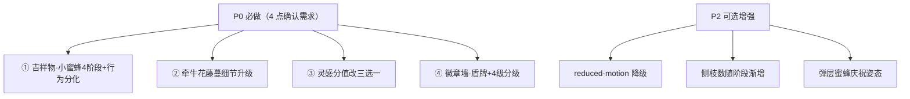

# 儿童暑期成长银行 · UI 打磨（UI-polish-4）增量 PRD

> 版本：v1.0（增量，仅描述变更部分）｜产品：暑假成长积分银行（纯前端 PWA）｜PM：许清楚
> 关联基线：`docs/prd-ui-polish-3.md` 与 `docs/architecture-ui-polish-3.md`（UI-polish-3 已验收；本轮为其**增量第四轮**，不重写全量）。
> 本轮范围：用户已逐条确认，仅落地前 4 点；第 5 点（暂缓）不在本 PRD。
> 方案状态：4 点均已拍板，回合数=0。

---

## 0. 落地约束（沿用前几轮，不破坏）

- **技术栈不变**：原生 HTML+CSS+JS（ES Module 多文件，无框架）；PWA；localStorage（STATE）+ IndexedDB（media）；CSS 全部内联于 `index.html` 的 `<style>`。
- **零新依赖**：吉祥物（小蜜蜂）/藤蔓/徽章全部内联 SVG + CSS 变量 + CSS 动画，不引入位图或动画库；不新增任何 npm 包。
- **多孩子隔离必须保持**：藤蔓/徽章随 `STATE`（=当前 activeChild 快照）渲染；蜜蜂阶段、徽章积分均按 activeChild 重算。灵感 `customIdeas` 仍为全局主数据偏好（不随 child 变），本轮不改其落点。
- **暗色 / 主题约束（铁律）**：SVG 与 JS 内**禁止硬编码 hex 颜色**，一律走 CSS 变量（`var(--xxx)`）；本轮新增吉祥物与徽章配色变量须在 `:root` + 5 个主题块（`sakura`/`ocean`/`forest`/`sunset`/`starry`）+ 暗色 `@media` 全部定义，保证暗色与多主题下可见。
- **复用既有能力**：藤蔓复用 `scoreToStage`/`STAGES`/`calcTotalScore`；徽章复用 `computeDimensionScores` 与 `badgeLevel`（阈值 0–9/10–24/25–49/50+ 不变）；灵感复用 `openModal` 单例与 `customIdeas` 读写。
- **受保护文件（绝对不改）**：`main.js`、`features/runtime.js`、`features/parent-center.js`。本轮改动仅限 `features/mascot.js`、`features/growth-tree.js`、`features/ideas.js`、`features/render.js`、`index.html`。
- **测试底座**：既有 **103 单测 + 29 E2E 须全绿**；SVG 结构变化若影响快照类断言需同步更新，不可因重构回归。

---

## 1. 增量产品目标

把首页陪伴吉祥物升级为**会成长的「小蜜蜂」**（4 阶段形态 + 早期常驻静态 / 后期绕藤飞舞的行为分化），并把牵牛花藤蔓做得更繁茂真实（侧枝、心形叶、多朝向喇叭花），同时把灵感分值改为**只能三选一**杜绝乱填、把徽章墙重做成**盾牌造型 + 4 级精确分级（抽象维度图标永远在最上层）**——让首页"有伙伴、有生长、有成就"，且整体观感更儿童清新。

---

## 2. 用户故事（覆盖 4 点）

- **① 小蜜蜂陪伴（4 阶段 + 行为分化）**：作为孩子，我希望首页藤蔓旁有一只小蜜蜂陪我长大——刚开始是虫卵/蛹（静态、占满藤蔓右端，看得清），破壳成小幼虫，再到长叶期飞起来绕着藤蔓和花朵转，繁茂期变成采蜜满载的大蜜蜂（最大只）。验收：藤蔓区吉祥物按积分阶段呈现 卵/蛹→幼虫→小蜜蜂→大蜜蜂 四种形态；0–49 分阶段蜜蜂静态常驻右端且尽可能大（占满藤蔓块高度）；≥50 分阶段蜜蜂脱离右端、以 CSS 动画绕藤蔓/花朵飞行（长叶期较小、繁茂期最大）；全矢量 SVG + CSS 变量，暗色下可见。
- **② 牵牛花藤蔓更繁茂真实**：作为孩子，我希望首页藤蔓是一株真正的牵牛花——主茎多段自然摆动、有左右交错的侧枝、心形/三裂的真叶、5–8 朵不同朝向的喇叭花、螺旋卷须，繁茂期铺满，且仍然严格按阶段开花。验收：主茎多段贝塞尔曲线；侧枝 3–5 根左右交错、粗细递减；每侧枝 2–3 片真实牵牛叶（随阶段增大）；喇叭花 5–8 朵不同朝向（左垂/右垂/正上/侧开）；螺旋卷须装饰；高度仍 ≤160px；严格阶段 gating 不变（发芽无花、长叶仅花苞、开花/繁茂盛花）。
- **③ 灵感分值改为三选一**：作为家长/孩子，我希望修改灵感时分值只能选 1/2/3 分，不能乱填数字。验收：`openIdeaEditModal` 的分值控件由自由数字输入改为 **1分/2分/3分 按钮组（或下拉）三选一**，默认带原值，禁止自由填写；分类（五维）不变，仅标题与分值可改；保存仍写 `customIdeas[id]` 覆盖默认、可「恢复默认」。
- **④ 徽章墙重做盾牌 + 4 级精确分级**：作为家长，我希望徽章是盾牌造型、五大维度各有常驻抽象图标，且 4 级区分精确（线框银灰→单色填充+1星→渐变+2星+翅膀→金渐变+3星+光晕），但填充色绝不盖住中心维度图标。验收：`badgeSVG` 改为盾牌造型（在不改格子高度前提下尽量放大）；每维盾牌中心常驻抽象图标（书本/球/调色板/房子/手形，白或深色对比色，永远最上层）；Lv1 线框银灰 / Lv2 单色填充+1★ / Lv3 渐变填充+2★+翅膀或绶带 / Lv4 金渐变+3★+光晕；填充色只作用于盾牌底色/边框，绝不覆盖中心图标；等级沿用 `badgeLevel`（0–9/10–24/25–49/50+）。

---

## 3. 需求池（P0 为本轮 4 点确认需求；P2 为可选增强）

| 编号 | 类型 | 需求（变更点） | 验收标准 | 优先级 | 影响文件/锚点 |
|---|---|---|---|---|---|
| R1 | 功能变更 | **① 吉祥物重做「小蜜蜂」+ 4 阶段 + 行为分化**：`renderMascot` 由「小芽」改写为「小蜜蜂」，按阶段渲染 卵/蛹(idx0)→破壳幼虫(idx1)→小蜜蜂(idx2)→采蜜大蜜蜂(idx3/4)；`renderGrowthVine` 按 `idx` 决定蜜蜂容器：idx0/1 用 `.vine-bee-static`（右端常驻、静态、尽可能大、占满藤蔓块高度），idx≥2 用 `.vine-bee-fly`（脱离右端、CSS `beeOrbit` 轨道动画绕藤/花飞，繁茂期最大） | 4 形态与阶段对齐；早期静态占满右端、后期绕飞；繁茂最大；纯 SVG+`var()`、暗色可见；`mascot.js` 内部可自推导阶段（导入 `scoreToStage`/`calcTotalScore`） | P0 | `features/mascot.js`（重写 `renderMascot`→蜜蜂+`beeSVG(stage)`+翅膀 `beeWingFlutter` 动画类）；`features/growth-tree.js`（`renderGrowthVine` 末尾蜜蜂容器按 idx 切换 static/fly，传 `size`）；`index.html` `<style>`（新增 `--bee-*`/`--metal-*` 变量 + `.vine-bee-static`/`.vine-bee-fly` + `@keyframes beeOrbit`/`beeWing`）；`showEncourageMsg`/`renderCheckinExtras`/`renderGrowthTree` 调用点无需改（mascot 自推导阶段） |
| R2 | 功能变更 | **② 牵牛花藤蔓细节大幅升级**：主茎多段贝塞尔（自然摆动）；新增侧枝 3–5 根、左右交错、粗细递减；真实牵牛叶（心形/三裂），每侧枝 2–3 片、随阶段增大；喇叭花 5–8 朵不同朝向（左垂/右垂/正上/侧开），繁茂期铺满；螺旋卷须装饰加密；高度仍 ≤160px；严格阶段 gating 不变 | 主茎贝塞尔/侧枝交错递减/心形叶/多朝向花/卷须；密度与形象度显著提升；暗色 `--vine-*` 可见；发芽无花、长叶仅花苞、开花/繁茂盛花；高度≤160 | P0 | `features/growth-tree.js`（`vineStemPath` 增强摆动；新增 `vineBranch`(侧枝)/`vineLeaf` 改三裂心形/`vineFlower` 增 `orient` 参数支持多朝向/侧枝叶挂载/花数 5–8 随阶段；`renderGrowthVine` 按 idx 组装侧枝+叶+花）；`index.html` `<style>`（`.vine-branch`/`.vine-leaf`/`.vine-flower` 朝向微调） |
| R3 | 功能变更 | **③ 灵感修改弹窗分值改「三选一」**：`openIdeaEditModal` 的分值 `<input type=number>` 改为 **1分/2分/3分 按钮组（或 `<select>`）**，默认选中原值，禁止自由填写；分类只读不变，仅标题+分值可改 | 分值只能 1/2/3 三选一（无数字输入）；默认带原值；保存写 `customIdeas[id]`、可「恢复默认」；分类不变 | P0 | `features/ideas.js`（`openIdeaEditModal` builder 分值控件改按钮组/下拉 + `onMount` 取选中值校验∈{1,2,3}）；`index.html` `<style>`（`.pts-options`/`.pts-opt` 选中高亮） |
| R4 | 功能变更 | **④ 徽章墙重做盾牌造型 + 4 级精确分级**：`badgeSVG` 由圆形奖牌改为**盾牌造型**（不改格子高度前提下尽量放大）；每维盾牌中心常驻**抽象维度图标**（书本/球/调色板/房子/手形，白或深色对比色，**永远最上层**）；Lv1 线框银灰 / Lv2 单色填充+1★ / Lv3 渐变填充+2★+翅膀或绶带 / Lv4 金渐变+3★+光晕；填充色只作用于盾牌底色/边框，绝不覆盖中心图标；等级沿用 `badgeLevel` | 盾牌造型；中心抽象图标常驻最上层、对比色可见；4 级视觉精确区分（银灰线框→铜色单填+1★→渐变+2★+翅膀→金渐变+3★+光晕）；铁律：Lv2/3/4 填充不盖中心图标；等级阈值沿用 `badgeLevel` | P0 | `features/growth-tree.js`（`badgeSVG` 重写为盾牌+`badgeIcon(cat)` 抽象图标常驻最上层 + 4 级填充/渐变/星/光晕；新增 `badgeIcon` 维度抽象图标路径）；`index.html` `<style>`（新增 `--metal-silver`/`--metal-copper`/`--metal-gold` 与盾牌 `.lv1..lv4` 视觉；`.badge-slot` 布局高度不变、盾牌 SVG 尽量放大） |
| R5 | 增强 | 尊重 `prefers-reduced-motion`：蜜蜂 `beeOrbit` 飞行动画降级为静态居中（覆盖全局 reduced-motion 处理） | 开启"减少动态效果"时蜜蜂不绕飞、静态显示当前阶段形态 | P2 | `index.html` `<style>`（`@media (prefers-reduced-motion:reduce)` 覆盖 beeOrbit） |
| R6 | 增强 | 侧枝数量随阶段从 3 渐增至 5（长叶 3 根 → 繁茂 5 根铺满） | 藤蔓密度随成长自然递增，繁茂期侧枝最密 | P2 | `features/growth-tree.js`（`renderGrowthVine` 侧枝数 = f(idx)） |
| R7 | 增强 | 成功/鼓励弹层蜜蜂用「飞行+挥手」庆祝姿态 | 打卡成功弹层蜜蜂更生动 | P2 | `features/mascot.js`（`success`/`encourage` 放置位新增庆祝姿态） |

### 需求优先级总览（Mermaid）



---

## 4. UI 设计稿（文字 / ASCII 草图）

### 4.1 ① 小蜜蜂 · 4 阶段形态 + 行为分化

```
阶段对齐 scoreToStage 的 idx（阈值 0/20/50/100/200）：

 idx0 种子(0–19)          idx1 发芽(20–49)
  ╭───────╮                ⠿ ╭─╮   ← 破壳小幼虫探头
  │ ≈≈≈≈≈ │  虫卵/蛹形态     ╰─●─╯  带小翅芽
  ╰───────╯                （ sleepy 表情）
  ▸ 右端常驻·静态·占满藤蔓块高度（.vine-bee-static，大尺寸）

 idx2 长叶(50–99)         idx3/4 开花·繁茂(100+)
     🐝                       🐝✨
   ↻ 绕藤蔓/花朵飞           ↻ 绕飞 + 蜜囊满载
   （小蜜蜂·较小）            （大蜜蜂·最大只）
  ▸ 脱离右端·CSS beeOrbit 轨道动画（.vine-bee-fly）
  ▸ 翅膀 beeWingFlutter 持续扇动

【布局变化】
 idx0/1: <div class="vine-bee-static">  🥚/🐛  </div>   → 绝对定位右端、尺寸≈占满藤蔓块高、无飞行动画
 idx≥2: <div class="vine-bee-fly">     🐝            </div>   → 覆盖藤蔓区、beeOrbit 轨道动画、长叶小/繁茂大
```

### 4.2 ② 牵牛花藤蔓（更繁茂真实，密度提升）

```
阈值复用 STAGES：0 / 20 / 50 / 100 / 200（scoreToStage，gating 不变）

🌱 种子(0–19)：  仅种子图标（vineSeed），无茎/无叶/无花
🌿 发芽(20–49)：  ╭～╮ 🍃🍃          短贝塞尔主茎 + 2 小嫩叶，无花无苞
🍃 长叶(50–99)：  ╭～～╮  ╱╲🍃 ╱╲🍃  主茎 + 侧枝(3根,左右交错,粗细递减)
                    ╲╱bud ╲╯         + 每侧枝2–3片心形叶 + 花苞(半开,非盛花)
🌺 开花(100–199)： ╭～～～╮ 🌸🌸🍃🌸  侧枝4根 + 喇叭花(5–6朵,多朝向)盛花
🌸 繁茂(200+)：   ╭～～～～╮ 🌸🌸🌿🌸🌸  侧枝5根铺满 + 喇叭花(7–8朵,多朝向) + 新苞
                   螺旋卷须(加密)点缀枝梢

升级点：
 · 主茎：多段贝塞尔（自然摆动，非折线）
 · 侧枝：3–5 根、左右交错、粗细递减（4→3→2.5→2→1.5px）
 · 叶：真实牵牛叶（心形/三裂），每侧枝 2–3 片、随阶段增大
 · 花：喇叭形 5–8 朵，多朝向（左垂/右垂/正上/侧开），繁茂铺满
 · 卷须：螺旋须装饰加密
 · 高度仍 ≤160px（SVG max-height:160px 不变）
 · 严格 gating 不变：发芽无花、长叶仅花苞、开花/繁茂盛花
```

### 4.3 ③ 灵感修改弹窗 · 分值三选一

```
【修改灵感弹窗（openIdeaEditModal）】
┌──────── 修改灵感 ────────┐
│ 标题：[背一首喜欢的古诗    ] │  ← 可改（文本输入）
│                              │
│ 分值：[ 1分 ][ 2分*][ 3分 ] │  ← 三选一按钮组/下拉，*默认原值，禁自由填
│                              │
│ 分类：学习力（只读·不可改）  │  ← cat 冻结（五维不变）
│   [ 保存修改 ]  [ 恢复默认 ] │  ← 保存写 customIdeas[id]；恢复默认=删覆盖
└──────────────────────────┘
◆ 仅 1/2/3 三选一；保存时校验 pts∈{1,2,3}；默认带当前 view.pts。
◆ 五维分类不变（学习力/运动力/自控力/探索力/实践力，详见 §5 待确认）。
```

### 4.4 ④ 徽章墙 · 盾牌造型 + 4 级精确分级

```
【档案页 · 徽章墙（badgeSVG 重写为盾牌）】
每维盾牌中心常驻抽象维度图标（📚书本/⚽球/🎨调色板/🏠房子/👋手形），
图标永远最上层、白或深色对比色，填充色绝不覆盖它。

📚 学习力   [Lv1 银灰线框] [Lv2 铜色单填+★] [Lv3 渐变+★★+翅膀] [Lv4 金渐变+★★★+光晕]
⚽ 运动力   [ outline ]     [ fill+★ ]       [ glossy+★★ ]        [ gold+★★★ ]
🎨 创造力   [ outline ]     [ fill+★ ]       [ glossy+★★ ]        [ gold+★★★ ]
🏠 生活力   [ outline ]     [ fill+★ ]       [ glossy+★★ ]        [ gold+★★★ ]
👋 社交力   [ outline ]     [ fill+★ ]       [ glossy+★★ ]        [ gold+★★★ ]

ASCII 示意（盾牌 + 中心图标 + 星）：
 Lv1 银灰线框            Lv2 铜色单填+1★
   ╱╲                     ╱╲
  ╱  ╲  [📚] 无填充       ╱  ╲  [📚] 铜填
  ╲  ╱  仅灰线框         ╲  ╱   ★
   ╲╱                     ╲╱

 Lv3 渐变+2★+翅膀        Lv4 金渐变+3★+光晕
   ≋╱╲≋                  ✨╱╲✨
  ╱  ╲ [📚] 渐变填        ╱  ╲ [📚] 金填
  ╲  ╱  ★★ 翅膀/绶带     ╲  ╱  ★★★
   ╲╱                     ╲╱
 ◆ 铁律：Lv2/3/4 填充色只作用于盾牌底色/边框，中心 [📚] 抽象图标永远最上层、对比色可见。
 ◆ 金属色系 银→铜→金：Lv1 银灰线框 / Lv2 铜色单填 / Lv3 银→铜渐变 / Lv4 金渐变。
 ◆ 等级判定沿用 badgeLevel（0–9 Lv1 / 10–24 Lv2 / 25–49 Lv3 / 50+ Lv4）。
 ◆ 盾牌在不改 .badge-slot 格子高度前提下尽量放大。
```

---

## 5. 影响文件锚点汇总（给架构师）

| 需求 | 文件 | 动作 | 关键锚点 |
|---|---|---|---|
| ① | `features/mascot.js` | **重写** | `renderMascot(placement,opts)` → 小蜜蜂；新增 `beeSVG(stage)`（卵/蛹/幼虫/小蜜蜂/大蜜蜂 5 形态，stage 缺省时由 `scoreToStage(calcTotalScore()).idx` 自推导）；翅膀加 `class="bee-wing"`（CSS `beeWingFlutter`）；全部 `fill/stroke` 走 `var(--bee-*)`/`var(--metal-*)`，禁硬编码 hex；放置位 `tree/success/empty/encourage` 全部渲染蜜蜂 |
| ① | `features/growth-tree.js` | 改 | `renderGrowthVine` 末尾：按 `idx` 切换蜜蜂容器——`idx 0/1` → `<div class="vine-bee-static">${renderMascot('tree',{size:BIG})}</div>`；`idx≥2` → `<div class="vine-bee-fly vine-bee-fly-${idx}">${renderMascot('tree',{size:FLY})}</div>`；`size` 随阶段（繁茂最大） |
| ① | `index.html` | 改 `<style>` | 新增 `--bee-body`/`--bee-stripe`/`--bee-wing`/`--bee-stroke`/`--bee-cheek`/`--metal-silver`/`--metal-copper`/`--metal-gold`（`:root`+5 主题块+暗色）；`.vine-bee-static{position:absolute;right:6px;bottom:6px;width:~104px;height:~116px}`（占满藤蔓块高、静态）；`.vine-bee-fly{position:absolute;inset:0;pointer-events:none}` + `@keyframes beeOrbit`（绕藤轨道）+ `.bee-wing{animation:beeWingFlutter .25s ...}`；保留 `.growth-vine-block{position:relative}` |
| ② | `features/growth-tree.js` | 改 | `vineStemPath` 增强自然摆动；新增 `vineBranch(x,y,dir,thick)`（侧枝，3–5 根左右交错、粗细递减）；`vineLeaf` 改心形/三裂真叶（每侧枝 2–3 片、随 idx 增大）；`vineFlower(x,y,r,bloom,orient)` 增 `orient`（左垂/右垂/正上/侧开）；花数 5–8 随 idx（繁茂铺满）；`vineTendril` 加密；`renderGrowthVine` 按 idx 组装侧枝+叶+花，严格 gating 不变 |
| ② | `index.html` | 改 `<style>` | `.vine-branch`/`.vine-leaf`/`.vine-flower`（多朝向 transform-origin）微调；SVG `max-height:160px` 不变 |
| ③ | `features/ideas.js` | 改 | `openIdeaEditModal` builder：分值 `<input type=number>` → 按钮组 `<div class="pts-options"><button class="pts-opt" data-pts="1/2/3">`，默认 `data-pts===view.pts` 选中；`onMount` 取 `.pts-opt.active` 的 `data-pts`，校验 ∈{1,2,3} 后 `saveCustomIdea(id,title,pts)`；分类只读不变 |
| ③ | `index.html` | 改 `<style>` | `.pts-options{display:flex;gap:8px}`/`.pts-opt`（默认灰底、`.active` 高亮渐变选中） |
| ④ | `features/growth-tree.js` | 改 | `badgeSVG(cat,level)` 重写：盾牌 `<path>` 基底（尽量放大）+ 中心 `badgeIcon(cat)` 抽象图标（书本/球/调色板/房子/手形，**最后绘制、最上层、白/深色对比色**）；Lv1 线框银灰 / Lv2 铜色单填+1★ / Lv3 渐变+2★+翅膀或绶带 / Lv4 金渐变+3★+光晕；新增 `badgeIcon(cat)` 返回各维抽象图标 SVG；填充只作用于盾牌底色/边框 |
| ④ | `index.html` | 改 `<style>` | 新增 `--metal-silver`/`--metal-copper`/`--metal-gold`（`:root`+5 主题块+暗色）；`.badge-slot.lv1..lv4` 视觉按盾牌重新定义（线框/铜填/渐变/金光晕）；`.badge-slot` 布局高度不变、盾牌 SVG 尽量放大 |

**不动清单（回归护栏）**：
- `main.js` / `runtime.js` / `parent-center.js` 一律不改（含 bug-E 接线）。
- 多孩子隔离：藤蔓/徽章按 `STATE` 随 activeChild 重绘；`customIdeas` 全局主数据偏好不变。
- `scoreToStage`/`STAGES`/`computeDimensionScores`/`calcTotalScore`/`badgeLevel` 语义与阈值不变（仅 `badgeSVG` 视觉重写、`renderGrowthVine` 组装更密）。
- `openModal` 单例契约（z1500、关闭三要素）不变；`customIdeas` 读写函数签名不变。
- 既有 103 单测 + 29 E2E 须全绿（SVG 结构变化若触碰快照断言需同步）。

---

## 6. 验收标准（按需求，转交 QA 严过关）

- **① 小蜜蜂**：4 形态与 `scoreToStage` 的 idx 对齐（卵/蛹→幼虫→小蜜蜂→大蜜蜂）；0–49 分阶段蜜蜂静态常驻藤蔓右端且占满藤蔓块高度；≥50 分阶段蜜蜂脱离右端、以 CSS 动画绕藤蔓/花朵飞行（长叶较小、繁茂最大）；纯 SVG+`var()`、暗色与多主题下可见；无硬编码 hex。
- **② 藤蔓升级**：主茎多段贝塞尔、侧枝 3–5 根左右交错粗细递减、心形/三裂真叶每侧枝 2–3 片随阶段增大、喇叭花 5–8 朵多朝向、螺旋卷须加密、高度 ≤160px；密度与形象度显著提升；严格 gating 不变（发芽无花、长叶仅花苞、开花/繁茂盛花）。
- **③ 分值三选一**：修改灵感弹窗分值只能 1/2/3 三选一（无数字输入），默认带原值；保存写 `customIdeas[id]`、可「恢复默认」；分类不变。
- **④ 盾牌徽章**：盾牌造型（不改格子高度前提下尽量放大）；每维中心抽象图标常驻最上层、对比色可见；Lv1 银灰线框 / Lv2 铜色单填+1★ / Lv3 渐变+2★+翅膀/绶带 / Lv4 金渐变+3★+光晕；**铁律**：Lv2/3/4 填充只作用于盾牌底色/边框，绝不覆盖中心图标；等级沿用 `badgeLevel`。

---

## 7. 待确认问题

**有 1 项需确认（维度命名与抽象图标映射）**：

本轮需求 ③、④ 的描述里，五维写作「学习力/运动力/创造力/生活力/社交力」，并给出抽象图标 📚/⚽/🎨/🏠/👋（书本/球/调色板/房子/手形）。但代码库实际五维为 **学习力/运动力/自控力/探索力/实践力**（`core/helpers.js` 的 `CATEGORIES`、灵感库 `IDEA_LIBRARY`、徽章 `BADGE_COLORS` 均一致）。需求 ③ 明确写「分类不变」，故本 PRD **默认保留代码库现有五维、不改维度名称**。

请确认两点：
1. 维度集合是否确认为代码库现有「学习力/运动力/自控力/探索力/实践力」（即不引入 创造力/生活力/社交力 这套新命名）？
2. 若沿用代码库五维，各维度中心抽象图标建议映射为：**学习力→书本📚 / 运动力→球⚽ / 自控力→沙漏(或时钟) / 探索力→放大镜(或指南针) / 实践力→手/工具**。是否采纳此映射，或您有指定图标？

> 其余 4 点方案（蜜蜂 4 阶段与行为分化、藤蔓细节升级、分值三选一、盾牌 4 级分级与"填充不盖中心图标"铁律）均已拍板，无其它遗留歧义。若上述维度问题无需调整（即采纳默认），则本 PRD 可零阻塞进入架构落地。

*文档结束 — 增量 PRD（仅变更部分），配合 `docs/prd-ui-polish-3.md` 与 `docs/architecture-ui-polish-3.md` 使用。*
