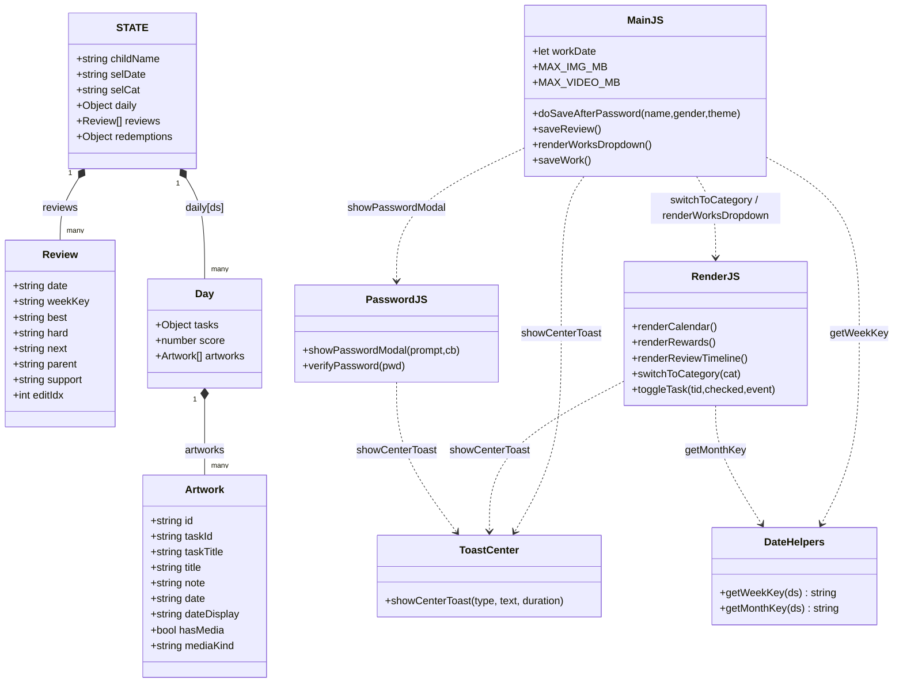
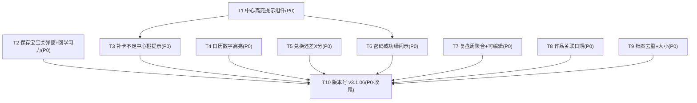

# 系统架构设计 + 任务分解 ——「暑假成长积分银行」v3.1.06（8 项体验增强）

> 架构师：高见远（software-architect）
> 输入 1：PRD v3.1.06（许清楚，8 项 P0 + 1 项 P1-1）
> 输入 2：已定位关键代码位置（交付总监读，main.js / render.js / password.js / index.html / helpers.js / data.js）
> 技术栈：**原生 HTML + CSS 变量 + 原生 ES Module JS（PWA）**，无构建步骤、无框架、无新增依赖
> 根目录：`D:\workbuddy工作区\summer-growth-bank\`

---

## Part A：系统设计

### 1. 实现方案 & 框架选型

本次是**「多模块局部修复 + CSS 增强 + 少量数据模型 upsert/去重」**，属于存量 PWA 的定点改造。核心难点与对策：

- **难点① — 保存宝宝后弹窗移除时机**：当前 `doSaveAfterPassword()`（main.js:128-179）在 `renderAll()` 之前就 `ov.remove()`（:177），若渲染抛错会残留或闪烁。对策：把 `renderAll()` + `switchToCategory('学习力')` 包进 `try/catch`，`ov.remove()` 放到 try 之后（确保渲染成功才关弹窗）；成功后再切到「学习力」分类。
- **难点②⑤ — 统一"中心高亮提示"三态组件（P1-1）**：现有 `showPasswordError`（password.js:153）是居中红字，可作基础。对策：新建 `features/toast-center.js` 导出 `showCenterToast(type, text, duration)`，type∈{ok,warn,err}，颜色取自 CSS 变量 `--ok/--warn/--err`（在 `:root` 统一定义，5 主题兼容），JS 零写死。供 ②（补卡不足·橙）与 ⑤（密码成功·绿）复用。
- **难点⑥ — 复盘"按周聚合"**：当前 `saveReview`（main.js:210-247）每次 `unshift` 新增。对策：新增 `getWeekKey(ds)`（周一为起点，返回当周周一 `YYYY-MM-DD`）；`saveReview` 改为按 `weekKey` upsert（同周更新内容、异周新增）；加载期对旧记录按 `date` 推导 `weekKey` 做迁移兼容；`renderReviewTimeline`（render.js:808-816）每条均渲染"编辑"按钮。
- **难点⑦⑧ — 作品与具体日期/去重/大小**：当前 `saveWork`（main.js:286-334）用 `STATE.selDate` 且每次生成新 id 无去重。对策：作品表单加显式日期选择（默认今天），`renderWorksDropdown` 与 `saveWork` 统一读表单所选 `workDate`；写入前按 `artwork.id` 去重（防御性）；新增 `MAX_IMG_MB=10`/`MAX_VIDEO_MB=100`，超限 `toast` 拒绝；`index.html` 上传框 `<small>` 写明限制 + `accept`。
- **难点③ — 日历数字高亮**：HTML 结构已就绪（render.js 已输出 `.cal-cell.has-pts > .day-num`），仅需纯 CSS 增强（加粗 + 主题色 + 圆角标），5 主题兼容，JS 零改动。
- **难点④ — 兑换差额文案**：`renderRewards`（render.js:708）按钮文案由"继续存分"改为 `还差 {cost-total} 分`（total<cost 时），分够时按钮可点显示"兑换所选奖励"。

**架构模式**：沿用现有「STATE 单源真相 + `renderXxx()` 纯渲染 + 事件委托」单体模式。不引入新目录结构（除新增一个小组件 `toast-center.js`）、不改 `makeup.js` 规则、不改整体存储模型、不做家长中心/账号/云同步。

### 2. 文件清单（相对路径）

| 文件 | 本次角色 |
|------|----------|
| `features/toast-center.js` | **新增**：中心高亮提示组件 `showCenterToast(type,text,duration)`（三态 ok/warn/err），CSS 变量驱动 |
| `core/helpers.js` | 新增 `getWeekKey(ds)`（周一为起点，复用 `getMonthKey` 思路）；`getMonthKey` 不动 |
| `features/password.js` | `showPasswordModal` 成功分支（:100-103）增加 `showCenterToast('ok','✓ 验证通过',1200)` 绿闪示（覆盖 4 个密码门）；`showPasswordError` 保留 |
| `features/render.js` | 新增 `switchToCategory`（①）；`toggleTask` 补卡不足改 `showCenterToast('warn',...)`（:392-396，②）；③ 日历 HTML 已就绪（`.has-pts .day-num`）；`renderRewards` 差额文案（:708，④）；`renderReviewTimeline` 每条编辑按钮（:808-816，⑥） |
| `main.js` | ①`doSaveAfterPassword` 关弹窗+回学习力（:128-179）；⑥`saveReview` weekKey upsert（:210-247）；⑦`renderWorksDropdown` 跟随所选日期 + 作品表单日期（:261-271）；⑧`saveWork` 去重+大小校验（:286-334）；常量 `MAX_IMG_MB/MAX_VIDEO_MB`；调用 `switchToCategory` |
| `index.html` | `:root` 新增 `--ok/--warn/--err`（+rgb）；③`.cal-cell.has-pts .day-num` 高亮样式；⑦作品表单加日期 `<input type=date>`；⑧上传框 `<small>` 说明 + `accept`；脚本版本号 `?v=3.1.06` |
| `sw.js` | 版本号 `CACHE_NAME` 与 precache `?v=` 全部 `3.1.05`→`3.1.06` |
| `core/data.js` | `loadData` 增加旧 reviews 的 `weekKey` 迁移（⑥，兼容旧数据） |

> 注：纯静态 PWA，无 `package.json`/构建配置，无独立 css（全内联 `index.html`）。故无"脚手架"任务；本设计基础设施 = 中心提示组件 `toast-center.js` + 日期工具 `getWeekKey`（T1）。

### 3. 数据结构与接口（结构）



**关键字段 / 接口说明**

- **Review（复盘记录）** 新增字段 `weekKey: string`（`YYYY-MM-DD`，当周周一）。`STATE.reviews: Review[]` 由"每次 `unshift` 新增"变为"按 `weekKey` upsert"。**合并策略（推荐）**：同周再次保存时**更新该周记录的内容字段（best/hard/next/parent/support）并以最新提交覆盖，但保留首条记录的 `date`（该周首次保存日）作为时间线稳定锚点**；异周则 `unshift` 新记录。旧记录（无 `weekKey`）按 `r.date` 推导 `weekKey`（`getWeekKey(r.date)`）做迁移，保证可编辑/可聚合。
- **Artwork（作品记录）** 调整：`date` 一律取**表单所选日期** `workDate`（默认今天），不再隐式用 `STATE.selDate`；`id` 生成规则沿用 `art_<Date.now()>_<rand36>`（main.js:300）作为去重键；新增 `MAX_IMG_MB=10`/`MAX_VIDEO_MB=100` 常量（大小上限，非数据字段）。
- **`getWeekKey(ds)`** 实现（周一为起点）：
  ```js
  export function getWeekKey(dateStr){
    const [y,m,d] = dateStr.split('-').map(Number);
    const dt = new Date(y, m-1, d);
    const dow = (dt.getDay()+6)%7;          // 周一=0 … 周日=6
    dt.setDate(dt.getDate() - dow);          // 回退到本周周一
    const pad = n => String(n).padStart(2,'0');
    return `${dt.getFullYear()}-${pad(dt.getMonth()+1)}-${pad(dt.getDate())}`;
  }
  ```
- **`showCenterToast(type, text, duration=1300)`** API：
  - `type`: `'ok'`(绿) | `'warn'`(橙) | `'err'`(红)
  - `text`: 提示文案；`duration`: 毫秒（⑤ 用 1200，② 用 1800）
  - 行为：在 `body` 居中（`top:50%;left:50%;translate(-50%,-50%)`）插入 fixed 元素，背景用 `var(--ok/--warn/--err)`，自动在 `duration` 后移除；多实例互不干扰（每次新建节点）。建议同时挂到 `window.showCenterToast` 便于任何上下文调用。

### 4. 程序调用流程（时序图）

> 7 条核心流程见 `docs/sequence-diagram.mermaid`（①保存宝宝→关弹窗→回学习力；②补卡不足→中心橙提示；③密码成功→中心绿闪示；④兑换差额渲染；⑤复盘保存→weekKey upsert→时间线每条可编辑；⑥作品存盘→取所选日期；⑦档案上传→去重+大小校验）。

### 5. 待明确事项（编码前需拍板）

1. **复盘合并策略（最关键）**：同周多次保存是"覆盖内容、保留首条 `date`"还是"覆盖整条含 `date`"？推荐**前者**（更新内容、保留首条 date 作锚点，时间线不跳动）。请确认。
2. **旧复盘冲突处理**：同一周若有多条无 `weekKey` 旧记录，迁移按各自 `date` 推导后可能同周——upsert 时以"最新一条覆盖"还是"保留多条"？推荐：加载时一次性合并同周旧记录（保留最新内容 + 最早 date）。需确认是否接受合并（会丢中间版本）。
3. **密码成功闪示文案是否 4 门一致**：保存宝宝/补卡/兑换/删作品 是否均用"✓ 验证通过"？推荐统一文案，实现最简。请确认。
4. **作品日期是否限暑假区间（7/1–8/31）**：`<input type=date>` 是否加 `min/max`？PRD 未要求。推荐：**本期不加 min/max**（便于补录），仅默认今天。请确认。
5. **中心提示颜色是否按主题微调**：`--ok/--warn/--err` 设计为统一语义色（绿/橙/红），不随主题变，确保三态可区分；若产品希望随主题变色（如 starry 用紫调）需逐主题覆写。推荐统一语义色。请确认。
6. **版本号实际出现处**：经 grep，`3.1.05` 出现在 `index.html:894`、`main.js:486`、`main.js:493`、`sw.js:1`（CACHE_NAME）与 `sw.js:3-6`（precache `?v=` 共 10 个资源 URL）。T10 需把**全部**改为 `3.1.06`（`manifest.json?v=2` 是另一套清单版本，不改）。

---

## Part B：任务分解

### 6. 依赖包列表

**无新增依赖**。纯原生 HTML / CSS 变量 / 原生 ES Module JS，无 npm 运行时依赖（项目内 `node_modules/playwright` 仅用于测试，与本次改造无关）。

```
# 无第三方运行时依赖
```

### 7. 任务列表（有序、含依赖、按实现顺序）

> ⚠️ 任务粒度说明：系统默认软上限为 ≤5 任务，但本次为"多点局部修复"PRD，团队负责人明确要求按修复点拆成 T1–T10（建议 ≤8）以利逐点验收。故本设计**遵循团队负责人指示拆为 10 个任务**（T1 基础组件 + T2–T9 八个修复点 + T10 版本收尾），依赖图中标注真实耦合。如负责人希望收敛到 5 个，可按"T1 基础 / T2+T4 渲染相关 / T3+T5+T6 提示相关 / T7+T8+T9 数据相关 / T10 版本"合并。

#### T1【P0】中心高亮提示组件（基础设施）
- **任务名**：新建 `features/toast-center.js` 的 `showCenterToast(type,text,duration)` 三态组件 + `:root` 定义语义色变量
- **源文件**：`features/toast-center.js`（新增）、`index.html`（`:root` 加 `--ok/--ok-rgb`、`--warn/--warn-rgb`、`--err/--err-rgb`）、`features/password.js`（声明依赖，T6 调用）、`features/render.js`（声明依赖，T3 调用）
- **内容**：新建模块导出 `showCenterToast`，居中 fixed 节点、按 type 套 `--ok/--warn/--err` 背景、`duration` 后自动移除；`index.html` 的 `:root` 统一定义三态语义色（绿 `#66bb6a` 系 / 橙 `#ff9800` 系 / 红 `#ef5350` 系，含 rgb 变量），5 主题块无需逐条覆写即可兼容。
- **依赖**：无
- **优先级**：P0

#### T2【P0】① 保存宝宝关弹窗 + 回学习力
- **任务名**：`doSaveAfterPassword` 渲染成功后才关弹窗，并切回「学习力」分类
- **源文件**：`main.js`（:128-179 `doSaveAfterPassword`）、`features/render.js`（新增 `switchToCategory` 导出）、`index.html`（无改动，仅契约）
- **内容**：新增 `switchToCategory(cat)`（设 `STATE.selCat=cat` + `renderCatTabs()` + `renderTasks()` + `renderMap()`）；在 `doSaveAfterPassword` 中把 `renderAll()` + `switchToCategory('学习力')` 包进 `try/catch`，`ov.remove()` 与 `dismissAutofill()` 放到 try 之后；成功 toast 文案保留。
- **依赖**：无（`switchToCategory` 自包含于 render.js）
- **优先级**：P0

#### T3【P0】② 补卡不足中心橙提示
- **任务名**：`toggleTask` 补卡余额不足改居中橙提示（复用 T1）
- **源文件**：`features/render.js`（:390-396 `toggleTask` 不足分支）、`features/toast-center.js`（T1 提供）、`index.html`（无改动）
- **内容**：把 `toast("成长分不足，无法补卡（补卡需扣"+mc.cost+"分，当前只有"+currentScore+"分）")` 改为 `showCenterToast('warn','成长分不足，无法补卡（补卡需扣 '+mc.cost+' 分，当前只有 '+currentScore+' 分）', 1800)`；仍回退勾选并 `return`。
- **依赖**：T1
- **优先级**：P0

#### T4【P0】③ 日历数字高亮（5 主题）
- **任务名**：`.cal-cell.has-pts .day-num` 加粗 + 主题色 + 圆角标
- **源文件**：`index.html`（CSS 增强）、`features/render.js`（HTML 结构已就绪，cls 已含 `has-pts`，无需改 JS）
- **内容**：新增 `.cal-cell.has-pts .day-num{ font-weight:900; background:var(--leaf); color:#fff; border-radius:999px; padding:1px 6px; box-shadow:0 2px 6px rgba(var(--leaf-rgb),.35); }`；置于 `.today`/`.active` 规则之后以正确叠加；用 `--leaf`（逐主题已定义）保证 5 主题兼容；保留 `.active .day-num`/`.future .day-num` 覆盖。
- **依赖**：无
- **优先级**：P0

#### T5【P0】④ 兑换"还差 X 分"
- **任务名**：`renderRewards` 积分不足时按钮文案渲染差额
- **源文件**：`features/render.js`（:708 按钮文案）、`core/data.js`（`calcTotalScore` 已在用）
- **内容**：按钮文案由 `'继续存分'` 改为 `can ? '兑换所选奖励' : ('还差 ' + (cost - total) + ' 分')`；分够时按钮可点显示"兑换所选奖励"，不足时禁用并显示 `还差 X 分`（与 redeemReward 内 toast 文案一致）。
- **依赖**：无
- **优先级**：P0

#### T6【P0】⑤ 密码成功绿闪示
- **任务名**：`showPasswordModal` 验证成功分支加居中绿闪示（覆盖 4 个密码门）
- **源文件**：`features/password.js`（:100-103 成功分支）、`features/toast-center.js`（T1）
- **内容**：在 `if(ok){ if(ov.parentNode)ov.remove(); ... }` 分支、`ov.remove()` 之后调用 `showCenterToast('ok','✓ 验证通过', 1200)`；因保存宝宝/补卡/兑换/删作品均经 `showPasswordModal`，一处改动覆盖全部 4 门；`cb()` 执行不受影响。
- **依赖**：T1
- **优先级**：P0

#### T7【P0】⑥ 复盘周聚合 + 每条可编辑
- **任务名**：`saveReview` 按 `weekKey` upsert + `renderReviewTimeline` 每条编辑按钮 + 旧数据迁移
- **源文件**：`main.js`（:210-247 `saveReview`）、`features/render.js`（:808-816 `renderReviewTimeline`）、`core/helpers.js`（新增 `getWeekKey`）、`core/data.js`（`loadData` 旧记录迁移）
- **内容**：`helpers.js` 加 `getWeekKey`；`saveReview` 计算 `weekKey`、回填旧记录 `weekKey`、按 `weekKey` upsert（同周更新内容保留首条 date，异周 `unshift`）；`renderReviewTimeline` 去掉 `isLatest ?` 限制，每条均渲染"编辑"按钮（复用 `revEditIdx`）；`data.js` `loadData` 对无 `weekKey` 的旧 reviews 按 `date` 推导并合并同周。
- **依赖**：无
- **优先级**：P0

#### T8【P0】⑦ 作品关联具体日期
- **任务名**：作品表单加显式日期选择，下拉与存盘跟随所选日期
- **源文件**：`main.js`（顶部 `let workDate`、`:261-271 renderWorksDropdown`、`:286-334 saveWork`）、`index.html`（作品表单加 `<input type="date" id="workDate">` 默认今天）
- **内容**：`main.js` 顶部 `let workDate = localDateStr(new Date());`；`index.html` 作品表单加日期框（默认 `today`，`onchange`→`renderWorksDropdown()`）；`renderWorksDropdown` 改为 `getDay(workDate)`；`saveWork` 中 `artwork.date = workDate`、`artwork.dateDisplay = fmtDisplay(new Date(workDate+'T00:00:00'))`；切换日期实时刷新关联任务下拉。
- **依赖**：无
- **优先级**：P0

#### T9【P0】⑧ 档案去重 + 大小限制 + 说明
- **任务名**：`saveWork` 写入前去重 + 文件大小校验；上传框说明
- **源文件**：`main.js`（:286-334 `saveWork` + 常量）、`index.html`（上传框 `<small>` 说明、`accept`）
- **内容**：`main.js` 新增 `const MAX_IMG_MB=10, MAX_VIDEO_MB=100;`；`saveWork` 在文件处理前校验大小（图片≤10MB / 视频≤100MB，超限 `toast('文件过大：图片≤10MB，视频≤100MB')` 并 `return`）；写入前 `if(day.artworks.some(a=>a.id===artwork.id)){ toast('该作品已存在'); return; }` 去重（防御性，因 id 每次生成唯一，正常不会误拒）；`index.html` `<small>` 写明"图片≤10MB，视频≤100MB"，`accept="image/*,video/*,audio/*"`（现有仅 image/video，可补 audio）。
- **依赖**：无
- **优先级**：P0

#### T10【收尾】版本号 v3.1.05 → v3.1.06
- **任务名**：全量版本号升级并一致性校验
- **源文件**：`index.html`（:894 脚本 `?v=3.1.06`）、`main.js`（:486 `SW_VERSION`、:493 `register("sw.js?v=3.1.06")`）、`sw.js`（:1 `CACHE_NAME`、:3-6 precache `?v=3.1.06` 共 10 处）
- **内容**：全局替换 `3.1.05`→`3.1.06`（5 个逻辑位置、共 13 处文本）；`manifest.json?v=2` 不动；最后执行，确认 T1–T9 均已合入。
- **依赖**：无（最后执行，确认其它任务均已合入）
- **优先级**：P0（收尾）

### 8. 共享知识（跨文件约定）

- 中心提示组件统一 API `showCenterToast(type,text,dur)`，三态色彩取自 CSS 变量 `--ok/--warn/--err`，不写死。
- `getWeekKey(ds)` 周一为一周起点，返回 `YYYY-MM-DD`。
- 复盘 upsert 键 = `weekKey`；旧记录按 `date` 推导 `weekKey` 兼容。
- 作品 `date` 一律取表单所选日期 `workDate`（不再隐式用 `STATE.selDate`）。
- 高亮只靠 CSS 类（`.has-pts`）+ 主题变量；JS 零颜色判断。
- 日期 key 统一 `YYYY-MM-DD`。
- 数据保存统一走 `saveData()`；渲染统一走 `renderXxx()` / `renderAll()`。
- 密码门统一走 `showPasswordModal(prompt, cb)`；成功反馈只在 `showPasswordModal` 成功分支发一次，避免 4 门各自重复。

### 9. 任务依赖图



> 说明：真实耦合仅 `T1 → T3`、`T1 → T6`（组件复用）；T2/T4/T5/T7/T8/T9 彼此独立、可并行实现（修改不同文件的不同代码段，无冲突）。T10 为最后收尾，确认其余任务均已合入后执行。注：团队负责人原建议 T2/T5 也依赖 T1，但经核对 ①（保存宝宝）与 ④（兑换差额文案）均不消费中心提示组件，故置为独立以最大化并行度。
